This is the first episode of our **Cloud Native DevOps on GCP** series. Here we’ll be building an Google Kubernetes Engine (GKE) cluster using Terraform. From my personal experience, GKE has been one of the most scalable and reliable managed Kubernetes solution, and it’s also 100% upstream compliant and [certified by CNCF](https://www.cncf.io/certification/software-conformance/).

For this demo I have provided a sample Terraform script [at here](https://github.com/sc13912/tf-gcp-gke.git). The target state will look like this:

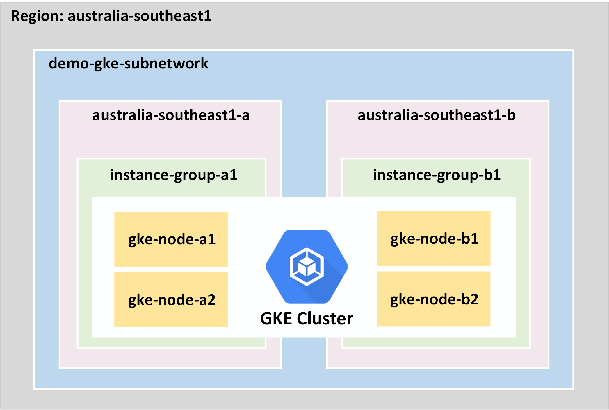

In specific, we’ll be launching the following GCP/GKE resources:

- 1x new VPC for hosting the demo GKE cluster
- 1x /17 CIDR block as the primary address space for the VPC
- 2x /18 CIDR blocks for the GKE Pod and Service address spaces
- 1x GKE high availability cluster across 2x Availability Zone (AZ)
- 2x GKE worker instance groups (2x nodes each)

## PREREQUISITES

- Access to a GCP testing environment
- Install Git, Kubectl and Terrafrom on your client
- Install [**GCloud SDK**](https://cloud.google.com/sdk/install)
- Check the NTP clock & sync status on your client —\> important!
- Clone the Terraform Repo [at here](https://github.com/sc13912/tf-gcp-gke.git)

**Step-1: Setup the GCloud Environment and Run the Terrafrom Script**

To begin, run below interactive GCloud commands to prepare for the GCP environment

```
gcloud init  
gcloud config set accessibility/screen_reader true  
gcloud auth application-default login  
```

Remember to update the *terraform.tfvars* with your own GCP *project_id*

```
project_id = "xxxxxxxx"
```

Make sure to enable the GKE API if not already

```
gcloud services enable container.googleapis.com
```

Now run the Terraform script:

```
terraform init
terraform apply
```

The whole process should be taking about 7~10 mins, and you should get an output like this:

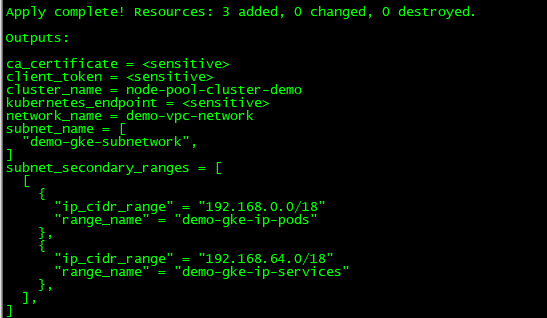

Now register the cluster and update kubeconfig file

```
[root@cloud-ops01 tf-gcp-gke]# gcloud container clusters get-credentials node-pool-cluster-demo --region australia-southeast1
Fetching cluster endpoint and auth data.
kubeconfig entry generated for node-pool-cluster-demo.
```

**Step-2: Verify the GKE Cluster Status**

Check that we can access the GKE cluster and there should be 4x worker nodes provisioned.

```
[root@cloud-ops01 ~]# kubectl get nodes
NAME                                               STATUS   ROLES    AGE     VERSION
gke-node-pool-cluster-demo-pool-01-03a2c598-34lh   Ready    <none>   8m59s   v1.16.9-gke.2
gke-node-pool-cluster-demo-pool-01-03a2c598-tpwq   Ready    <none>   9m      v1.16.9-gke.2
gke-node-pool-cluster-demo-pool-01-e903c7a8-04cf   Ready    <none>   9m5s    v1.16.9-gke.2
gke-node-pool-cluster-demo-pool-01-e903c7a8-0lt8   Ready    <none>   9m5s    v1.16.9-gke.2
```

This can also been verified on GKE console

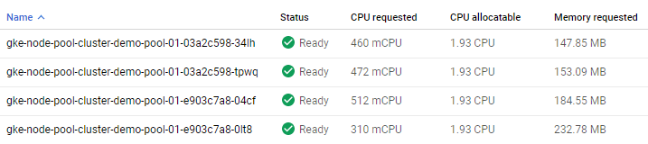

The 4x worker nodes are provisioned over 2x managed instance groups across two different AZs

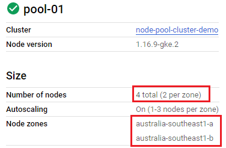

Run *kubectl describe nodes* and we can see each node has been tagged with a few customised labels based on its unique properties. These are important metadata which can be used for selective Pod/Node deployment and other use cases like affinity or anti-affinity rules.

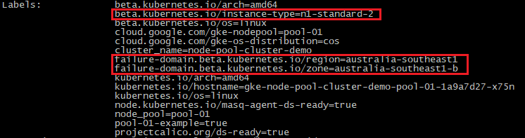

**Step-3: Deploy GKE Add-on Services**

- Install Metrics-Server to provide cluster-wide resource metrics collection and to support use cases such as Horizontal Pod Autoscaling (HPA)

```
[root@cloud-ops01 tf-gcp-gke]# kubectl apply -f https://github.com/kubernetes-sigs/metrics-server/releases/download/v0.3.6/components.yaml
```

Wait for a few seconds and we should have resource stats

```
[root@cloud-ops01 tf-gcp-gke]# kubectl top nodes
NAME                                               CPU(cores)   CPU%   MEMORY(bytes)   MEMORY%   
gke-node-pool-cluster-demo-pool-01-03a2c598-34lh   85m          4%     798Mi           14%       
gke-node-pool-cluster-demo-pool-01-03a2c598-tpwq   300m         15%    816Mi           14%       
gke-node-pool-cluster-demo-pool-01-e903c7a8-04cf   191m         9%     958Mi           16%       
gke-node-pool-cluster-demo-pool-01-e903c7a8-0lt8   102m         5%     795Mi           14%    
```

- Next, deploy a NGINX Ingress Controller so we can use L7 URL load balancing and to save cost by reducing the required numbers of external load balances

```
[root@cloud-ops01 tf-gcp-gke]# kubectl apply -f https://raw.githubusercontent.com/kubernetes/ingress-nginx/controller-0.32.0/deploy/static/provider/cloud/deploy.yaml  
```

On GCP console we can see that an external Load Balancer has been provisioned in front of the Ingress Controller. Take a note of the LB address at below — this is the public IP that will be consumed by our ingress services.

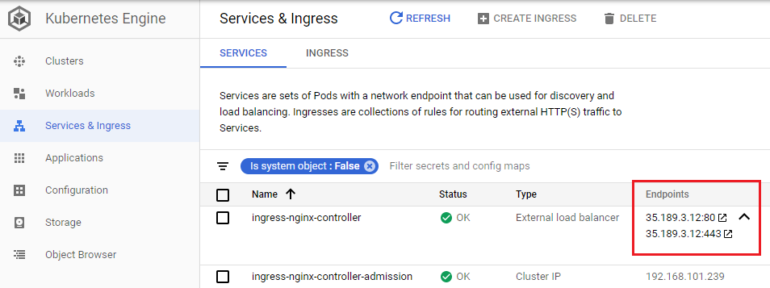

In addition, we’ll deploy 2x storage classes to provide dynamic persistent storage support for stateful pods and services. Note the different persistent disk (PD) specs (standard & SSD) for different I/O requirements.

```
 [root@cloud-ops01 tf-gcp-gke]# kubectl create -f ./storage/storageclass/  
```

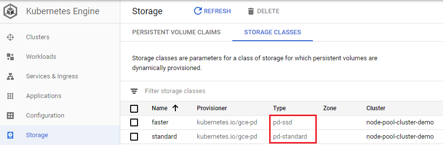

**Step-4: Deploy Sample Apps onto the GKE Cluster for Testing**

- We’ll first deploy the famous [Hipster Shop app](https://github.com/GoogleCloudPlatform/microservices-demo/), which is a cloud-native microservice application developed by Google.

```
kubectl apply -f https://raw.githubusercontent.com/GoogleCloudPlatform/microservices-demo/master/release/kubernetes-manifests.yaml  
```

wait for all the Pods up and running

```
[root@cloud-ops01 tf-gcp-gke]# kubectl get pods 
NAME                                     READY   STATUS    RESTARTS   AGE
adservice-687b58699c-fq9x4               1/1     Running   0          2m16s
cartservice-778cffc8f6-dnxmr             1/1     Running   0          2m20s
checkoutservice-98cf4f4c-69fqg           1/1     Running   0          2m26s
currencyservice-c69c86b7c-mz5zv          1/1     Running   0          2m19s
emailservice-5db6c8b59f-jftv7            1/1     Running   0          2m27s
frontend-8d8958c77-s9665                 1/1     Running   0          2m24s
loadgenerator-6bf9fd5bc9-5lsrn           1/1     Running   3          2m19s
paymentservice-698f684cf9-7xbjc          1/1     Running   0          2m22s
productcatalogservice-789c77b8dc-4tk4w   1/1     Running   0          2m21s
recommendationservice-75d7cd8d5c-4x9kl   1/1     Running   0          2m25s
redis-cart-5f59546cdd-8tj8f              1/1     Running   0          2m17s
shippingservice-7d87945947-nhb5x         1/1     Running   0          2m18s
```

check the external frontend service, you should see a LB has been deployed by GKE with a public IP assigned[](https://github.com/sc13912/tf-gcp-gke#demo-app2-guestbook-verify-storage-classes)

```
[root@cloud-ops01 ~]# kubectl get svc frontend-external 
NAME                TYPE           CLUSTER-IP      EXTERNAL-IP     PORT(S)        AGE
frontend-external   LoadBalancer   192.168.74.68   35.197.182.62   80:32408/TCP   5m32s
```

You should be able to access the app via the LB public IP.

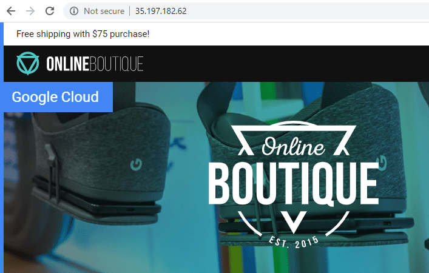

- Next, we’ll deploy the sample Guestbook app to verify the persistent storage setup.

```
[root@cloud-ops01 tf-gcp-gke]# kubectl create ns guestbook-app  
[root@cloud-ops01 tf-gcp-gke]# kubectl apply -f ./demo-apps/guestbook/  
```

The application requests 2x persistent volumes (PV) for the redis-master and redis-slave pods. Both PVs should be automatically provisioned by the persistent volume claims (PVC) with the 2x different storage classes as we deployed earlier. You should see the STATUS reported as “Bound” between each PV and PVC mapping.

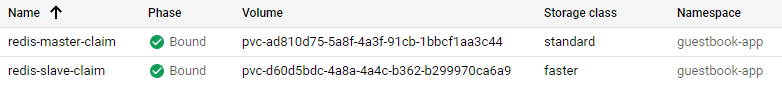

Retrieve the external IP/DNS for the frontend service of the Guestbook app.

```
[root@cloud-ops01 tf-gcp-gke]# kubectl get svc frontend -n guestbook-app 
NAME       TYPE           CLUSTER-IP        EXTERNAL-IP    PORT(S)        AGE
frontend   LoadBalancer   192.168.127.128   34.87.228.35   80:31006/TCP   23m
```

You should be able to access the Guesbook app now. Enter and submit some messages, and try to destroy and redeploy the app, your data will be kept by the redis PVs.

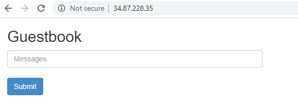

- Lastly, we’ll deploy a modified version of the [yelb app](https://github.com/mreferre/yelb) to test the NGINX ingress controller

```
[root@cloud-ops01 tf-gcp-gke]# kubectl create ns yelb  
[root@cloud-ops01 tf-gcp-gke]# kubectl apply -f ./demo-apps/yelb/
```

You should see an ingress service deployed as per below.

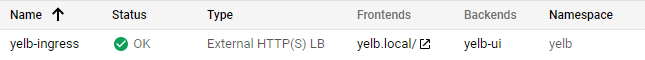

Retrieve the external IP for the ingress service within the yelb namespace. As mentioned before, this should be the same address of the external LB deployed for the ingress controller.

```
[root@cloud-ops01 tf-gcp-gke]# kubectl get ingresses -n yelb 
NAME           HOSTS        ADDRESS       PORTS   AGE
yelb-ingress   yelb.local   35.189.3.12   80      6m47s
```

Also, notice the ingress URL path is defined as “yelb.local”. This is the DNS entry that will be redirected by the http ingress service. So we’ll update the local host file (with the ingress public IP) for a quick testing.

```
[root@cloud-ops01 tf-aws-eks]# echo "35.189.3.12  yelb.local" >> /etc/hosts  
```

and that’s it, the incoming requests to “yelb.local” are now routed via the ingress service to the yelb frontend pod running on our GKE cluster.

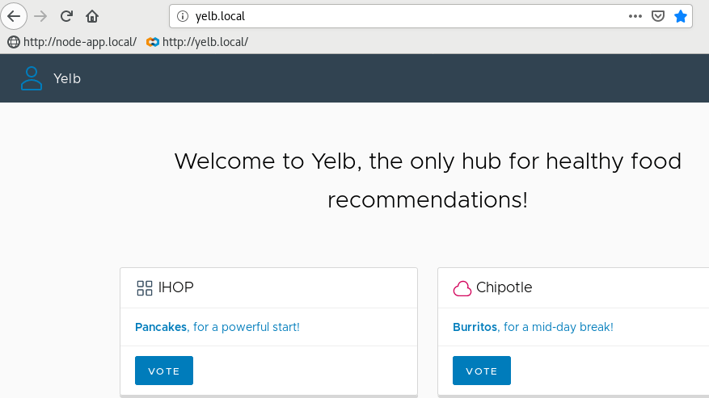
