This is the second episode of our **Cloud Native DevOps on GCP **series. In the previous chapter, we have built a multi-AZ GKE cluster with Terraform. This time, we’ll create a cloud native CI/CD pipeline leveraging our GKE cluster and Google DevOps tools such as Cloud Build and Google Container Registry (GCR). We’ll create a Cloud Build trigger by connecting to GitHub repository to perform automatic build, test and deployment of a sample micro-service app onto the GKE cluster.

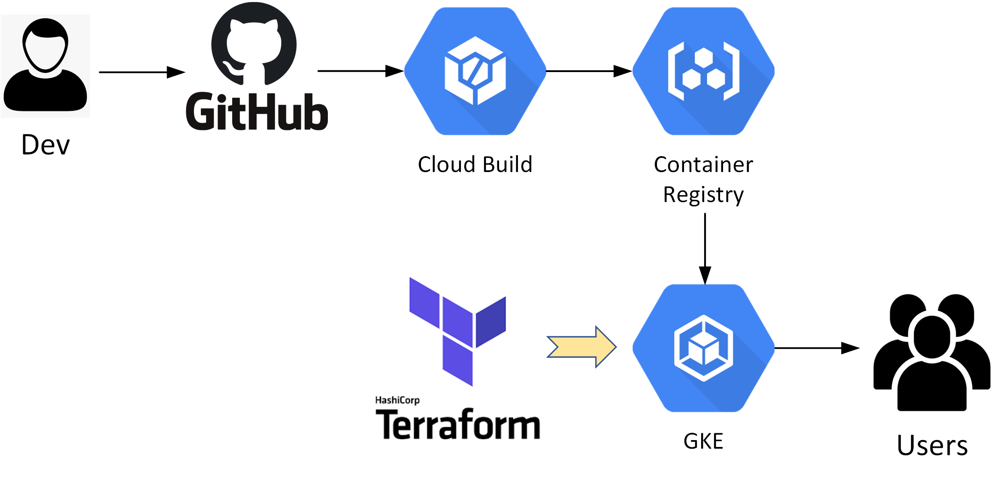

For this demo, I have provided a simple NodeJS app which is already containerized and packaged as a Helm Chart for fast K8s deployment. You can find all the artifacts at** [](https://github.com/sc13912/nodejs-cloudbuild-demo.git) [my GitHub Repo](https://github.com/sc13912/nodejs-cloudbuild-demo.git)**, including the demo app, Helm template/chart, as well as the Cloud Build pipeline code.

**WHAT YOU’LL NEED:**

- Access to a GCP testing environment
- Install Git, Kubectl and Terrafrom on your client
- Install Docker on your client
- Install [**GCloud SDK**](https://href.li/?https://cloud.google.com/sdk/install)
- Check the NTP clock & sync status on your client —\> important!
- Clone or download the demo app repo **[at here](https://github.com/sc13912/nodejs-cloudbuild-demo.git)**

**Step-1: Prepare the GCloud Environment**

To begin, configure the GCloud environment variables and authentications.

```
gcloud init
gcloud config set accessibility/screen_reader true
gcloud auth application-default login
```

Register GCloud as a Docker credential helper — this is important so our Docker client will have privileged access to interact with GCR. (Later we’ll need to build and push a Helm client image to GCR as required for the pipeline deployment process)

```
gcloud auth configure-docker
```

Enable required GCP API services.

```
gcloud services enable compute.googleapis.com
gcloud services enable servicenetworking.googleapis.com
gcloud services enable cloudresourcemanager.googleapis.com
gcloud services enable container.googleapis.com
gcloud services enable cloudbuild.googleapis.com
```

Update Cloud Build service account with an editor role so it will have required permissions to access GKE and GCR within the project.

```
PROJECT_ID=`gcloud config get-value project`
CLOUDBUILD_SA="$(gcloud projects describe $PROJECT_ID --format 'value(projectNumber)')@cloudbuild.gserviceaccount.com"
gcloud projects add-iam-policy-binding $PROJECT_ID --member serviceAccount:$CLOUDBUILD_SA --role roles/editor
```

**Step-2: Launch a GKE Cluster using Terraform**

If you have been following the series and have already deployed a GKE cluster, you can skip this step and move on to the next. Otherwise you can follow [this post](https://route179.wordpress.com/2020/06/09/build-a-gke-cluster-with-terraform/) to build a GKE cluster with Terraform.

Make sure to deploy an Ingress Controller as there is an Ingress service defined in our Helm Chart!

```
kubectl apply -f https://raw.githubusercontent.com/kubernetes/ingress-nginx/controller-0.32.0/deploy/static/provider/cloud/deploy.yaml  
```

**Step-3: Initialize Helm for Application Deployment on GKE**

As mentioned above, for this demo we have encapsulated our demo app into a Helm Chart. Helm is a package management system designed for simplifying and accelerating application deployment on the Kubernetes platform.

As of version 2, Helm consists of a local client and a Tiller server pod (deployed in K8s cluster) to interact with the Kube-apiserver for app deployment. In our example, we’ll first build a customised Helm client docker image and push it to GCR. This image will then be used by Cloud Build to interact with the Tiller server (deployed on GKE) for deploying the pre-packaged Helm chart — as illustrated in the below diagram.

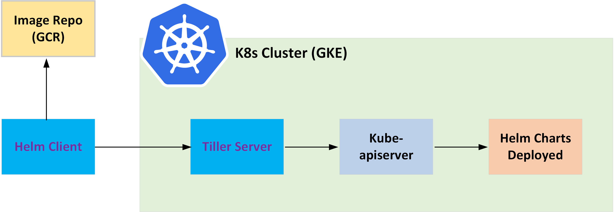

First let’s configure a service account for Tiller and initialize Helm (server component) on our GKE cluster.

```
kubectl apply -f ./k8s-helm/tiller.yaml
helm init --history-max 200 --service-account tiller
```

We’ll then build and push a customised Helm client image to GCR. This might take a few minutes.

```
cd ./k8s-helm/cloud-builders-community/helm
docker build -t gcr.io/$PROJECT_ID/helm .
docker push gcr.io/$PROJECT_ID/helm
```

On GCR confirm there is a new Helm (client) image has been pushed through.

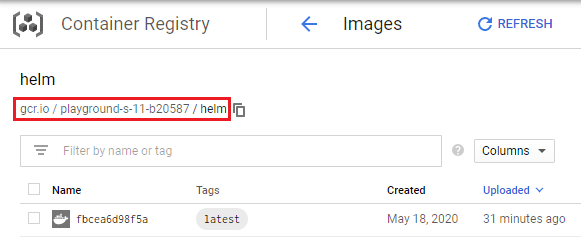

**Step-4: Review the (Cloud Build) Pipeline Code**

Before we move forward, let’s take a moment to review the pipeline code (as defined in the *cloudbuild.yaml*). There is a total of 4 stages included in our Cloud Build pipeline:

1.  Build a docker image with our demo app
2.  Push the new image to GCR
3.  Deploy Helm chart (for our demo app) to GKE via GCR
4.  Integration Testing

The first two stages are straight forward, we’ll use the Google published **[Cloud Builder docker image](https://github.com/GoogleCloudPlatform/cloud-builders/tree/master/docker)** to build the node app image and push it to the GCR repository.

``` brush:
  # Build demo app image
  - name: gcr.io/cloud_builders/docker
    args:
      - build
      - -t
      - gcr.io/$PROJECT_ID/node-app:$COMMIT_SHA
      - .
  # Push demo app image to GCR
  - name: gcr.io/cloud-builders/docker
    args:
      - push
      - gcr.io/$PROJECT_ID/node-app:$COMMIT_SHA
```

Next we’ll leverage the (previously built) Helm client to interact with our GKE cluster and to deploy the Helm chart (for our node app), with the image repository pointing to the GCR path from the last pipeline stage.

``` brush:
  # Deploy with Helm Chart
  - name: gcr.io/$PROJECT_ID/helm
    args:
      - upgrade
      - -i
      - node-app
      - ./k8s-helm/node-app
      - --set
      - image.repository=gcr.io/$PROJECT_ID/node-app,image.tag=$COMMIT_SHA
      - -f
      - ./k8s-helm/node-app/values.yaml
    env:
      - CLOUDSDK_COMPUTE_REGION=$_CUSTOM_REGION
      - CLOUDSDK_CONTAINER_CLUSTER=$_CUSTOM_CLUSTER
      - KUBECONFIG=/workspace/.kube/config
      - TILLERLESS=false
      - TILLER_NAMESPACE=kube-system
```

Lastly, we’ll run an integration test to verify the demo app status on our GKE cluster. For our node app there is a built-in heath-check URL configured at “*/health*“, and we’ll be leveraging another **[Cloud Builder curl image](https://github.com/GoogleCloudPlatform/cloud-builders/tree/master/curl)** to ping this URL path and expect a return message of \<*“status”: “ok”\>* . Note: here we should be polling the internal DNS address for the k8s service (of the demo app) so there is no dependency on IP allocations.

``` brush:
  # Integration Testing
  - name: gcr.io/cloud-builders/kubectl
    entrypoint: 'bash'
    args:
      - '-c'
      - |
        kubectl delete --wait=true pod curl
        kubectl run curl --restart=Never --image=gcr.io/cloud-builders/curl --generator=run-pod/v1 -- http://node-app.default.svc.cluster.local/health
        sleep 15
        kubectl logs curl 
        kubectl logs curl | grep OK
    env:
      - CLOUDSDK_COMPUTE_REGION=$_CUSTOM_REGION
      - CLOUDSDK_CONTAINER_CLUSTER=$_CUSTOM_CLUSTER
      - KUBECONFIG=/workspace/.kube/config
```

**Step-4: Create a Cloud Build Trigger by Connecting to GitHub Repository**

Now that we have our GKE cluster ready and Helm image pushed to GCR, the next step is to connect Cloud Build to the GitHub repository and create a CI trigger. On GCP console, go to *Cloud Build —\> Triggers*, select the GitHub repo as below.

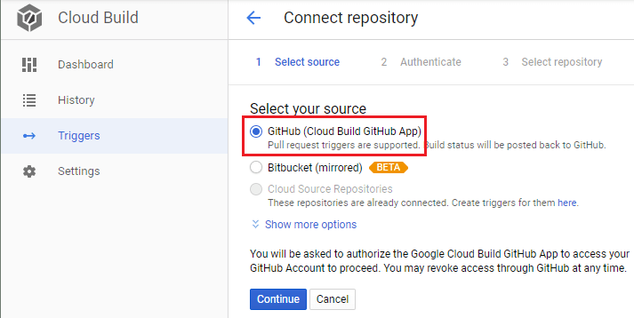

If this is the first time you are connecting to GitHub in Cloud Build, it will redirect you to an authorization page like below, accept it in order to access your repositories.

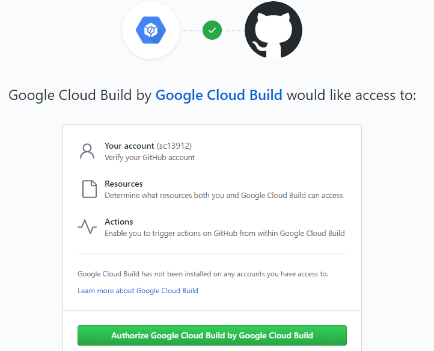

Select the demo app repository, which also includes the pipeline config (*cloudbuild.yaml*) file.

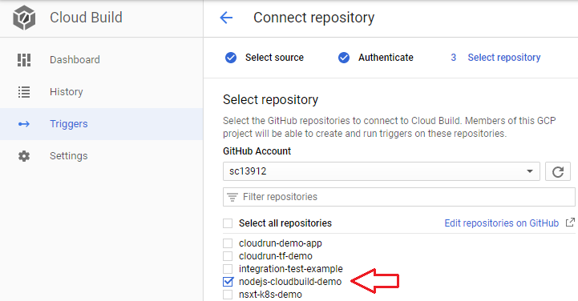

Create a push trigger in the next page and you should see a summary like this.

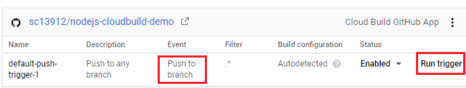

You can manually run the trigger now to kick off the CI build process. However we’ll be running more thorough testing to verify the end-to-end pipeline automation process in the next section.

**Step-5: Test the CI/CD Pipeline**

It’s time to test our CI/CD pipeline! First we’ll make a “cosmetic” version change (1.0.0 to 1.0.1) to the Helm chart for our demo app.

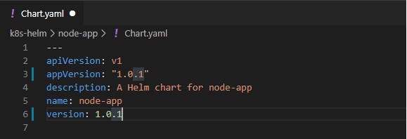

Commit the change and push to the Git repository.

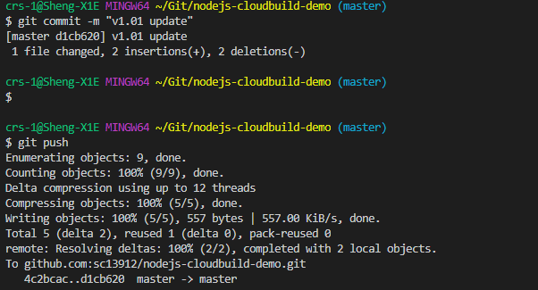

This (push event) should have triggered our Cloud Build pipeline. You can jump on the GCP console to monitor the fully automated 4-stage process. The pipeline will be completed once the integration test has returned a status of OK.

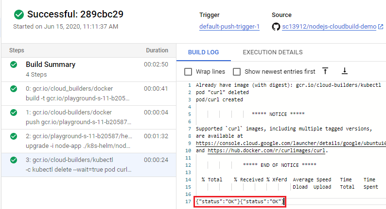

On the GKE cluster we can see our Helm chart v-1.0.1 has been deployed successfully.

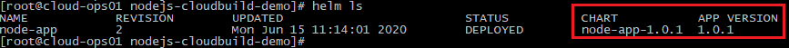

The deployment and node app are running as expected.

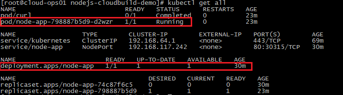

Retrieve the Ingress public IP and update the local host file for a quick testing. (Note the Ingress URL is defined as “node-app.local”)

```
[root@cloud-ops01 nodejs-cloudbuild-demo]# kubectl get ingresses 
NAME       HOSTS            ADDRESS         PORTS   AGE
node-app   node-app.local   34.87.213.107   80      15m
[root@cloud-ops01 nodejs-cloudbuild-demo]# 
[root@cloud-ops01 nodejs-cloudbuild-demo]# echo "34.87.213.107  node-app.local" >> /etc/hosts   
```

Now point your browser to “node-app.local” and you should see the demo app page like below. Congrats, you have just successfully deployed a cloud native CI/CD pipeline on GCP!

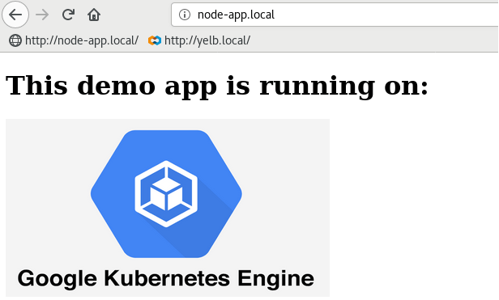
