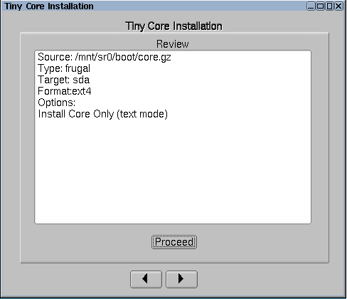
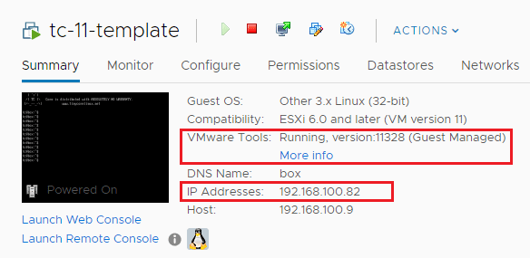
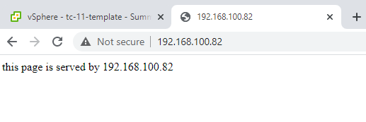

I’ve always wanted to find a lightweight VM template for running on nested vSphere lab environment, or sometimes for demonstrating live cloud migration such as vMotion to the VMware Cloud on AWS. Recently I have managed to achieve this by using the [Tiny Core Linux distribution](http://tinycorelinux.net/) and it ticked all of my requirements:

- ultra lightweight – the VM runs stable with only 1 vCPU, 256MB RAM and 64MB hard disk!
- common linux tools installed – such as curl, wget, openssh etc
- open-vm-tools installed
- a lightweight http server serving a static site for running networking or load-balancing tests

In this post I will walk you through the process for creating a Tiny Core based Linux VM template including all of the above requirements. To begin, download the Tiny Core ISO from [](http://tinycorelinux.net/downloads.html) [her](http://tinycorelinux.net/downloads.html)[e](http://tinycorelinux.net/downloads.html). (For reference, I’m using the **[CorePlus-v11.1](http://tinycorelinux.net/11.x/x86/archive/11.1/CorePlus-11.1.iso)** release as I was getting some weird issues with OpenSSH on the latest v12.0 release)

Below are the settings I’ve used for my VM template:

- VM hardware version 11 – compatible with ESXi 6.0 and later
- Guest OS = Linux \\ Other 3.x Linux (32-bit)
- Memory = 256MB (this is the lowest I could go for getting a stable machine)
- Hard Disk = 64MB – change drive type to IDE and set the virtual device node to IDE0:0
- CDROM – change the virtual device node to IDE1:0
- iSCSI controller – remove this as it’s not required

Also, you should use the below minimal settings for installing the Tiny Core OS. For detailed installation instructions, you can follow the step-by-step guide at [here](http://tinycorelinux.net/install.html):



Once the OS has been installed and you are into the shell, create a below script to configure static IP settings for eth0 (and disable DHCP if required).

```
tc@box:~$ cat /opt/interfaces.sh
#!/bin/sh
# If you are booting Tiny Core from a very fast storage such as SSD / NVMe Drive and getting 
# "ifconfig: SIOCSIFADDR: No such Device" or "route: SIOCADDRT: Network is unreachable"
# error during system boot, use this sleep statement, otherwise you can remove it -
sleep .2
# kill dhcp client for eth0
sleep 1
if [ -f /var/run/udhcpc.eth0.pid ]; then
 kill `cat /var/run/udhcpc.eth0.pid`
 sleep 0.5
fi
# configure interface eth0
ifconfig eth0 192.168.0.1 netmask 255.255.255.0 broadcast 192.168.0.255 up
route add default gw 192.168.0.254
echo nameserver 192.168.0.254 >> /etc/resolv.conf
tc@box:~$sudo chmod 777 /opt/interfaces.sh
tc@box:~$sudo /opt/interfaces.sh
```

You may also want to reset the password for the default user “tc” (this can be used later for SSH access), and reset the root password as well:

```
tc@box:~$ passwd
Changing password for tc
...
tc@box:~$ sudo su
root@box:/home/tc# passwd
Changing password for root
...
```

Now install all the required packages and extensions, and your onboot package list should look like below:

```
tce-load -wi pcre.tcz curl.tcz wget.tcz open-vm-tools.tcz openssh.tcz busybox-httpd.tcz
tc@box:~$ cat /etc/sysconfig/tcedir/onboot.lst
pcre.tcz
curl.tcz
wget.tcz
open-vm-tools.tcz
openssh.tcz
busybox-httpd.tcz
```

Now configure and enable the SSH server — you can use user “tc” for a quick SSH test:

```
cd   /usr/local/etc/ssh
sudo cp ssh_config.orig ssh_config
sudo cp sshd_config.orig sshd_config
sudo /usr/local/etc/init.d/openssh start
```

Next, we’ll need to save all the settings and make them persistent across reboots, especially we’ll need to add the open-vm-tools and openssh onto the startup script (bootlocal.sh) — otherwise none of these services would be started after a reboot.

```
sudo su
echo '/opt/interfaces.sh' >> /opt/.filetool.lst
echo '/usr/local/etc/ssh' >> /opt/.filetool.lst
echo '/etc/shadow' >> /opt/.filetool.lst
echo '/opt/interfaces.sh' >> /opt/bootlocal.sh
echo '/usr/local/etc/init.d/open-vm-tools start &> /dev/null'  >> /opt/bootlocal.sh
echo '/usr/local/etc/init.d/openssh start &> /dev/null' >> /opt/bootlocal.sh
```

and most importantly, use the below command to backup all the config!

```
tc@box:~$ filetool.sh -b
Backing up files to /mnt/sda1/tce/mydata.tgz
```

The last one is for my own specific requirement — you can use the below script to setup a lightweight http server so it can be used for networking or load-balancing related tests.

```
tc@box:~$ sudo vi /opt/httpd.sh
sudo /usr/local/httpd/bin/busybox httpd -p 80 -h /usr/local/httpd/bin/
sleep .5
sudo touch /usr/local/httpd/bin/index.html
sudo chmod 666 /usr/local/httpd/bin/index.html
echo "this page is served by" >> /usr/local/httpd/bin/index.html
ifconfig eth0 | grep -i mask | awk '{print $2}'| cut -f2 -d:  >> /usr/local/httpd/bin/index.html
tc@box:~$ sudo chmod 777 /opt/httpd.sh
tc@box:~$ sudo echo '/opt/httpd.sh' >> /opt/bootlocal.sh
tc@box:~$ filetool.sh -b
```

Now you can go ahead and safely reboot the VM, and once it comes back online you should be able to SSH into it. Also the the open-vm-tools service should be automatically started and you can see the correct IP address and VM tool version reported in vCenter.



In addition, you should be able to see a static page like below by browsing to the VM address — the script (httpd.sh) should report back the VM’s IP address which could be handy for running a LB related testings.


