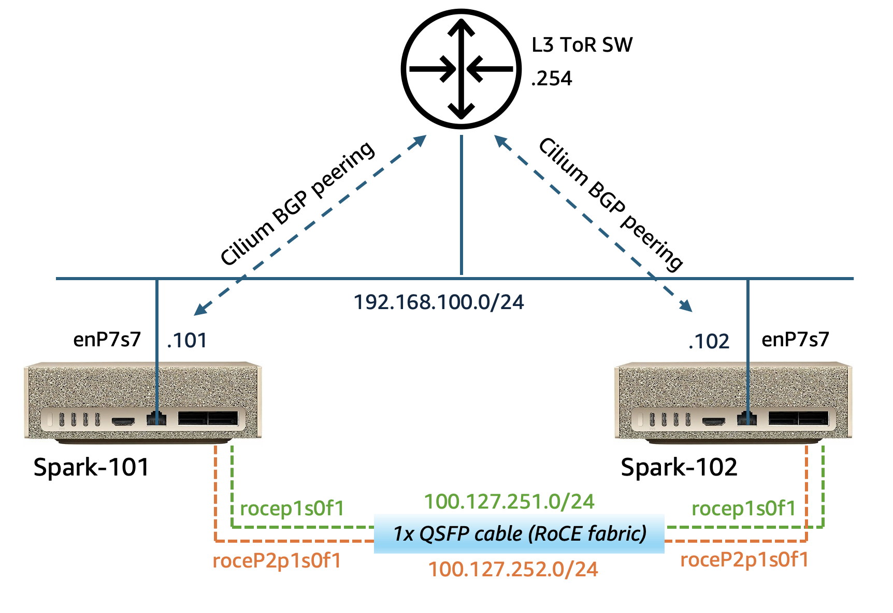

In this post, I'll walk you through deploying **[DeepSeek-V4-Flash-DSpark](https://huggingface.co/deepseek-ai/DeepSeek-V4-Flash-DSpark)** — a 284B-parameter MoE model (13B active) — across two NVIDIA DGX Sparks running as **EKS Hybrid Nodes**, connected over a ConnectX-7 RoCE stacking link. 

A single DGX Spark has a 128 GB unified memory pool, so the weights alone (~167 GB) don't fit on one node. Spreading the model across two Sparks with tensor parallelism (TP=2) leaves just enough room for the weights, the KV cache, and framework overhead. I'll show you how to reach **50–60 tok/s** decode with a **1.79M KV pool** — a 512K context window at >3× concurrency as deployed, or up to a single 1M context stream.

Most DGX Spark clusters today are wired together by hand: passwordless SSH, per-node .env files, and a shell script to launch the leader and workers — with no centralized orchestration or health monitoring at the cluster level. By integrating the two Sparks with EKS Hybrid Nodes, I get declarative deployments and orchestration, self-healing, and the same k8s workflow I already use in the cloud — without the complexity of self-managing the Kubernetes control plane.


## Setup (Prerequisites)

This post assumes you have deployed an Amazon EKS cluster with Hybrid Nodes enabled, using the following:

- **2× NVIDIA DGX Spark (GB10)**, `aarch64` / `sm_121`
  -  both nodes joined to the EKS Cluster as **[Hybrid Nodes](https://docs.aws.amazon.com/eks/latest/userguide/hybrid-nodes-overview.html)**
  -  **identical firmware/driver/kernel** on both boxes. (e.g. My baseline: DGX OS 7.5.0, driver 580.173.02, CUDA 13.0, kernel 6.17.0-1026-nvidia, ConnectX-7 FW 28.45.4028, USB-C PD FW `0x516`)
- **Cilium CNI** installed with BGP control plane enabled
- **NVIDIA GPU Operator for Kubernetes** installed so the nodes advertise `nvidia.com/gpu`.
- **RoCE/RDMA configured** on both Sparks and NCCL verified across the RoCE link — see the [previous post](https://route179.dev/2026/07/21/dgx-spark-nccl-roce-benchmarking/) for the full bring-up.
- Download and stage the **DeepSeek-V4-Flash-DSpark** model weights onto both Sparks' local NVMe storage, at the same path on both nodes. Use `hf download deepseek-ai/DeepSeek-V4-Flash-DSpark` so the weights land in the Hugging Face hub-cache layout (`hub/models--…/snapshots/<hash>/`) that the serve command expects.

You can follow this **[AWS blog post](https://aws.amazon.com/blogs/containers/deploy-production-generative-ai-at-the-edge-using-amazon-eks-hybrid-nodes-with-nvidia-dgx/)** for details on how to set up the hybrid EKS cluster with DGX Sparks. For better illustration, below is a high-level network diagram of my Spark cluster.




## vLLM Recipes

This project is largely inspired by MiaAI Lab's [DeepSeek-v4-Flash-DSpark-2x-DGX-Spark](https://github.com/MiaAI-Lab/DeepSeek-v4-Flash-DSpark-2x-DGX-Spark), with configurations updated for fast deployment into a Kubernetes environment.

You can find all artefacts used by this post at my **[GitHub repo](https://github.com/sc13912/DeepSeekv4-Flash-DSpark-Dual-DGX-Spark-EKS-Hybrid)**. 

The deployment blueprint rides on a (recently landed) stack of vLLM features, using a specific [`ghcr.io/anemll/dspark-vllm-gx10:0.1.1`](https://github.com/anemll) image with pre-built **vLLM 0.25.1** and **DSpark** engine. 

Here are the key vLLM configuration flags used in our deployment:

| Flag | What it does & why it matters |
|---|---|
| `--distributed-executor-backend mp` | Uses vLLM's own multiprocessing executor instead of Ray. Ray is not efficient for the dual-Spark setup given the limited memory resource. More below. |
| `--tensor-parallel-size 2` | Splits the model across the two Sparks' GPUs — one shard per node (TP=2). |
| `--kv-cache-dtype nvfp4_ds_mla` | NVFP4 KV cache for the MLA attention. Optimizes the KV footprint dramatically — the deployed config reports a **~1,790,385-token KV pool** at startup. |
| `--moe-backend flashinfer_b12x` | Fused FlashInfer MoE backend for the model's mxfp4 experts. |
| `--speculative-config '{"method":"dspark","num_speculative_tokens":5,...}'` | DSpark-native multi-token prediction (MTP=5) — uses the checkpoint's **built-in MTP head**, no second checkpoint read. |
| `--tokenizer-mode deepseek_v4` | Model-specific tokenizer path. |
| `--reasoning-parser deepseek_v4` / `--tool-call-parser deepseek_v4` | Parse the model's `<think>` reasoning traces and its tool calls (with `--enable-auto-tool-choice`). |
| `--gpu-memory-utilization 0.85` | Fraction of the unified pool vLLM may claim. |
| `--max-model-len 524288` | My live deployment runs a **512K** context window — the engine reports **3.41× concurrency** at that length. Raise it to 1M for a single full-length stream. |
| `--max-num-seqs 6` / `--max-num-batched-tokens 8192` | Concurrency + batch token budget, sized to fit the pool. |
| `--max-cudagraph-capture-size 36` | Bounds CUDA-graph capture (`= 6 × (MTP 5 + 1)`); a memory/startup tradeoff. |
| `--async-scheduling` / `--enable-chunked-prefill` / `--enable-prefix-caching` / `--enable-flashinfer-autotune` | Overlap scheduling with execution, chunk long prefills, reuse prefix KV, and autotune FlashInfer kernels. |
| `--block-size 256` | KV block size. |


## Walkthrough

### 1. Why vLLM MP, not Ray

Every "multi-node vLLM" tutorial reaches for Ray, and Ray can work here — I was able to run a Qwen3.6 35B MoE model across these same two Sparks with the Ray backend. But you're paying a tax you mostly don't need: Ray's daemons (raylet, gcs_server, dashboard) and its object store (which by default reserves ~30% of RAM unless you cap it) burn several GB of unified memory per node. With ~167 GB of weights squeezed into two Sparks, those gigabytes are the difference between fitting and OOM — see the OOM saga below. 

vLLM's **multiprocessing (`mp`) executor** provides a simple and efficient resolution for this:

```
--distributed-executor-backend mp
--nnodes 2
--node-rank 0                       # leader; worker uses --node-rank 1
--master-addr 192.168.100.101       # leader's mgmt IP (spark-101)
--master-port 25000
# worker (rank 1) additionally passes:  --headless
```


### 2. LeaderWorkerSet for job scheduling 

While `mp` is the *compute* layer (the executor), we also need **LWS** for the pod-orchestration layer: it co-schedules the leader + worker as one gang, and restarts the whole group if either pod dies. They're complementary — LWS owns the pod lifecycle, `mp` owns the tensor-parallel math. Note: Since the pods run `hostNetwork`, I pin `--master-addr` to the leader node's management IP rather than using LWS's injected `LWS_LEADER_ADDRESS` — both resolve to the same node either way.

Here are the basics of the LWS spec (**LWS v0.9.0**, installed from `oci://registry.k8s.io/lws/charts/lws`, no cert-manager):

```yaml
apiVersion: leaderworkerset.x-k8s.io/v1
kind: LeaderWorkerSet
metadata:
  name: dsv4-flash-tp2
spec:
  replicas: 1
  leaderWorkerTemplate:
    size: 2                                 # 1 leader + 1 worker
    restartPolicy: RecreateGroupOnPodRestart # gang restart
    leaderTemplate:
      spec:
        nodeSelector:
          kubernetes.io/hostname: <leader-node-name>   # spark-101 (from `kubectl get nodes`)
        # ... leader container: node-rank 0, serves the API
    workerTemplate:
      spec:
        nodeSelector:
          kubernetes.io/hostname: <worker-node-name>   # spark-102 (from `kubectl get nodes`)
        # ... worker container: node-rank 1, --headless
```

Both pods share the same pod spec — a privileged, host-networked RDMA workload:

```yaml
hostNetwork: true
hostIPC: true
dnsPolicy: ClusterFirstWithHostNet
containers:
  - name: vllm
    securityContext:
      privileged: true
      capabilities: { add: ["IPC_LOCK"] }
    resources:
      limits:
        nvidia.com/gpu: "1"        # 1 GPU/pod × 2 pods = TP=2
    volumeMounts:
      - { name: infiniband, mountPath: /dev/infiniband }
      - { name: dshm,       mountPath: /dev/shm }
      - { name: hf-cache,   mountPath: /cache/huggingface }
    readinessProbe:
      httpGet: { path: /health, port: 8888 }
      initialDelaySeconds: 600     # DSpark cold start ~6-7 min (weights + cudagraph capture)
volumes:
  - name: infiniband
    hostPath: { path: /dev/infiniband, type: Directory }   # pod RDMA; no k8s RDMA device-plugin works on GB10
  - name: dshm
    emptyDir: { medium: Memory, sizeLimit: 64Gi }          # = --shm-size 64g
  - name: hf-cache
    hostPath: { path: /root/.cache/huggingface, type: DirectoryOrCreate }  # local NVMe, weights staged per-node
```

### 3. The RoCE split: data plane vs control plane

This is the same lesson from the [NCCL post](https://route179.dev/2026/07/21/dgx-spark-nccl-roce-benchmarking/), now expressed as pod env. There are **two independent network planes** and you must pin each one, or the job wires up on the wrong interface and hangs. The **data plane** (the actual tensor-parallel all-reduces) goes over the two merged ConnectX-7 RoCE NICs; the **control plane** (torch.distributed rendezvous + the Gloo CPU coordination group) goes over the 1/10G EKS management NIC `enP7s7`.

```bash
# --- Data plane: RoCE, both NICs merged into one logical path (~20 GB/s) ---
NCCL_NET=IB
NCCL_IB_DISABLE=0
NCCL_IB_HCA=rocep1s0f1,roceP2p1s0f1     # both ConnectX-7 NICs (the "f1 twins")
NCCL_IB_MERGE_NICS=1
NCCL_IB_GID_INDEX=3                     # RoCEv2 GID
NCCL_IB_ADDR_FAMILY=AF_INET
NCCL_IB_ROCE_VERSION_NUM=2
NCCL_CROSS_NIC=1
NCCL_IGNORE_CPU_AFFINITY=1
NCCL_CUMEM_ENABLE=0
NCCL_NVLS_ENABLE=0
NCCL_DEBUG=WARN

# --- Control plane: pin ALL THREE coordination selectors to the mgmt NIC ---
NCCL_SOCKET_IFNAME=enP7s7
GLOO_SOCKET_IFNAME=enP7s7               # <-- torch.distributed's CPU/coordination group is Gloo, and it needs its own pin. 
TP_SOCKET_IFNAME=enP7s7
```


### 4. Stage the model weights and vLLM image

- **Weights are staged to both nodes** at the identical path - in my case: `/root/.cache/huggingface/hub/models--deepseek-ai--DeepSeek-V4-Flash-DSpark/snapshots/<hash>/` (48 shards, ~167 GB, on local NVMe), and served with `HF_HUB_OFFLINE=1` from the local snapshot. 
- **Pre-pull the image into containerd on both nodes.** The image is large, and the gang-scheduled pair can't come up until both nodes have it — so to speed up the deployment I pull it into the `k8s.io` containerd namespace on each node up front:

```bash
sudo ctr -n k8s.io images pull ghcr.io/anemll/dspark-vllm-gx10:0.1.1   # on BOTH nodes
# (the k8s.io containerd namespace is separate from docker's image store)
```

### 5. Serve the model

Putting it together, here's the leader's vLLM serve command (worker is identical but with `--node-rank 1 --headless`):

```bash
vllm serve "$MODEL_PATH" \
  --served-model-name deepseek-v4-flash-dspark \
  --host 0.0.0.0 --port 8888 \
  --tensor-parallel-size 2 --pipeline-parallel-size 1 \
  --distributed-executor-backend mp \
  --nnodes 2 --node-rank 0 \
  --master-addr 192.168.100.101 --master-port 25000 \
  --kv-cache-dtype nvfp4_ds_mla --block-size 256 \
  --max-model-len 524288 --max-num-seqs 6 --max-num-batched-tokens 8192 \
  --max-cudagraph-capture-size 36 \
  --gpu-memory-utilization 0.85 \
  --moe-backend flashinfer_b12x --tokenizer-mode deepseek_v4 \
  --speculative-config '{"method":"dspark","num_speculative_tokens":5,"draft_sample_method":"probabilistic"}' \
  --enable-prefix-caching --async-scheduling --enable-chunked-prefill --enable-flashinfer-autotune \
  --reasoning-parser deepseek_v4 --tool-call-parser deepseek_v4 --enable-auto-tool-choice
```

Apply the LWS/vLLM deployment file. 

```bash
kubectl apply -f dsv4flash-lws.yaml 
```


### 6. Expose the API 

The vLLM leader listens on `:8888` and only the **leader** pod serves the API. I expose it on the LAN with the **Cilium BGP Load Balancer**:

```yaml
apiVersion: v1
kind: Service
metadata:
  name: dsv4-flash-tp2-external
  annotations:
    io.cilium/lb-ipam-ips: "192.168.65.10"   # from Cilium LB pool CIDR 192.168.65.0/28
spec:
  type: LoadBalancer
  loadBalancerClass: io.cilium/bgp-control-plane
  externalTrafficPolicy: Local
  ports:
    - { port: 80, targetPort: 8888 }
  selector:
    leaderworkerset.sigs.k8s.io/name: dsv4-flash-tp2
    role: leader
```

```bash
kubectl apply -f dsv4flash-lb.yaml
```

The OpenAI-compatible endpoint then lives at `http://192.168.65.10/v1/...` — reachable from anywhere on the LAN, no port-forward needed.

### 7. Benchmarking (GPQA-Diamond test)

To test the model quality and performance, I ran it against **[GPQA Diamond](https://huggingface.co/datasets/Idavidrein/gpqa)** — a highest-quality subset of the "Google-Proof Q&A" benchmark: 198 graduate-level multiple-choice questions across physics, chemistry, and biology. For reference points: a **human PhD-expert baseline of ~65-70%**, and the **published DeepSeek-V4-Flash score of ~88.1%**.

**Method**: zero-shot, simple-evals-style prompt ending in `ANSWER: $LETTER`, **thinking ON** for a fair comparison with the published 88.1% (a thinking number), options **shuffled per question** with a fixed seed, temperature 0.0, `max_tokens` 32768, concurrency 2. Answers are parsed with a strict `ANSWER: X` regex, plus a **two-stage fallback** — a short thinking-off re-ask for the final letter — for responses that hit the token budget before printing an answer. (GPQA is gated, so questions are loaded from a local CSV.)

The full test harness (`gpqa_eval.py`) and the raw results are uploaded to the same [GitHub repo](https://github.com/sc13912/DeepSeekv4-Flash-DSpark-Dual-DGX-Spark-EKS-Hybrid) alongside the deployment manifests.

**Result — 100 questions tested:**

| | Questions | Accuracy | Correct |
|---|---|---|---|
| **DeepSeek-V4-Flash-DSpark**<br>(dual Spark, TP=2) | 100 | **89.0%** | 89 / 100 |

**89.0%** — a hair above DeepSeek's own published GPQA-Diamond number of ~88.1% (see the [model card on Hugging Face](https://huggingface.co/deepseek-ai/DeepSeek-V4-Flash)), with **zero request errors**. Two DGX Sparks stacked over a cable successfully reproduce the model's headline reasoning quality.

The run also doubled as a smoke test. The full 100 questions took ~3.4 hours of continuous inference (thinking traces up to 32K tokens), during which the GPU temperature never exceeded 65°C, zero thermal-throttling events, and unified-memory usage sat flat at 115–117 GB per node for the entire run — no OOM, no pod restarts. Two desktop AI boxes sustained a 284B MoE model under continuous reasoning without breaking a sweat.


## Lessons learned

### The OOM saga

Trying to squeeze ~167 GB of weights + KV + framework onto two DGX Sparks was tough. I hit multiple OOM issues before it fit:

| # | What I tried | Root cause | Fix |
|---|---|---|---|
| 1 | **run:ai model streamer** | The streamer's whole design is to stage weights in a **pinned host-RAM buffer** while copying them into VRAM — a win on discrete GPUs, but senseless on a unified-memory box: so you're holding the staged weights **twice** in the very memory you're trying to save | Just don't use it |
| 2 | **fastsafetensors + `FASTSAFETENSORS_UNIFIED_MEM=1`** | Forces a **full-shard pinned host buffer** (~+34 GB) on top of the weights | Don't set that env; use the **default safetensors loader**. With `mp` headroom the plain loader fits |
| 3 | **Ray backend** | Ray reserves ~30% of RAM by default for its object store + daemons — wasteful on a tight unified pool | Switch to `--distributed-executor-backend mp` |

### The decode stall

vLLM ships a warmup (`_deepseek_v4_sparse_mla_attention_warmup`, ON by default), but it's gated to a hardcoded list of attention backends — and GB10 (`sm_121`) selects the **`SPARSE_MLA_SM120`** backend, which isn't on the list. The warmup **silently no-ops**, so the kernels JIT-compile mid-inference: any **long generation (200+ tokens) stalled**, throughput collapsing from ~15 tok/s to zero. The **`ghcr.io/anemll/dspark-vllm-gx10:0.1.1`** (vLLM 0.25.1) image warms these paths correctly and fixed the stall. 


### Turn the GUI off

To run the 167GB model on a dual-Spark cluster, you'll need to squeeze every last bit of resources, and you'll be surprised how much GPU memory and compute you can save by turning off the GUI. Kill it before deploying the vLLM serving stack.

```bash
sudo systemctl stop display-manager   # BOTH nodes; only temporary — reboot restores it
```

### The minor ones

- **b12x env flags:** setting `VLLM_USE_B12X_MHC` / `_WO_PROJECTION` / `_FP8_GEMM` crashes the import (`cannot import b12x_mhc_pre`) because they aren't in the image's b12x package. Set only `VLLM_USE_B12X_MOE=1`. On 0.25.1, `VLLM_USE_B12X_WO_PROJECTION` is merely a harmless cosmetic "unknown" warning.
- **Startup order + cold start:** start the **worker (rank 1) first, then the leader (rank 0)** — the leader hosts the rendezvous. Cold start is ~6-7 min (weights + cudagraph capture), which is why the readiness probe's `initialDelaySeconds` is 600. 


## References

- [DeepSeek-v4-Flash-DSpark-2x-DGX-Spark](https://github.com/MiaAI-Lab/DeepSeek-v4-Flash-DSpark-2x-DGX-Spark)
- [Anemll DSpark vLLM image (ghcr.io/anemll/dspark-vllm-gx10)](https://github.com/anemll)
- [Deployment artefacts for this post (GitHub)](https://github.com/sc13912/DeepSeekv4-Flash-DSpark-Dual-DGX-Spark-EKS-Hybrid)
- [DGX Sparks Clustering — RoCE/RDMA Networking Setup & NCCL Benchmarking](https://route179.dev/2026/07/21/dgx-spark-nccl-roce-benchmarking/)
- [Deploy production generative AI at the edge using Amazon EKS Hybrid Nodes with NVIDIA DGX](https://aws.amazon.com/blogs/containers/deploy-production-generative-ai-at-the-edge-using-amazon-eks-hybrid-nodes-with-nvidia-dgx/)
- [GPQA: A Graduate-Level Google-Proof Q&A Benchmark](https://arxiv.org/abs/2311.12022)
- [Dataset Card for GPQA](https://huggingface.co/datasets/Idavidrein/gpqa)
