This blog provides a guide to help you deploying Contour Ingress Controller onto a Tanzu Kubernetes Grid (TKG) cluster. [Contour](https://projectcontour.io/) is an open source Kubernetes ingress controller that exposes HTTP/HTTPS routes for internal services so they are reachable from outside the cluster. Like many other ingress controllers, Contour can provide advanced L7 URL/URI based routing and load balancing, as well as SSL/TLS termination capabilities.

Contour was originally developed by Heptio (VMware) and has been recently handed over to CNCF as [an incubating project](https://www.cncf.io/projects/). Contour consists of a control plane that is provisioned via a K8s deployment, and an [Envoy](https://www.envoyproxy.io/)-based data plane running as a Daemonset on every cluster worker node.

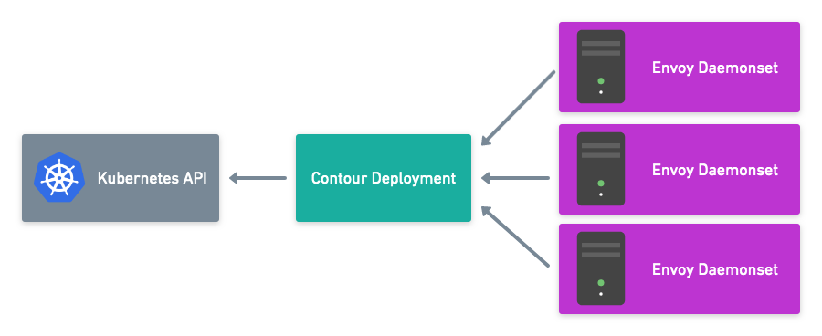

[https://projectcontour.io/contour-v014/](https://projectcontour.io/contour-v014/)

**WHAT YOU’LL NEED:**

- A TKG cluster (you can create one [following this post](/2020/07/17/deploying-vsphere-7-with-kubernetes-and-tanzu-kubernetes-grid-tkg-cluster/))
- Download the ***Tanzu Kubernetes Grid 1.1 Extension manifests*** [at here](https://my.vmware.com/en/web/vmware/downloads/details?downloadGroup=TKG-110&productId=988&rPId=48121)

For this lab, we’ll install the Contour ingress controller onto a TKG cluster, and we’ll then deploy a sample app (supplied within the manifest) for testing the Ingress services. The overall service topology will look like this:

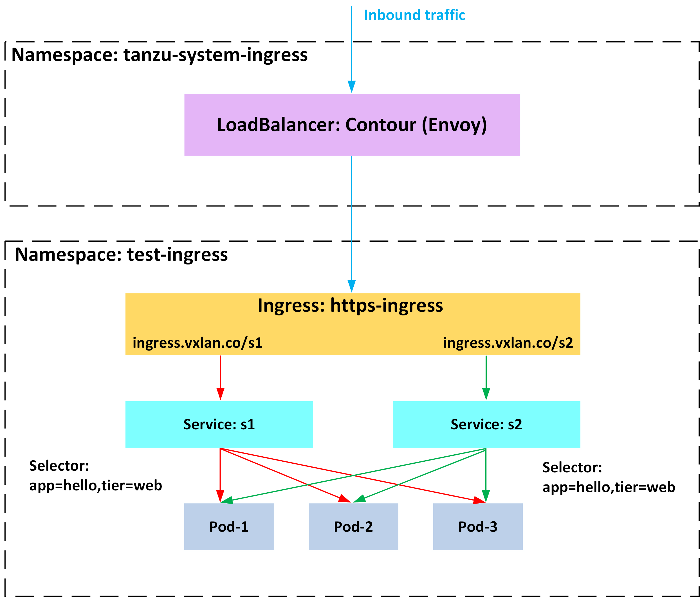

**Install the Contour Ingress Controller**

To begin, unzip the TKG extension manifest (I’m using v1.1.0).

```
[root@pacific-ops01 ~]# tar -xzf tkg-extensions-manifests-v1.1.0-vmware.1.tar.gz 
```

Log into your TKG cluster and make sure you are in the correct context.

```
[root@pacific-ops01 ~]# kubectl vsphere login --server=192.168.100.129 --vsphere-username administrator@vsphere.local --insecure-skip-tls-verify --tanzu-kubernetes-cluster-name dev01-tkg-01 --tanzu-kubernetes-cluster-namespace dev01
[root@pacific-ops01 ~]# kubectl config use-context dev01-tkg-01 
```

Next, install the Cert-Manager (for Contour Ingress) onto the TKG cluster.

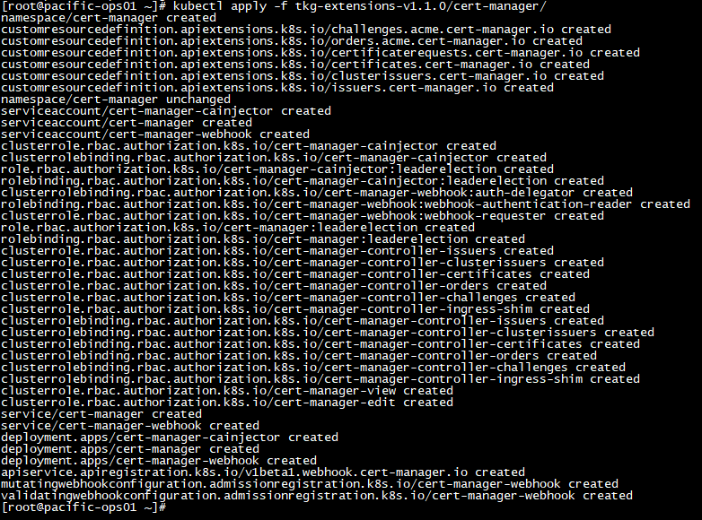

Before we can install Contour and Envoy, we’ll need to make a small change to the Envoy service config (*02-service-envoy.yaml*). As illustrated in the [service topology](contour.png), we will deploy a LoadBalancer in front of the ingress controller. So we’ll update the Envoy service type from *NodePort* (default) to *LoadBalancer*.

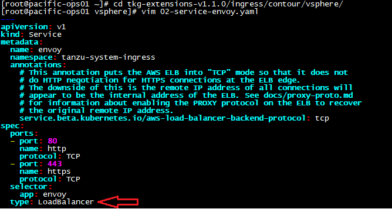

Now deploy Contour and Envoy onto the cluster.

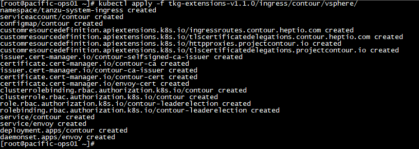

We can see a Contour deployment, and an Envoy daemonset of 3x (we have 3 worker nodes) have been deployed under the namespace of *tanzu-system-ingress*. Also, take a note of the external IP (192.168.100.130) of the Envoy LoadBalancer service as this will be used by our Ingress services.

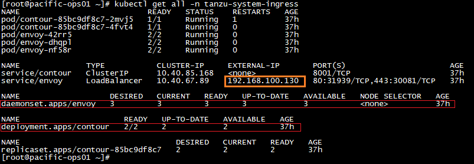

**Deploy a Sample App for testing Ingress Services**

Deploy the sample app from within the manifest, this will create:

- one new namespace called “test-ingress”
- one deployment of the “helloweb” app, with a Replicaset of 3x Pods
- two separate services called “s1” & “s2” — Note: both services are actually pointing to the same 3x Pods (as they are using the same Pod selector)

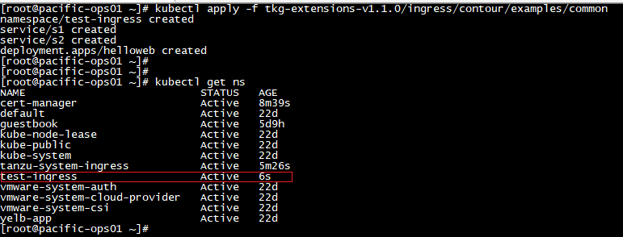

Verify the Pods are up and running

```
[root@pacific-ops01 ~]# kubectl get pods -n test-ingress 
NAME                        READY   STATUS    RESTARTS   AGE
helloweb-7cd97b9cb8-qjwtk   1/1     Running   0          50s
helloweb-7cd97b9cb8-r9s8g   1/1     Running   0          51s
helloweb-7cd97b9cb8-swztl   1/1     Running   0          51s
```

and both services (s1 & s2) are deployed as expected.

```
[root@pacific-ops01 ~]# kubectl get svc -n test-ingress 
NAME   TYPE        CLUSTER-IP      EXTERNAL-IP   PORT(S)   AGE
s1     ClusterIP   10.40.183.104   <none>        80/TCP    1m
s2     ClusterIP   10.40.129.12    <none>        80/TCP    1m
```

We can’t get to these services yet as they are internal K8s services (ClusterIP) only. We’ll need to deploy an Ingress object so that Contour can expose these services and route traffic to them from external. The good news is that there’s already an Ingress config template provided in the manifest. I’ve made the following changes to the template as per my lab environment (my lab domain is *vxlan.co*). Note the hostname (URL) and the path (URI) as we’ll be using these to access the two services.

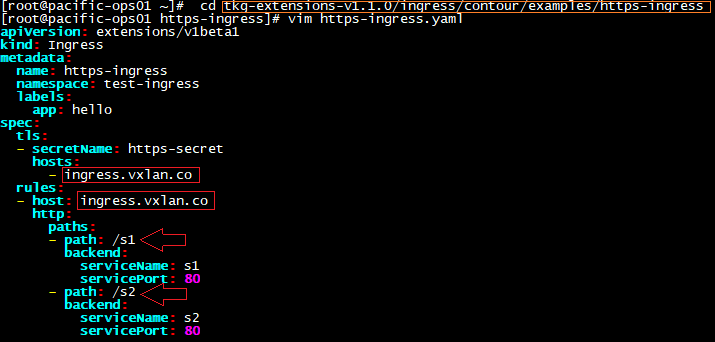

Deploy the Ingress object.

```
[root@pacific-ops01 ~]# cd tkg-extensions-v1.1.0/ingress/contour/examples/https-ingress 
[root@pacific-ops01 https-ingress]# kubectl apply -f .
ingress.extensions/https-ingress created
secret/https-secret created
```

Verify the Ingress service is running as expected

```
[root@pacific-ops01 https-ingress]# kubectl get ingress -n test-ingress 
NAME            HOSTS              ADDRESS   PORTS     AGE
https-ingress   ingress.vxlan.co             80, 443   2m
```

Create a DNS record with the ingress hostname by pointing to the Envoy load balancer external IP.

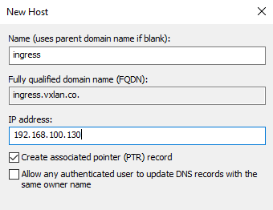

Now test access to the s1 service by browsing *[https://ingress.vxlan.co/s1](https://ingress.vxlan.co/s1)*

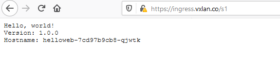

and s2 service by browsing *[https://ingress.vxlan.co/s2](https://ingress.vxlan.co/s2)*

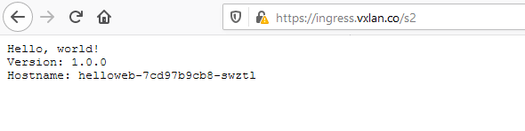

Congrats, you have successfully deployed a Contour Ingress controller on a TKG cluster!
