In this post we’ll explore the vSphere 7 with Kubernetes capabilities and the detailed deployment steps in order to provision a vSphere supervisor cluster and a Tanzu Kubernetes Grid (TKG) cluster.

If you are new to vSphere 7 and Tanzu Kubernetes, below are some background readings that can be used as a good start point:

- [Project Pacific – Technical Overview](https://blogs.vmware.com/vsphere/2019/08/project-pacific-technical-overview.html)
- [vSphere 7 – Introduction to the vSphere Pod Service](https://blogs.vmware.com/vsphere/2019/08/project-pacific-technical-overview.html)
- [vSphere 7 – Introduction to Kubernetes Namespaces](https://blogs.vmware.com/vsphere/2019/08/project-pacific-technical-overview.html)
- [vSphere 7 – Introduction to Tanzu Kubernetes Grid Clusters](https://blogs.vmware.com/vsphere/2019/08/project-pacific-technical-overview.html)

**Requirements**

I’ll be building a nested vSphere7/VCF4 environment in my home lab ESXi host, and the overall lab setup looks like below:

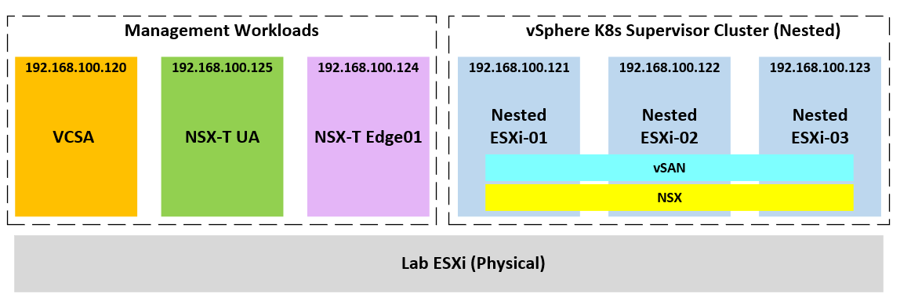

As you might have guessed, this lab requires a lot of resources! In specific you’ll need the following:

- physical ESXi host running at least vSphere 6.7 or later
- capacity to provision VM with up to 8x vCPU
- capacity to provision up to 140-180GB of RAM
- around 1TB of spare storage
- a flat /24 subnet connected to external & Internet (can be shared with lab management network)
- access to vSphere 7 ESXi/VCSA and NSX-T/Edge 3.0 OVA files and trial licenses

In order to save time on provisioning the vSphere/VCF stack, I’m using [William Lam](https://www.linkedin.com/in/lamwilliam/)‘s vSphere 7 automation script as [discussed here](https://www.virtuallyghetto.com/2020/04/automated-vsphere-7-and-vsphere-with-kubernetes-lab-deployment-script.html). You can find the PowerShell code and further details at his [Git repository](https://github.com/lamw/vghetto-vsphere-with-kubernetes-external-nsxt-automated-lab-deployment).

All demo apps and configuration yaml files used in this lab can be found [at my Git Repo](https://github.com/sc13912/vs7-k8s.git).

We’ll cover the following steps:

- **\#1 – build a (nested) vSphere7/VCF4 stack**
- **\#2 – configure workload management and deploy supervisor cluster**
- **\#3 – deploy a demo app with native vSphere Pod services**
- **\#4 – deploy a TKG cluster**
- **\#5 – vSphere environment overview (post deployment)**

**Step-1: Deploy a vSphere7/VCF4 stack**

First, you’ll need to download William’s PowerShell script and modify it based on your own lab environment. You’ll also need to download the required OVAs and place them in the same path as defined in the script — Note for the VCSA you’ll need to unzip the ISO and point the path to the unzipped folder!

Now let’s run the PowerShell script and you’ll see a deployment summary page like this:

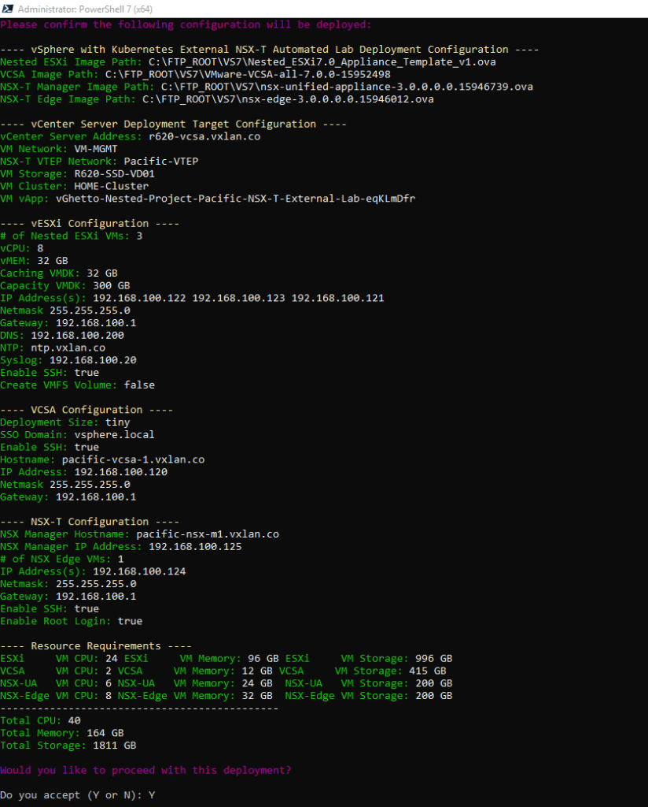

Hit “Y” to kickoff the deployment and for me the whole process took just a little over 1 hour.

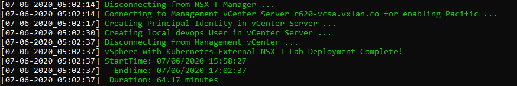

Once the script completes you should see a vAPP look like this deployed under your physical ESXi host.

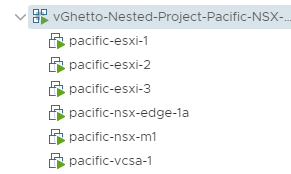

**Step-2: Configure Workload Management and Deploy Supervisor Cluster**

To activate vSphere 7 native Kubernetes capabilities, we need to enable workload management which will configure our nested ESXi cluster as a supervisor cluster. First, log into the nested VCSA, and navigate to “Menu” —\> “Workload Management”, click “Enable”:

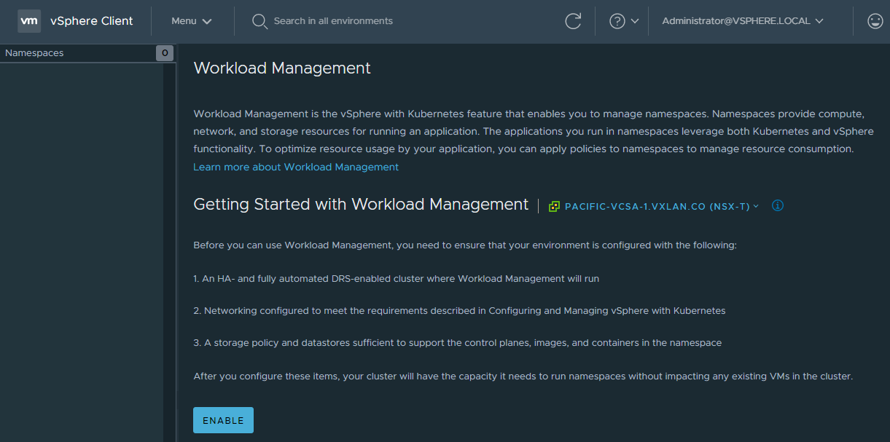

Select our nested ESXi cluster to be configured as a supervisor cluster

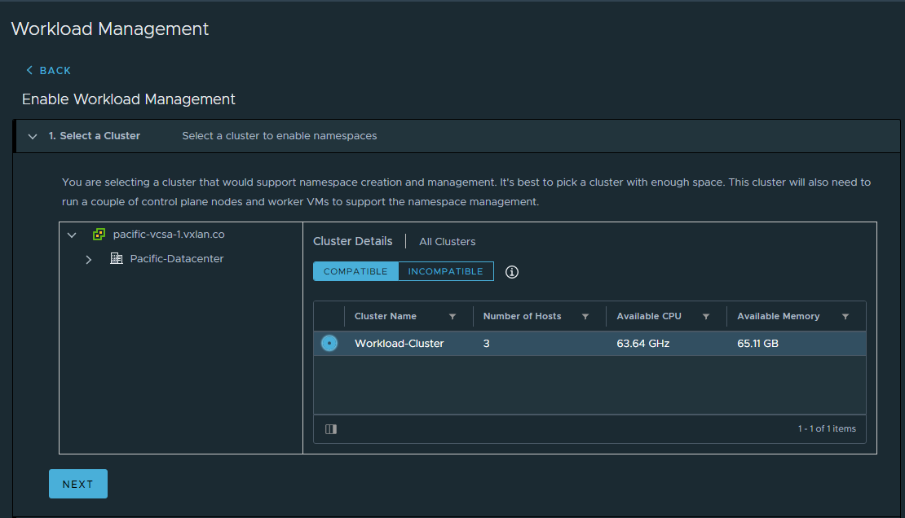

Select supervisor Control Plane VM size

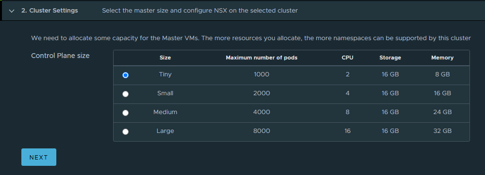

Configure the management network settings for the supervisor cluster, note that we’ll need to reserve a 5-address block for the control plane VMs including a VIP.

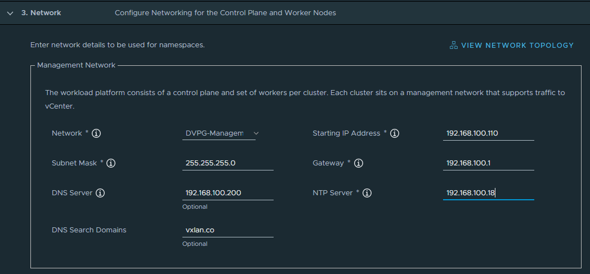

Next, configure vSphere Pod network settings — for this demo we’ll reserve one /27 for the Ingress CIDR block as the NAT IPs to be consumed by Load Balancer or Ingress services; and another /27 for the Egress CIDR block as outbound SNAT IPs for provisioned K8s namespaces.

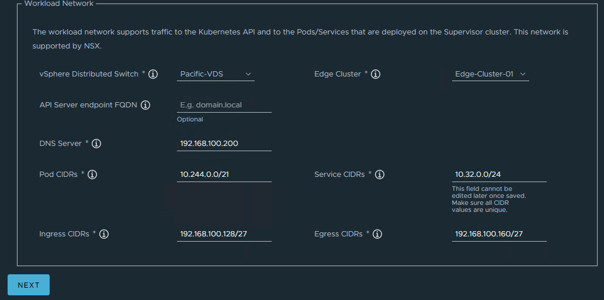

Configure storage policies by selecting the pre-provisioned pacific-gold vSAN policy, then click “Finish” to begin the deployment of supervisor cluster.

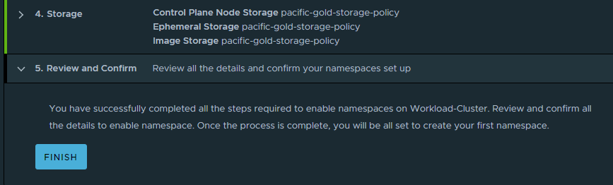

This process will take another 20~30 mins to complete, and you’ll see a cluster of 3x control plan VMs being provisioned.

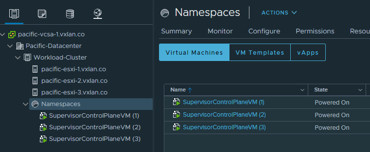

Back to the “Workload Management” —\> “Cluster”, you should see our supervisor cluster (consists of 3x ESXi hosts) is now up and running. Also, take a note of the VIP address of the control plan VMs as we’ll be using that IP to log into the supervisor cluster.

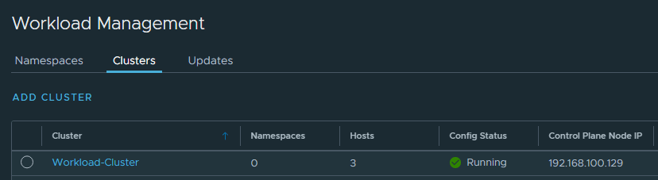

**Step-3: Deploy a demo app with Native vSphere Pods**

To consume the native vSphere Kubernetes Pods capabilities, we need to firstly create a vSphere Namespace, which is mapped to a K8s namespace within the supervisor cluster. vSphere leverages the K8s namespace logical construct to provide resource segmentation for the vSphere pods/services/deployments, and it offers a flexible way to attach authorization and network/storage policies for different environments.

Go to “Menu” —\> “Workload Management”, and click “Create Namespace”.

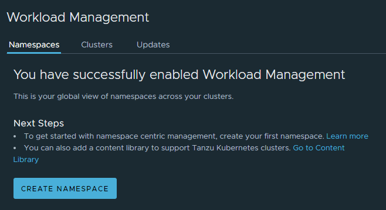

Since we’ll be deploying a [sample guestbook app](https://github.com/kubernetes/examples/tree/master/guestbook/), we’ll name the namespace “guestbook”.

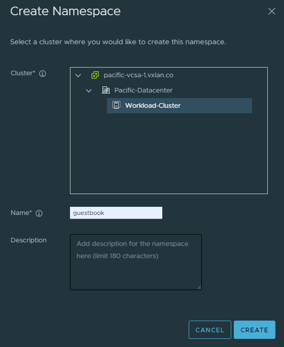

Next, grant the vSphere admin with editor’s permission to the namespace, and assign the vSAN storage policy “pacific-gold-storage-policy” for the namespace —\> this is important as (behind the scene) we are leveraging the vSAN [CSI (container storage interface)](https://docs.vmware.com/en/VMware-vSphere/6.7/Cloud-Native-Storage/GUID-AD5AE35E-5209-4775-988C-F86D0E4F0C29.html) driver to provide persistent storage support for the cluster.

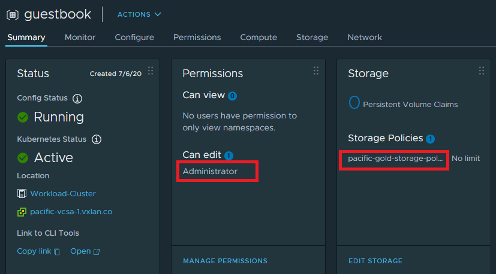

Now we are ready to dive into the vSphere supervisor cluster! Before we can do that, let’s get the Kubectl CLI and the vSphere plugin package.  
Open the CLI tools link at here:

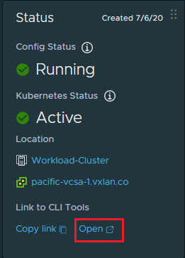

Follow the onscreen instructions to download and install the vSphere Kubectl CLI toolkit onto your management host (I’m using a CentOS7 VM).

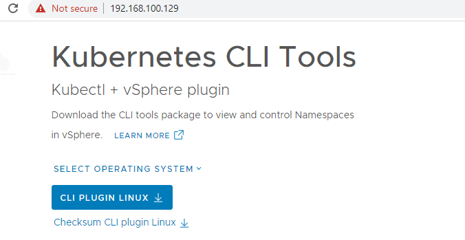

Time to log into our superviosr K8s cluster! — remember to use the control plane VIP (192.168.100.129) as noted before.

```
[root@Pacific-Ops01]# kubectl vsphere login --server=192.168.100.129 -u administrator@vsphere.local --insecure-skip-tls-verify
```

switch context to our “guestbook” namespace

```
[root@Pacific-Ops01]# kubectl config use-context guestbook
Switched to context "guestbook".
```

take a look of the cluster nodes, you’ll see the 3x master nodes (supervisor control VMs) and 3x worker nodes (ESXi hosts)

```
[root@pacific-ops01 vs7-k8s]# kubectl get nodes -o wide
NAME                               STATUS   ROLES    AGE   VERSION                    INTERNAL-IP       EXTERNAL-IP   OS-IMAGE                 KERNEL-VERSION      CONTAINER-RUNTIME
420a7d079f62a8ae40fb4bffea3cee48   Ready    master   8d    v1.16.7-2+bfe512e5ddaaaa   10.244.0.196      <none>        VMware Photon OS/Linux   4.19.84-1.ph3-esx   docker://18.9.9
420acb46e78281fcfaf3f45ea3d7c577   Ready    master   8d    v1.16.7-2+bfe512e5ddaaaa   10.244.0.194      <none>        VMware Photon OS/Linux   4.19.84-1.ph3-esx   docker://18.9.9
420aef27c9f45b01e8e0ed4a7e45cf2e   Ready    master   8d    v1.16.7-2+bfe512e5ddaaaa   10.244.0.195      <none>        VMware Photon OS/Linux   4.19.84-1.ph3-esx   docker://18.9.9
pacific-esxi-1                     Ready    agent    8d    v1.16.7-sph-4d52cd1        192.168.100.121   <none>        <unknown>                <unknown>           <unknown>
pacific-esxi-2                     Ready    agent    8d    v1.16.7-sph-4d52cd1        192.168.100.122   <none>        <unknown>                <unknown>           <unknown>
pacific-esxi-3                     Ready    agent    8d    v1.16.7-sph-4d52cd1        192.168.100.123   <none>        <unknown>                <unknown>           <unknown>
```

Clone the [git repo](https://github.com/sc13912/vs7-k8s.git) for this demo lab, and apply a dummy network policy (permit all ingress and all egress traffic)

```
[root@pacific-ops01 ~]# git clone https://github.com/sc13912/vs7-k8s.git
Cloning into 'vs7-k8s'...
remote: Enumerating objects: 15, done.
remote: Counting objects: 100% (15/15), done.
remote: Compressing objects: 100% (10/10), done.
remote: Total 15 (delta 2), reused 12 (delta 2), pack-reused 0
Unpacking objects: 100% (15/15), done.
[root@pacific-ops01 ~]# cd vs7-k8s/
[root@pacific-ops01 vs7-k8s]# kubectl apply -f network-policy-allowall.yaml
networkpolicy.networking.k8s.io/allow-all created
```

To deploy the guestbook app, we’ll leverage the dynamic persistent volume provisioning capability of the vSphere CSI driver by calling the vSAN storage class “pacific-gold-storage-policy”

``` brush:
kind: PersistentVolumeClaim
apiVersion: v1
metadata:
  namespace: guestbook
  name: redis-master-claim
spec:
  accessModes:
    - ReadWriteOnce
  storageClassName: pacific-gold-storage-policy
  resources:
    requests:
      storage: 2Gi
```

apply the PVCs yamls for both the redis master and slave Pods

```
[root@pacific-ops01 vs7-k8s]# kubectl apply -f guestbook/guestbook-master-claim.yaml
persistentvolumeclaim/redis-master-claim created

[root@pacific-ops01 vs7-k8s]# kubectl apply -f guestbook/guestbook-slave-claim.yaml 
persistentvolumeclaim/redis-slave-claim created
```

verify both PVCs are showing “Bound” status mapped to two dynamically provisioned persistent volumes (PVs)

```
[root@pacific-ops01 vs7-k8s]# kubectl get pvc
NAME                 STATUS   VOLUME                                     CAPACITY   ACCESS MODES   STORAGECLASS                  AGE
redis-master-claim   Bound    pvc-0102e725-41ad-440b-8a02-8af4d4768ebb   2Gi        RWO            pacific-gold-storage-policy   14m
redis-slave-claim    Bound    pvc-fb4b7bbe-9b35-40e8-b251-8f2effe85a2d   2Gi        RWO            pacific-gold-storage-policy   13m
```

Now deploy the guestbook app.

```
[root@pacific-ops01 vs7-k8s]# kubectl apply -f guestbook/guestbook-all-in-one.yaml 
service/redis-master created
deployment.apps/redis-master created
service/redis-slave created
deployment.apps/redis-slave created
service/frontend created
deployment.apps/frontend created
```

wait until all the pods up and running

```
[root@pacific-ops01 vs7-k8s]# kubectl get pods -o wide -n guestbook 
NAME                            READY   STATUS    RESTARTS   AGE     IP             NODE             NOMINATED NODE   READINESS GATES
frontend-6cb7f8bd65-kjgh2       1/1     Running   0          3m2s    10.244.0.214   pacific-esxi-2   <none>           <none>
frontend-6cb7f8bd65-mlv79       1/1     Running   0          3m2s    10.244.0.213   pacific-esxi-1   <none>           <none>
frontend-6cb7f8bd65-slz6b       1/1     Running   0          3m2s    10.244.0.215   pacific-esxi-2   <none>           <none>
frontend-6cb7f8bd65-vtkfz       1/1     Running   0          3m3s    10.244.0.212   pacific-esxi-1   <none>           <none>
redis-master-64fb8775bf-65sdc   1/1     Running   0          3m10s   10.244.0.210   pacific-esxi-1   <none>           <none>
redis-slave-779b6d8f79-bj9q7    1/1     Running   0          3m7s    10.244.0.211   pacific-esxi-2   <none>           <none>
```

retrieve the Load Balancer service IP — note NSX has allocated an IP from the /27 Ingress CIDR block

```
[root@pacific-ops01 vs7-k8s]# kubectl get svc -n guestbook 
NAME           TYPE           CLUSTER-IP    EXTERNAL-IP       PORT(S)        AGE
frontend       LoadBalancer   10.32.0.209   192.168.100.130   80:32610/TCP   4m15s
redis-master   ClusterIP      10.32.0.34    <none>            6379/TCP       4m22s
redis-slave    ClusterIP      10.32.0.197   <none>            6379/TCP       4m21s
```

Hit the load balancer IP in browser to test the guestbook app. Enter and submit some messages, and try to destroy and redeploy the app, your data will be kept by the redis PVs.

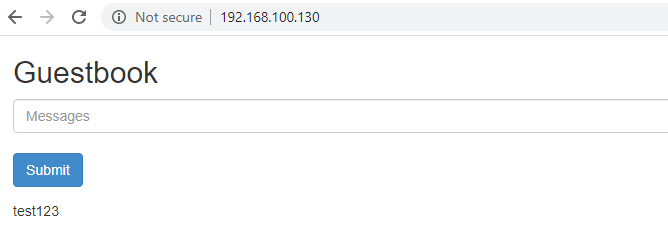

**Step-4: Deploy a TKG cluster**

Before we can deploy a TKG cluster, we’ll need to create a content library subscription by pointing to `https://wp-content.vmware.com/v2/latest/lib.json`, which contains the VMware Tanzu Kubernetes images:

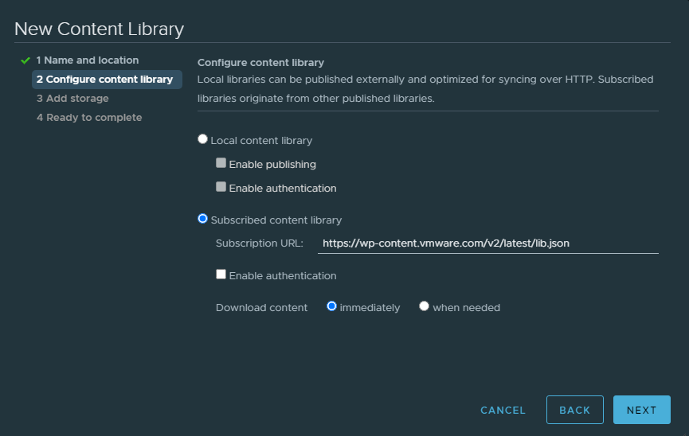

wait for about 5~10 mins for the library to fully sync, at this point of time I can see two versions of Tanzu K8s images:

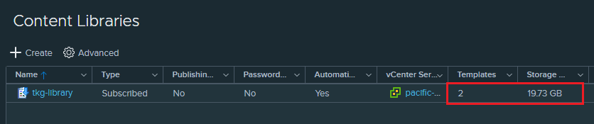

Next, create a new namespace called “dev01” which will be hosting our new TKG cluster.

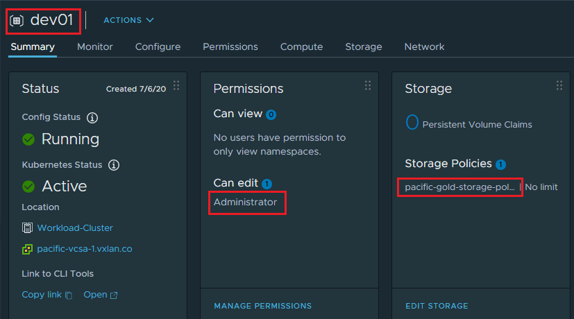

Back to the CLI, we’ll switch context from “guestbook” to the new “dev01” namespace:

```
[root@pacific-ops01 vs7-k8s]# kubectl config get-contexts 
CURRENT   NAME              CLUSTER           AUTHINFO                                          NAMESPACE
          192.168.100.129   192.168.100.129   wcp:192.168.100.129:administrator@vsphere.local   
          dev01             192.168.100.129   wcp:192.168.100.129:administrator@vsphere.local   dev01
*         guestbook         192.168.100.129   wcp:192.168.100.129:administrator@vsphere.local   guestbook
[root@pacific-ops01 vs7-k8s]# 
[root@pacific-ops01 vs7-k8s]# kubectl config use-context dev01 
Switched to context "dev01".
```

let’s examine the two TKG K8s versions available from the library:

```
[root@pacific-ops01 vs7-k8s]# kubectl get virtualmachineimages
NAME                                                        AGE
ob-15957779-photon-3-k8s-v1.16.8---vmware.1-tkg.3.60d2ffd   9m44s
ob-16466772-photon-3-k8s-v1.17.7---vmware.1-tkg.1.154236c   9m44s
```

and there are also [different classes](https://docs.vmware.com/en/VMware-vSphere/7.0/vmware-vsphere-with-kubernetes/GUID-7351EEFF-4EF0-468F-A19B-6CEA40983D3D.html) for the TKG VM templates:

```
[root@pacific-ops01 vs7-k8s]# kubectl get  virtualmachineclasses
NAME                 AGE
best-effort-large    4h48m
best-effort-medium   4h48m
best-effort-small    4h48m
best-effort-xlarge   4h48m
best-effort-xsmall   4h48m
guaranteed-large     4h48m
guaranteed-medium    4h48m
guaranteed-small     4h48m
guaranteed-xlarge    4h48m
guaranteed-xsmall    4h48m
```

so I have prepared the following yaml config for my TKG cluster — I’m using 1x master node and 3x worker nodes, all within the “guaranteed-small” machine classes.

``` brush:
[root@pacific-ops01 vs7-k8s]# cat tkg-cluster01.yaml 
apiVersion: run.tanzu.vmware.com/v1alpha1
kind: TanzuKubernetesCluster
metadata:
  name: dev01-tkg-01
  namespace: dev01
spec:
  distribution:
    version: v1.16
  topology:
    controlPlane:
      class: guaranteed-small
      count: 1
      storageClass: pacific-gold-storage-policy
    workers:
      class: guaranteed-small
      count: 3
      storageClass: pacific-gold-storage-policy
  settings:
    network:
      cni:
        name: calico
      services:
        cidrBlocks: ["10.36.0.0/16"]
      pods:
        cidrBlocks: ["10.242.0.0/16"]
```

apply the config to create the TKG cluster

```
[root@pacific-ops01 vs7-k8s]# kubectl apply -f tkg-cluster01.yaml 
tanzukubernetescluster.run.tanzu.vmware.com/dev01-tkg-01 created
```

monitor the cluster creation process, and eventually you’ll see all 4x TKG VMs are up and running:

```
[root@pacific-ops01 vs7-k8s]# kubectl get tanzukubernetesclusters.run.tanzu.vmware.com 
NAME           CONTROL PLANE   WORKER   DISTRIBUTION                     AGE   PHASE
dev01-tkg-01   1               3        v1.16.8+vmware.1-tkg.3.60d2ffd   13m   creating

[root@pacific-ops01 vs7-k8s]# kubectl get machines 
NAME                                         PROVIDERID                                       PHASE
dev01-tkg-01-control-plane-n9hqx             vsphere://420aff74-1367-9654-b2ba-59f8a64c3b52   running
dev01-tkg-01-workers-nwmhh-c766c8f77-nnbsj   vsphere://420aca94-26f3-f1c6-e112-607c28c439a4   provisioned
dev01-tkg-01-workers-nwmhh-c766c8f77-pcv65   vsphere://420a2c44-f4e3-f698-b173-86a6b4b3fa27   provisioned
dev01-tkg-01-workers-nwmhh-c766c8f77-zqfwj   vsphere://420a2c16-3002-b2c2-ef5d-d4e3d7a08bf8   provisioned

[root@pacific-ops01 vs7-k8s]# kubectl get machines            
NAME                                         PROVIDERID                                       PHASE
dev01-tkg-01-control-plane-n9hqx             vsphere://420aff74-1367-9654-b2ba-59f8a64c3b52   running
dev01-tkg-01-workers-nwmhh-c766c8f77-nnbsj   vsphere://420aca94-26f3-f1c6-e112-607c28c439a4   running
dev01-tkg-01-workers-nwmhh-c766c8f77-pcv65   vsphere://420a2c44-f4e3-f698-b173-86a6b4b3fa27   running
dev01-tkg-01-workers-nwmhh-c766c8f77-zqfwj   vsphere://420a2c16-3002-b2c2-ef5d-d4e3d7a08bf8   running
```

Time to log into our new cluster!

```
[root@pacific-ops01 vs7-k8s]# kubectl vsphere login --server=192.168.100.129 --vsphere-username administrator@vsphere.local --insecure-skip-tls-verify --tanzu-kubernetes-cluster-name dev01-tkg-01 --tanzu-kubernetes-cluster-namespace dev01

[root@pacific-ops01 vs7-k8s]# kubectl config use-context dev01-tkg-01 
Switched to context "dev01-tkg-01".
```

Once you are logged in and switched to the cluster “dev01-tkg-01” namespace, verify that you can see all 4x TKG nodes are in “Ready” status

```
[root@pacific-ops01 ~]# kubectl get nodes 
NAME                                         STATUS   ROLES    AGE   VERSION
dev01-tkg-01-control-plane-n9hqx             Ready    master   22m   v1.16.8+vmware.1
dev01-tkg-01-workers-nwmhh-c766c8f77-nnbsj   Ready    <none>   56s   v1.16.8+vmware.1
dev01-tkg-01-workers-nwmhh-c766c8f77-pcv65   Ready    <none>   61s   v1.16.8+vmware.1
dev01-tkg-01-workers-nwmhh-c766c8f77-zqfwj   Ready    <none>   85s   v1.16.8+vmware.1
```

We are now ready to deploy demo apps into the TKG cluster. First, update the cluster RBAC and Pod Security Policies by applying the supplied yaml config.

```
[root@pacific-ops01 vs7-k8s]# kubectl apply -f allow-nonroot-clusterrole.yaml 
clusterrole.rbac.authorization.k8s.io/psp:privileged created
clusterrolebinding.rbac.authorization.k8s.io/all:psp:privileged created
```

Next, deploy the [yelb demo app](https://github.com/mreferre/yelb) :

```
[root@pacific-ops01 vs7-k8s]# kubectl apply -f yelb/yelb-lb.yaml
service/redis-server created
service/yelb-db created
service/yelb-appserver created
service/yelb-ui created
deployment.apps/yelb-ui created
deployment.apps/redis-server created
deployment.apps/yelb-db created
deployment.apps/yelb-appserver created
```

wait for all the Pods up and running, then retrieve the external IP of the yelb-ui Load Balancer (assigned by NSX from the pre-provisioned /27 Ingress CIDR block)

```
[root@pacific-ops01 vs7-k8s]# kubectl get svc yelb-ui -n yelb-app 
NAME      TYPE           CLUSTER-IP    EXTERNAL-IP       PORT(S)        AGE
yelb-ui   LoadBalancer   10.40.19.40   192.168.100.132   80:30116/TCP   9d
```

Go to the LB IP and you’ll see the app is running successfully.

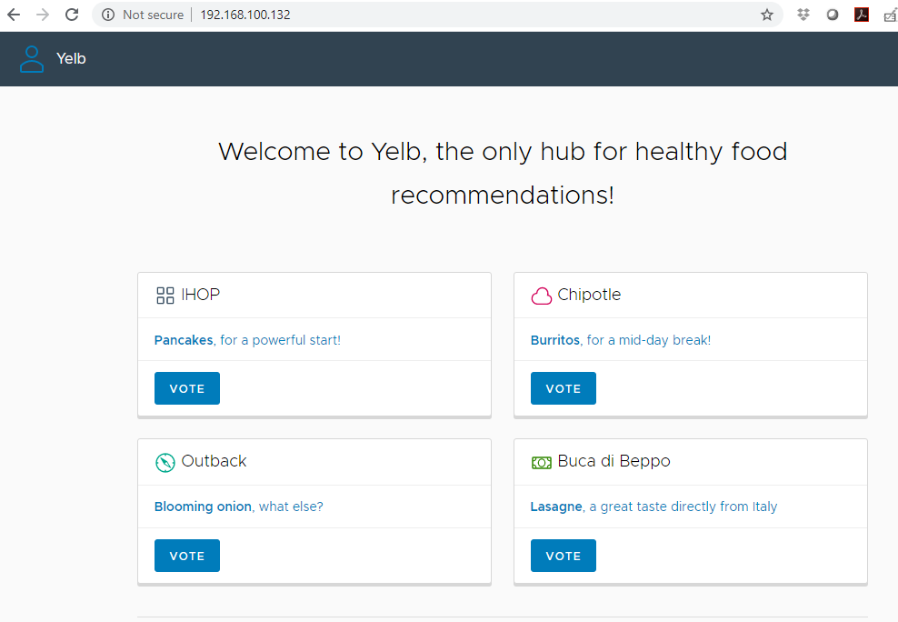

**vSphere Environment Overview**

Below is a quick overview of the vSphere Lab environment after you have completed all the steps. You should see a supervisor cluster (consists of 3x ESXi worker nodes and the 3x control VMs), a TKG cluster with its own namespace, and a guestbook microservice app deployed with native vSphere Pod services by leveraging vSAN CSI.

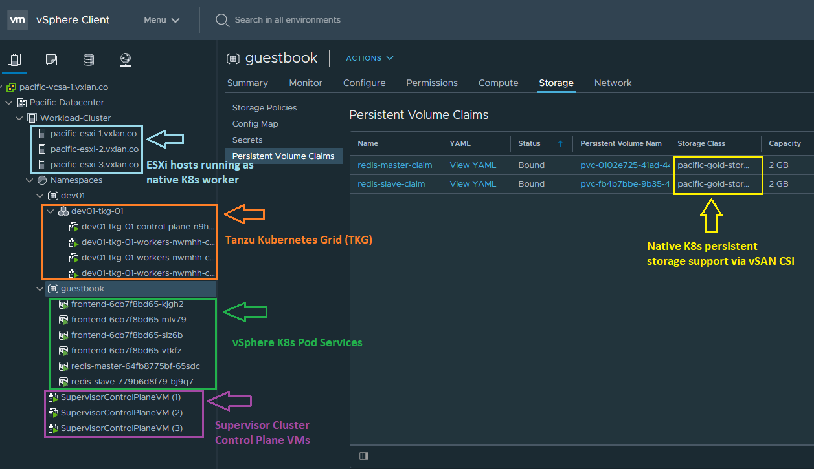

and here is the network topology overview captured from NSX-T UI. Note NSX automatically deploys a dedicated Tier-1 gateway for every TKG cluster created. The tier-1 gateway also provides egress SNAT and Ingress LB capabilities for the TKG cluster.

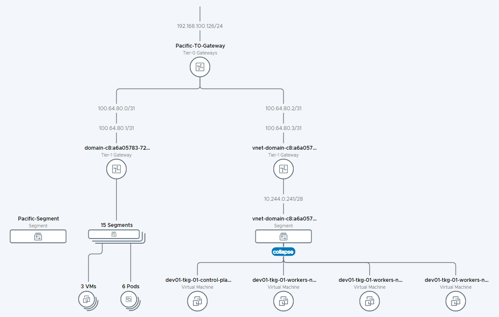
