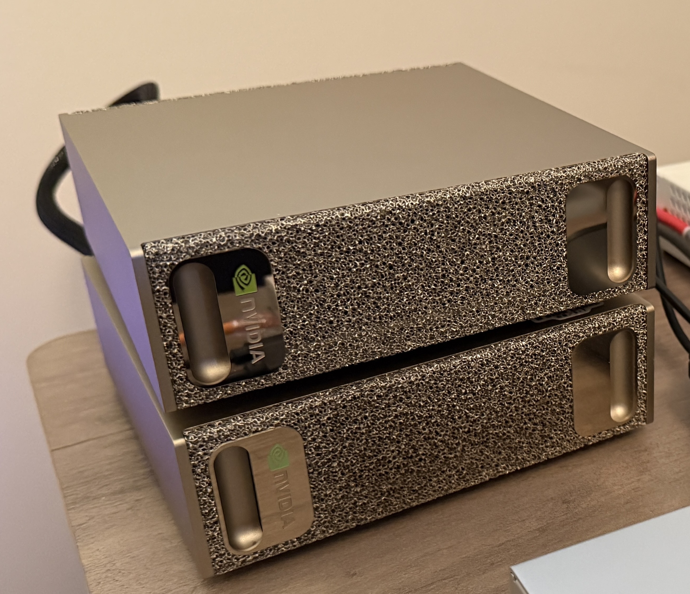
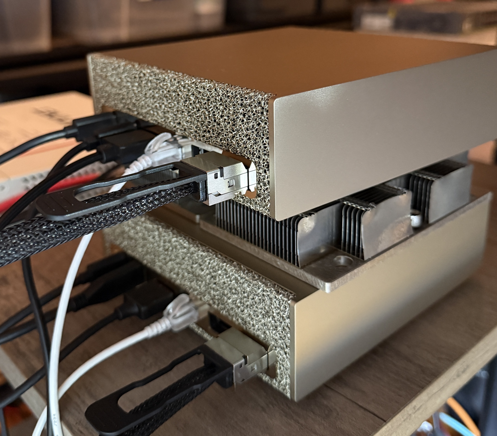

I've been running a single DGX Spark (GB10) as an EKS Hybrid Node for a while, and
recently a second one landed on my desk. The plan is to stack the two Sparks with one QSFP112 cable 
to create a little two-node EKS Hybrid cluster for distributed inference.
This post documents how to set up RoCE/RDMA networking and perform NCCL testing across the two Spark nodes, including all lessons learned. 




## The setup

- **2× NVIDIA DGX Spark (GB10)** `aarch64`, compute capability `12.1` (`sm_121`)
- **One QSFP112 or QSFP56 cable** - On GB10 that single cable presents as **two separate
  RDMA interfaces** (See [this blog](https://chronara.io/dev-news/gx10-connectx7-200gbe) for detailed explanation.)
- Configure static IPs on the two RoCE/RDMA interfaces, as per the [official playbook](https://build.nvidia.com/spark/connect-two-sparks/stacked-sparks)
  - `rocep1s0f1` / `enp1s0f1np1` — `100.127.251.x/24`
  - `roceP2p1s0f1` / `enP2p1s0f1np1` — `100.127.252.x/24`
- Ensure you have the [latest firmwares](https://docs.nvidia.com/dgx/dgx-spark/release-notes.html), 
inbox `mlx5` driver, `perftest` + `rdma-core` preinstalled. MTU 9000. RoCEv2
- A separate 1G interface `enP7s7` (`192.168.100.x/24`) for EKS Hybrid clustering & management. 
  - Spark01 = `192.168.100.101`
  - Spark02 = `192.168.100.102`
- **NCCL_IB_GID_INDEX=3** The IPv4-mapped RoCEv2 GID on these adapters (confirmed using `show_gids`. Note: v2 is the routable, UDP/IP-encapsulated version; v1 is L2-only)

**Prerequisites** (both nodes): install OpenMPI (`sudo apt install -y libopenmpi-dev`),
and make sure passwordless SSH works in **both** directions (101↔102) under the **same
username** — `mpirun` launches the remote rank over SSH.

> **Note:** `nvidia-smi` reports the GPU at PCIe "Gen1 x1" on GB10. That's cosmetic —
> the GPU talks to the CPU over NVLink-C2C, not PCIe.

## Verify the raw RDMA throughput first (`ib_write_bw`)

Before touching NCCL, confirm the wire itself is healthy. `ib_write_bw` is pure RDMA,
no CUDA, no NCCL — make sure you can achieve ~200Gbps/20GBs before proceeding to the NCCL test. 
Run one server per link over different UDP ports.

On spark-101 (servers, one per link):

```bash
ib_write_bw -d rocep1s0f1   -F --report_gbits -D 10 -s 1048576 -q 4 -p 18515 &
ib_write_bw -d roceP2p1s0f1 -F --report_gbits -D 10 -s 1048576 -q 4 -p 18516 &
```

On spark-102 (clients, point at each link's IP):

```bash
ib_write_bw -d rocep1s0f1   -F --report_gbits -D 10 -s 1048576 -q 4 -p 18515 100.127.251.101 &
ib_write_bw -d roceP2p1s0f1 -F --report_gbits -D 10 -s 1048576 -q 4 -p 18516 100.127.252.101 &
```

**Results (raw RDMA):**
```
---------------------------------------------------------------------------------------
                    RDMA_Write BW Test
 Dual-port       : OFF		Device         : rocep1s0f1
 Number of qps   : 4		Transport type : IB
 Connection type : RC		Using SRQ      : OFF
 PCIe relax order: ON
---------------------------------------------------------------------------------------
                    RDMA_Write BW Test
 Dual-port       : OFF		Device         : roceP2p1s0f1
 Number of qps   : 4		Transport type : IB
 Connection type : RC		Using SRQ      : OFF
 PCIe relax order: ON
 ibv_wr* API     : ON
 CQ Moderation   : 1
 Mtu             : 4096[B]
 Link type       : Ethernet
 GID index       : 3
 Max inline data : 0[B]
 rdma_cm QPs	 : OFF
 Data ex. method : Ethernet
---------------------------------------------------------------------------------------
 ibv_wr* API     : ON
 CQ Moderation   : 1
 Mtu             : 4096[B]
 Link type       : Ethernet
 GID index       : 3
 Max inline data : 0[B]
 rdma_cm QPs	 : OFF
 Data ex. method : Ethernet
---------------------------------------------------------------------------------------
... [Truncated] ...
---------------------------------------------------------------------------------------
 #bytes     #iterations    BW peak[Gb/sec]    BW average[Gb/sec]   MsgRate[Mpps]
 remote address: LID 0000 QPN 0x06e3 PSN 0x88913f RKey 0x11832d VAddr 0x00f0c34d49d000
 GID: 00:00:00:00:00:00:00:00:00:00:255:255:100:127:252:102
---------------------------------------------------------------------------------------
 #bytes     #iterations    BW peak[Gb/sec]    BW average[Gb/sec]   MsgRate[Mpps]
 1048576    70121            0.00               98.04  		   0.011687
---------------------------------------------------------------------------------------
 1048576    70120            0.00               98.04  		   0.011687
---------------------------------------------------------------------------------------
```

| Test | Bandwidth |
|---|---|
| **Both links concurrent** | **98 + 98 ≈ 196 Gb/s = ~24.5 GB/s** |

So ~24.5 GB/s is the raw ceiling. With the wire rate proven, we can now proceed to the container-native NCCL setup & testing. 

## Build the NCCL test components

Both benchmarks below need a GB10-capable NCCL. The stock NGC PyTorch container's
NCCL does **not** work on GB10 out of the box (see the Gotchas section below), so
we build NCCL and `nccl-tests` from source — on **both** nodes.


```bash
# 1. Build NCCL with GB10 (sm_121) kernels
git clone -b v2.28.9-1 https://github.com/NVIDIA/nccl.git ~/nccl
cd ~/nccl
make -j src.build NVCC_GENCODE="-gencode=arch=compute_121,code=sm_121"

# 2. Build nccl-tests against that NCCL, with MPI enabled (gives all_gather_perf etc.)
git clone https://github.com/NVIDIA/nccl-tests.git ~/nccl-tests
cd ~/nccl-tests
make MPI=1 MPI_HOME=/usr/lib/aarch64-linux-gnu/openmpi NCCL_HOME=$HOME/nccl/build

# 3. Point the runtime at the freshly built library
export LD_LIBRARY_PATH=$HOME/nccl/build/lib:$LD_LIBRARY_PATH
```

This mirrors NVIDIA's official DGX Spark path (`build.nvidia.com/spark/nccl/stacked-sparks`). Repeat the same build on spark-102.

## Run the NCCL benchmark

With the binaries built, run the `all_gather` test from spark-101. `mpirun` starts one
rank per node (spark-101 + spark-102) and the `-x` flags export the NCCL config to both:

```bash
mpirun -np 2 -H 192.168.100.101:1,192.168.100.102:1 \
  --mca plm_rsh_agent "ssh -o UserKnownHostsFile=/dev/null -o StrictHostKeyChecking=no" \
  --mca btl_tcp_if_include enP7s7 \
  --mca oob_tcp_if_include enP7s7 \
  -x LD_LIBRARY_PATH -x NCCL_SOCKET_IFNAME=enP7s7 \
  -x NCCL_IB_HCA==rocep1s0f1,roceP2p1s0f1 \
  -x NCCL_IB_MERGE_NICS=1 -x NCCL_CROSS_NIC=1 -x NCCL_IB_GID_INDEX=3 \
  ~/nccl-tests/build/all_gather_perf -b 512M -e 16G -f 2 -g 1
```

The flags that matter:

| Flag | Why |
|---|---|
| `-H 192.168.100.101:1,192.168.100.102:1` | One rank per node, addressed by their **EKS clustering / management IPs** |
| `--mca plm_rsh_agent "ssh ..."` | The SSH command MPI uses to launch the remote rank; the `-o` flags skip host-key prompts |
| `--mca btl_tcp_if_include/oob_tcp_if_include enP7s7` + `-x NCCL_SOCKET_IFNAME=enP7s7` | Pin **all** coordination traffic to the mgmt NIC — this is what avoids the `docker0` deadlock (see Gotcha 3) |
| `-x LD_LIBRARY_PATH` | Export the freshly built NCCL library path to the remote rank too |
| `-x NCCL_IB_HCA==rocep1s0f1,roceP2p1s0f1` + `-x NCCL_IB_MERGE_NICS=1` | Use **both** RoCE NICs as one — the single most important line (see Gotchas). Note the **double `==`**: that's NCCL's *exact-match* operator (single `=` is prefix-match) — leave it as `==` |
| `-x NCCL_IB_GID_INDEX=3` | The RoCEv2 GID we confirmed with `show_gids` earlier |

**Results (NCCL `all_gather` busbw):**
```
# nccl-tests version 2.19.6 nccl-headers=22809 nccl-library=22809
# Collective test starting: all_gather_perf
# nThread 1 nGpus 1 minBytes 536870912 maxBytes 17179869184 step: 2(factor) warmup iters: 1 iters: 20 agg iters: 1 validation: 1 graph: 0 unalign: 0
#
# Using devices
#  Rank  0 Group  0 Pid 1668270 on  spark-101 device  0 [000f:01:00] NVIDIA GB10
#  Rank  1 Group  0 Pid 1563448 on  spark-102 device  0 [000f:01:00] NVIDIA GB10
#
#                                                              out-of-place                       in-place          
#       size         count      type   redop    root     time   algbw   busbw  #wrong     time   algbw   busbw  #wrong 
#        (B)    (elements)                               (us)  (GB/s)  (GB/s)             (us)  (GB/s)  (GB/s)         
   536870912      67108864     float    none      -1  14594.4   36.79   18.39       0  13778.0   38.97   19.48       0
  1073741824     134217728     float    none      -1  26932.5   39.87   19.93       0  25564.1   42.00   21.00       0
  2147483648     268435456     float    none      -1  49245.0   43.61   21.80       0  46792.9   45.89   22.95       0
  4294967296     536870912     float    none      -1  93659.9   45.86   22.93       0  90915.7   47.24   23.62       0
  8589934592    1073741824     float    none      -1   183338   46.85   23.43       0   179211   47.93   23.97       0
 17179869184    2147483648     float    none      -1   361820   47.48   23.74       0   354934   48.40   24.20       0
# Out of bounds values : 0 OK
# Avg bus bandwidth    : 22.1205 
#
# Collective test concluded: all_gather_perf
```
**NCCL all_garther_perf with both RoCE NICs merged = ~22 GB/s avg (peaks ~24)** 

`#wrong=0` and **~22 GB/s** average busbw (peaking ~24 GB/s at 16 GB) — right at the
raw RDMA ceiling. That's the confirmation the two Sparks are stacked correctly and
ready for distributed workloads.

## Gotchas & lessons learned

**1. The stock container's NCCL is too old for GB10.** NVIDIA's PyTorch container
(`nvcr.io/nvidia/pytorch:25.08-py3`) ships **NCCL 2.27.7**, which predates GB10
(`sm_121`) support — collectives just hang and never complete. That's why we built NCCL
from source above. *Avoid the container NCCL; build 2.28.9+ yourself.*

**2. The container's bundled AWS plugin silently kills your bandwidth.** That same NGC
container bundles the `aws-ofi-nccl` plugin, which fails on GB10's unified memory and
makes NCCL **silently fall back to TCP** — ~3 GB/s instead of ~20, with no error. The
from-source NCCL avoids this entirely (it ships no such plugin).

**3. On an EKS/Kubernetes node, MPI deadlocks on the wrong interface.** This is the one
worth understanding in detail. If your Spark is also a k8s/k3s node, it has extra interfaces
— notably `docker0` at `172.17.0.1/16`, which is **identical on both machines**. `mpirun`
auto-discovers `docker0` and advertises the *same* `172.17.0.1` from both ends, so it
can't tell the peers apart and hangs at wire-up before NCCL even starts:

```
Open MPI accepted a TCP connection ... cannot find a corresponding process entry
```

To fix this, we need to understand the **three independent NCCL/MPI network layers** - each with its own
selector, and we need to pin all three explicitly:

| Layer | What it does | Selector |
|---|---|---|
| MPI launch (oob / btl) | process wire-up (TCP) | `--mca btl_tcp_if_include enP7s7 --mca oob_tcp_if_include enP7s7` |
| NCCL bootstrap | rendezvous (TCP) | `NCCL_SOCKET_IFNAME=enP7s7` |
| NCCL data | the actual transfer (RDMA) | `NCCL_IB_HCA==rocep1s0f1,roceP2p1s0f1` |

Pin the coordination traffic to the management NIC (`enP7s7`) and it starts cleanly every time.

**4. `NCCL_IB_MERGE_NICS=1` is required to achieve max ~20GB/s NCCL bandwidth**. 
Without merging, NCCL uses only one of the two logical NICs and caps at ~13.5 GB/s. 


### References

- [NVIDIA Playbook - NCCL for two DGX Sparks](https://build.nvidia.com/spark/nccl/stacked-sparks)
- [GX10 ConnectX-7 Interconnect: Why You're Getting 13Gbps instead of 200Gbps](https://chronara.io/dev-news/gx10-connectx7-200gbe)
- [DGX Spark Network Benchmarks: RDMA Performance over RoCE](https://www.linkedin.com/pulse/dgx-spark-network-benchmarks-rdma-performance-over-roce-thomas-8xlre/)
- [NVIDIA developer forum: NCCL bandwidth capped at 3 GB/s...](https://forums.developer.nvidia.com/t/nccl-bandwidth-capped-at-3-gb-s-gpu-pcie-topology-reports-gen1-x1-on-dgx-spark-fe/366266/4)
