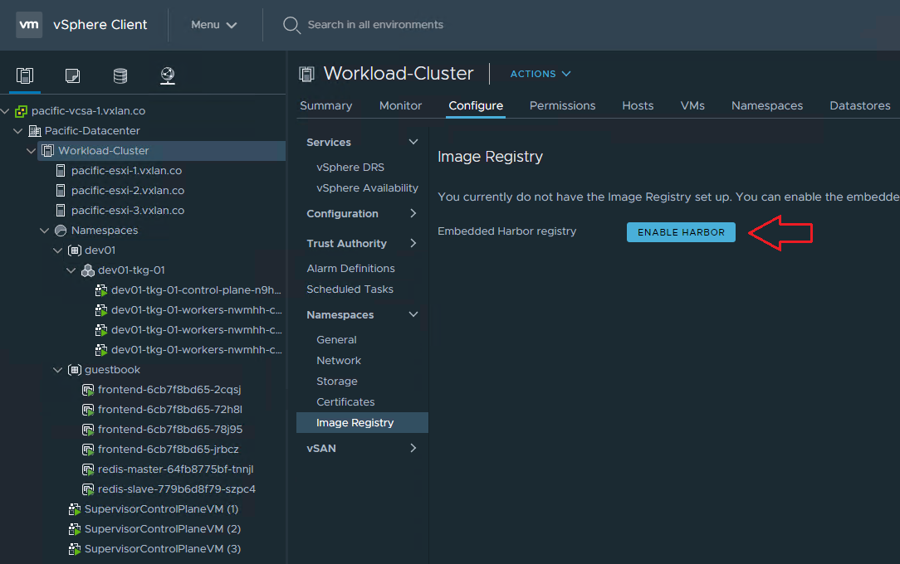
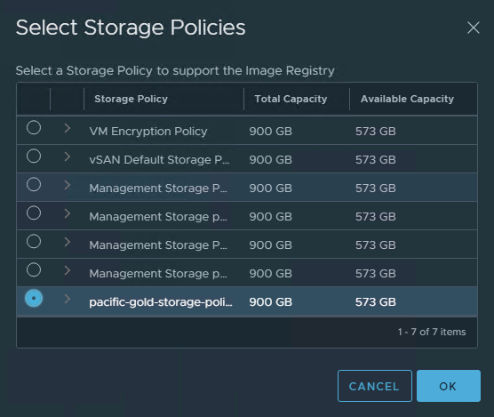
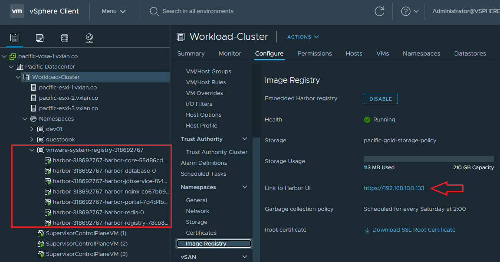
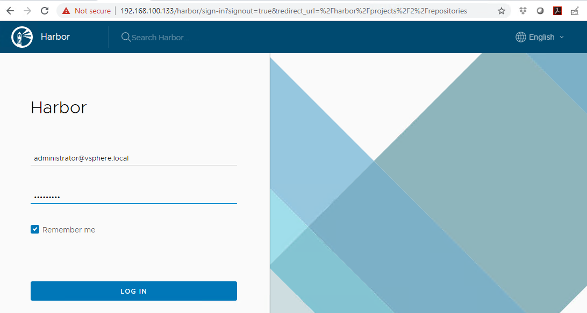
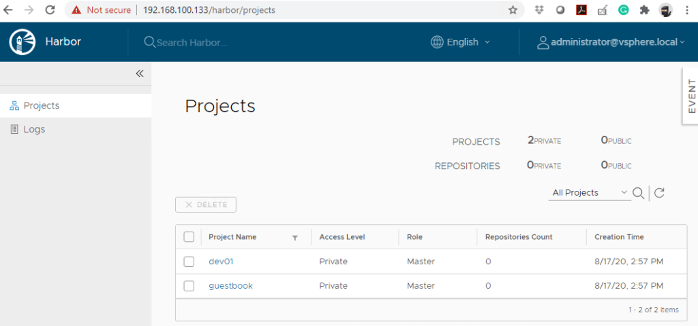
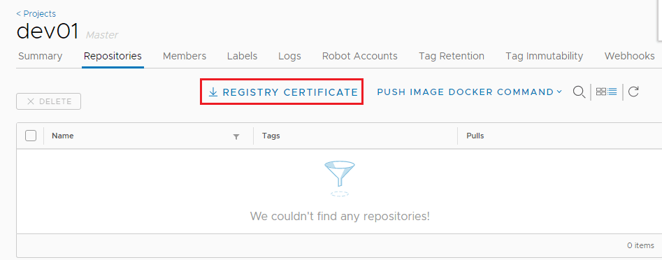
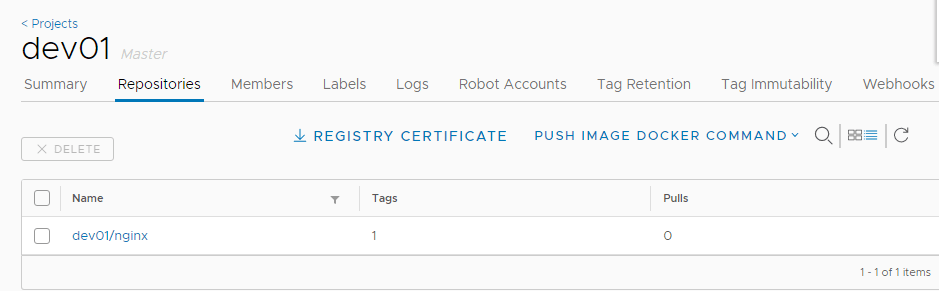
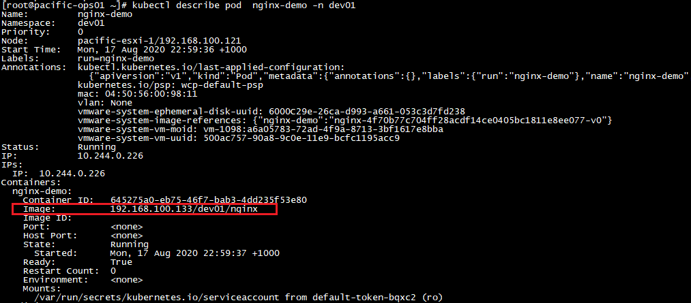

This will be a quick blog to demonstrate how to enable the (embedded) Harbor Image Registry in vSphere 7 with Kubernetes. [Harbor](https://goharbor.io/) was originally developed by VMware as a enterprise-grade private container registry. It was then donated to the CNCF in 2018 and recently became a [CNCF graduated project](https://www.cncf.io/projects/).

For this demo, we’ll activate the embedded Harbor register within the vSphere 7 Kubernetes environment, and integrate it with the Supervisor Cluster for container management and deployment.

**WHAT YOU’LL NEED:**

- 1x vSphere 7 with Kubernetes cluster (you can build one [following this post](/2020/07/17/deploying-vsphere-7-with-kubernetes-and-tanzu-kubernetes-grid-tkg-cluster/))
- [Kubernetes CLI tool for vSphere](https://docs.vmware.com/en/VMware-vSphere/7.0/vmware-vsphere-with-kubernetes/GUID-0F6E45C4-3CB1-4562-9370-686668519FCA.html) installed
- [Docker](https://docs.docker.com/engine/install/centos/) installed (on your client)

**Enabling the embedded Harbor Registry in vSphere 7 with Kubernetes**

To begin, go to your vSphere 7 “Workload Cluster —\> Namespaces —\> Image Registry”, and then click “Enable Harbor”.



Make sure to select the vSAN storage policy to provide persistent storage as required for the Harbor installation.



The process will take a few minutes, and you should see 7x vSphere Pods after Harbor is installed and enabled. Take a note of the Harbor URL — this is an external address of the K8s load balancer that is created by NSX-T.



**Push Container Images to Harbor Registry**

First, let’s log into the Harbor UI and take a quick look. Since this is embedded within vSphere, it supports the SSO login 🙂



Harbor will automatically create a project for every vSphere namespace we have created. In my case, there are two projects “dev01” and “guestbook” created, which are mapped to the two namespaces in my vSphere workload cluster.



Click the “dev01” project, and then “repository” — as expected it is currently empty, and we’ll be pushing container images to this repository for a quick test. However, before we can do that we’ll need to download and import the certificate to our client machine for certificate-based authentication. Click the “Registry Certificate” to download the ca.crt file.



Next, on the local client create a new directory under `/etc/docker/cert.d/` using the same name as the registry FQDN (URL).

```
[root@pacific-ops01 ~]# cd /etc/docker/certs.d/
[root@pacific-ops01 certs.d]# mkdir 192.168.100.133
[root@pacific-ops01 certs.d]# cd 192.168.100.133/
[root@pacific-ops01 192.168.100.133]# vim ca.crt
```

Now, let’s get a test (nginx) image, tag it, and try to push it to the *dev01* repository.

```
[root@pacific-ops01 ~]# docker login 192.168.100.133 --username administrator@vsphere.local
Password: 
Login Succeeded

[root@pacific-ops01 ~]# docker pull nginx
Using default tag: latest
Trying to pull repository docker.io/library/nginx ... 
latest: Pulling from docker.io/library/nginx
bf5952930446: Pull complete 
cb9a6de05e5a: Pull complete 
9513ea0afb93: Pull complete 
b49ea07d2e93: Pull complete 
a5e4a503d449: Pull complete 
Digest: sha256:b0ad43f7ee5edbc0effbc14645ae7055e21bc1973aee5150745632a24a752661
Status: Downloaded newer image for docker.io/nginx:latest
[root@pacific-ops01 ~]# 
[root@pacific-ops01 ~]# docker images
REPOSITORY          TAG                 IMAGE ID            CREATED             SIZE
docker.io/nginx     latest              4bb46517cac3        3 days ago          133 MB
[root@pacific-ops01 ~]# 
[root@pacific-ops01 ~]# docker tag docker.io/nginx 192.168.100.133/dev01/nginx
[root@pacific-ops01 ~]# 
[root@pacific-ops01 ~]# docker push 192.168.100.133/dev01/nginx
The push refers to a repository [192.168.100.133/dev01/nginx]
550333325e31: Pushed 
22ea89b1a816: Pushed 
a4d893caa5c9: Pushed 
0338db614b95: Pushed 
d0f104dc0a1f: Pushed 
latest: digest: sha256:179412c42fe3336e7cdc253ad4a2e03d32f50e3037a860cf5edbeb1aaddb915c size: 1362
[root@pacific-ops01 ~]# 
```

It works, perfect! Now refresh the repository and we can see the new nginx image we just pushed through.



**Deploy Kubernetes Pods to Supervisor Cluster from the Harbor Registry**

Let’s run a quick test to deploy a Pod using the nginx image from our Harbor Registry. First, log into the Supervisor Cluster and switch to the “dev01” namespace/context.

```
[root@pacific-ops01 ~]# kubectl vsphere login --server=192.168.100.129 --vsphere-username administrator@vsphere.local --insecure-skip-tls-verify
Password: 
Logged in successfully.
…
[root@pacific-ops01 ~]# kubectl config use-context dev01
Switched to context "dev01".
```

Make a nginx Pod config using the image path from our Harbor repository.

``` brush:
apiVersion: v1
kind: Pod
metadata:
  labels:
    run: nginx-demo
  name: nginx-demo
  namespace: dev01
spec:
  containers:
  - image: 192.168.100.133/dev01/nginx
    name: nginx-demo
  restartPolicy: Always
```

Deploy the Pod.

```
[root@pacific-ops01 ~]# kubectl apply -f nginx-demo.yaml 
pod/nginx-demo created
```

Monitor the events and soon we can see the Pod is deployed successfully from the image fetched from the Harbor repository.

```
[root@pacific-ops01 ~]# kubectl get  events -n dev01
LAST SEEN   TYPE     REASON                         OBJECT                                                    MESSAGE
48s         Normal   Status                         image/nginx-4f70b77c704ff28acdf14ce0405bc1811e8ee077-v0   pacific-esxi-3: Image status changed to Resolving
40s         Normal   Resolve                        image/nginx-4f70b77c704ff28acdf14ce0405bc1811e8ee077-v0   pacific-esxi-3: Image resolved to ChainID sha256:80b21afd8140706d5fe3b7106ae6147e192e6490b402bf2dd2df5df6dac13db8
40s         Normal   Bind                           image/nginx-4f70b77c704ff28acdf14ce0405bc1811e8ee077-v0   Imagedisk 80b21afd8140706d5fe3b7106ae6147e192e6490b402bf2dd2df5df6dac13db8-v0 successfully bound
32s         Normal   Status                         image/nginx-4f70b77c704ff28acdf14ce0405bc1811e8ee077-v0   Image status changed to Fetching
14s         Normal   Status                         image/nginx-4f70b77c704ff28acdf14ce0405bc1811e8ee077-v0   Image status changed to Ready
7s          Normal   SuccessfulRealizeNSXResource   pod/nginx-demo                                            Successfully realized NSX resource for Pod
<unknown>   Normal   Scheduled                      pod/nginx-demo                                            Successfully assigned dev01/nginx-demo to pacific-esxi-1
50s         Normal   Image                          pod/nginx-demo                                            Image nginx-4f70b77c704ff28acdf14ce0405bc1811e8ee077-v0 bound successfully
39s         Normal   Pulling                        pod/nginx-demo                                            Waiting for Image dev01/nginx-4f70b77c704ff28acdf14ce0405bc1811e8ee077-v0
14s         Normal   Pulled                         pod/nginx-demo                                            Image dev01/nginx-4f70b77c704ff28acdf14ce0405bc1811e8ee077-v0 is ready
7s          Normal   SuccessfulMountVolume          pod/nginx-demo                                            Successfully mounted volume default-token-bqxc2
7s          Normal   Created                        pod/nginx-demo                                            Created container nginx-demo
7s          Normal   Started                        pod/nginx-demo                                            Started container nginx-demo


[root@pacific-ops01 ~]# kubectl get pods -n dev01   
NAME         READY   STATUS    RESTARTS   AGE
nginx-demo   1/1     Running   0          60s
```

Use *kubectl describe pod* to confirm the nginx Pod is indeed running on the image pulled from the Harbor registry.


