With the recent release of [**VMware Cloud on AWS SDDC version 1.18**](https://docs.vmware.com/en/VMware-Cloud-on-AWS/0/rn/vmc-on-aws-relnotes.html#wn04052022), we have introduced a ton of advanced networking capabilities which opened up possibilities for many new interesting use cases. Customers can now utilise the NSX Manager UI (or VMC Policy API) to configure route aggregation at each SDDC level, and this provides an efficient way to solve the [100 DX route limit](https://kb.vmware.com/s/article/78931). Customer can also create additional Tier-1 Compute Gateways (Multi-CGWs) with static route injection capabilities to address different requirements such as network multi-tenancy, overlapping IPv4 environments and integrating with 3rd-party network & security appliances etc. You can read more details about the new features [at here](https://blogs.vmware.com/cloud/2022/04/06/vmware-cloud-on-aws-advanced-networking-and-routing-features/).

For this article we will focus on the use case of integrating 3rd-party load balancers into VMware Cloud on AWS. Specifically we will look at how to deploy and integrate a HA pair of **[F5 BIG-IP Local Traffic Manager (LTM) Virtual Edition (VE)](https://www.f5.com/products/big-ip-services/virtual-editions)** into a SDDC cluster.

We will utilise the **Route Aggregation** and **Multi-CGW** features to create an inline load balancing topology and integrate with F5 LTMs within the lab SDDC cluster. Traffic from external towards the web servers will be routed through the F5 and the client source addresses are preserved (no SNAT is required and no need to configure XFF at the web servers)

## prerequisites

- Deploy a VMware Cloud on AWS SDDC cluster (ver **1.18+**)
- Access to F5 BIG-IP LTM VE (I’m using **v16.1.2**, a 30-day trial [available here](https://www.f5.com/trials/big-ip-virtual-edition))
- Access to an AWS account that is linked to the SDDC (so you can test connectivity via the connected VPC or VMware Transit Connect)
- Deploy 2x web servers in SDDC for the LTM load balancing pool

## Lab Procedures

I won’t cover every detailed step but at a high level we’ll need to perform the following tasks:

1.  configure SDDC route aggregation in NSX manager (so that Multi-CGW segment routes are advertised to the external)
2.  create 3x Tier-1 CGWs as per the below lab topology (1x routed **CGW-LB-F5** for F5 Outside interfaces, 1x isolated **CGW-LB-WEB** for F5 Inside interfaces and the web segment, and 1x isolated **CGW-LB-HA** for F5 HA communications)
3.  create relevant network segments and attached to the above 3x CGWs accordingly
4.  configure static routes at the **CGW-LB-F5** and **CGW-LB-WEB** for ingress and egress transit routing
5.  deploy the F5 LTM HA pair and configure network settings
6.  configure LTM load balancing settings (Nodes, Pool, VIP) and run tests

[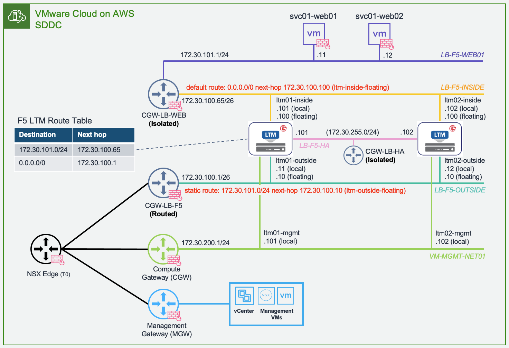](screen-shot-2022-05-02-at-4.32.35-pm.png)

**F5 Integration Lab Topology**

## STEP-1

To begin, we will first configure SDDC route aggregation at the NSX Manager UI. This will leverage an AWS managed prefix-list to announce summarised routes to external, so the Multi-CGW segments are accessible from connected VPC and Intranet (Direct Connect or VMware Transit Connect).

Within the NSX Manager UI, locate ***Networking \> Global Configurations \> Route Aggregation***, create an aggregation prefix-list to summarise the SDDC CIDR block (172.30.0.0/16 in my case)

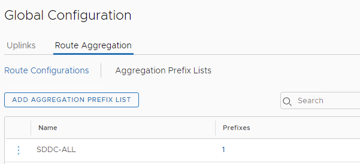

Then create a route configuration to announce the prefix-list to the **INTRANET** endpoint — since I’m using the VMware Transit Connect for my SDDC external connectivity, the summarised routes will be advertised to the VTGW.

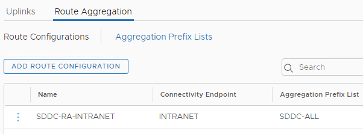

Back at the VMC console we can verify the summarised route (172.30.0.0/16) is being advertised at the SDDC under ***Networking & Security \> Transit Connect \> Advertised Routes***. Note the SDDC mgmt route (173.30.0.0/23) will not be summarised and will always be advertised explicitly.

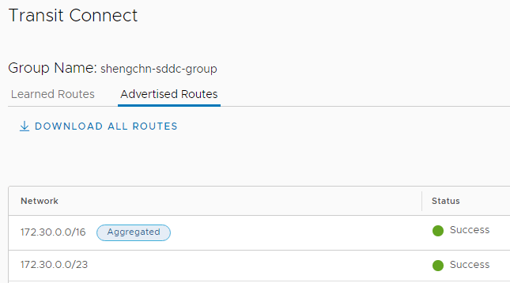

## STEP-2

Go to the NSX Manager again and create 3x Tier-1 CGWs as per the lap topology. Note we will need to select “**routed**” type for the **CGW-LB-F5** in order to inject a static route towards F5 for the web server segment, and “**isolated**” type is required for the **CGW-LB-WEB** in order to inject default route (0.0.0.0/0) towards the F5.

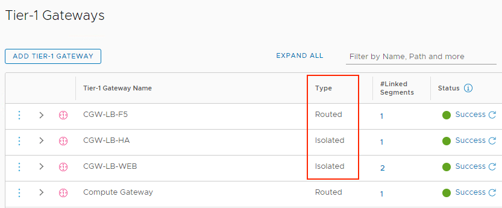

## STEP-3

Next, configure the below network segments as per the lab topology and attach them to the 3x CGWs accordingly. Note the **VM-MGMT-NET01** is created at the default CGW and this is to host the F5 LTM management interfaces, which use a separate management route table.

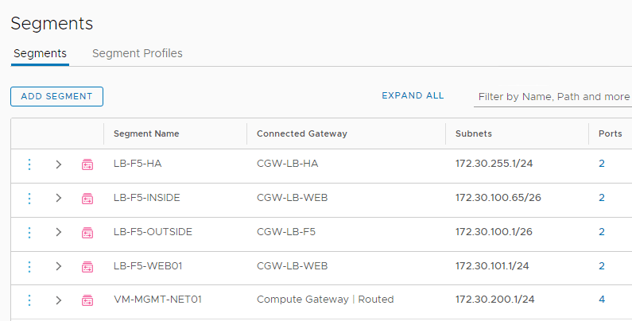

## STEP-4

Additionally, configure the **CGW-LB-F5** to add a static route (for **LB-F5-WEB01** segment) towards the F5 — the next-hop will be the **Outside interface floating IP** (172.30.100.10) between the LTM HA pair.

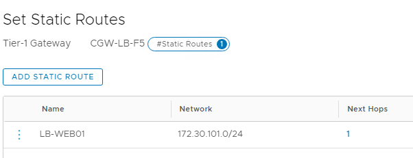

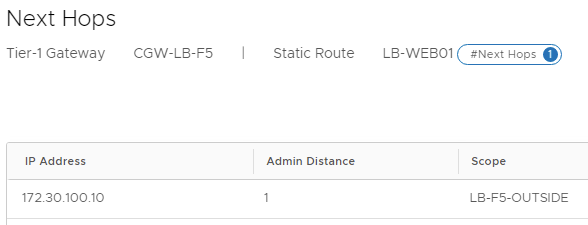

Similarly, configure the **CGW-LB-WEB** to add a default route towards the F5 — the next-hop will be the **Inside interface floating IP** (172.30.100.100) between the LTM HA pair.

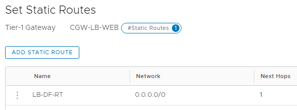

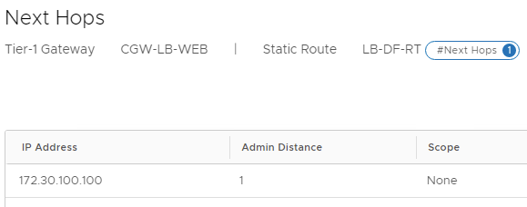

## STEP-5

We are now ready to deploy and configure the F5 LTM VE appliances. For the purpose of the demo I will only show the key network configurations of the LTM01.

Once the appliances are deployed and system has been initialised, go to each LTM management UI to configure the local network settings. First, create the data VLANs for each interface under ***Network \> VLANs*** — notice here all VLANs are internal to F5 only and must be untagged at each interface, as VLAN trunking to a guest VM is not supported by VMware Cloud on AWS at this stage.

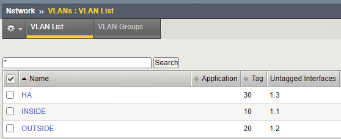

Next, configure the local interface IP addresses under ***Network \> Self-IPs***

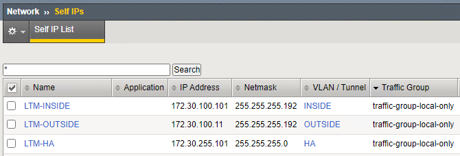

Also add the static routes including default route under ***Network \> Routes***

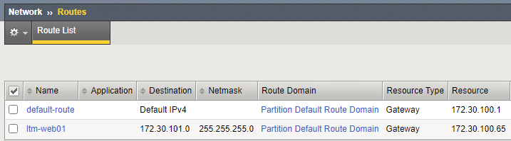

At this stage, you are ready to add the peer device and create a HA failover device group. Once the device group is created and the HA pair is in sync, you can now create additional HA floating IP addresses for both the Inside and Outside interfaces.

Note here for the floating IPs you’ll need to apply a floating traffic group (I’m using the default **traffic-group-1**).

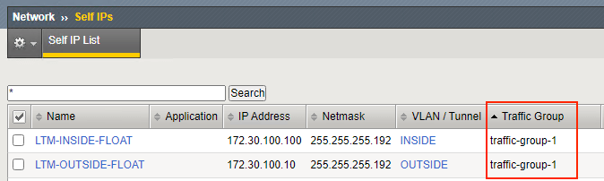

## STEP-6

Finally we are ready to configure the load balancing settings at the F5 LTM HA pair for the workloads deployed in SDDC. For this lab I have deployed two simple Linux VMs with Apache web servers (172.30.101.11 & 172.30.101.12)

[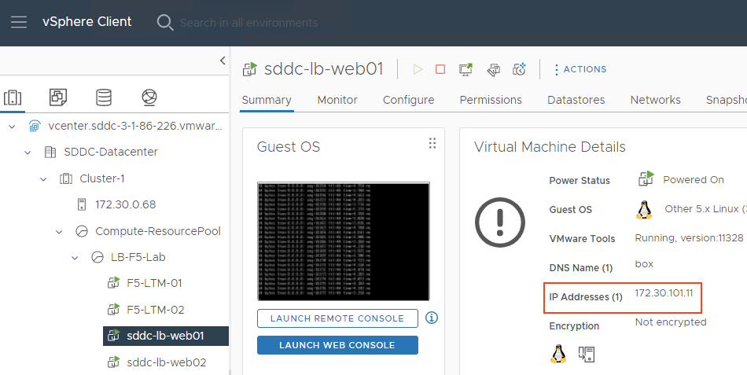](screen-shot-2022-05-02-at-5.14.22-pm-1.png)

First, create 2x nodes for the web servers under ***Local Traffic \> Nodes***:

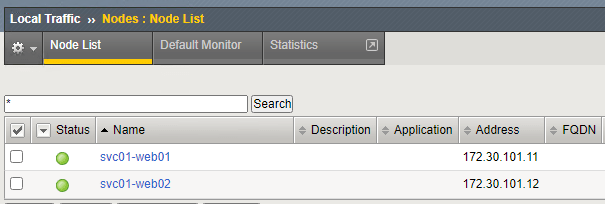

Second, create a LB pool at ***Local Traffic \> Pools*** with the 2x nodes and select appropriate Health Monitor and Load Balancing Method.

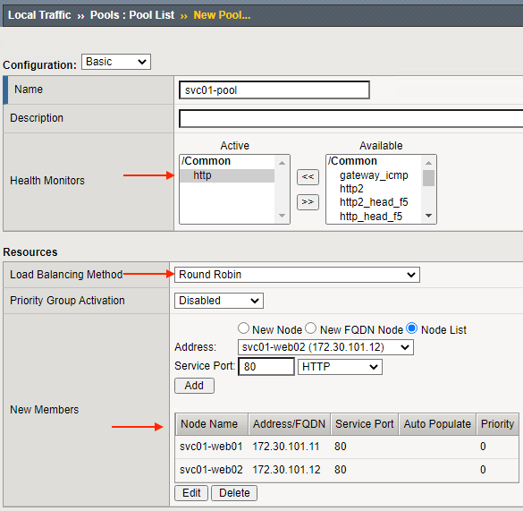

Lastly, go to ***Local Traffic \> Virtual Servers*** and deploy a HTTP VIP for the web service using the LB pool we have just created.

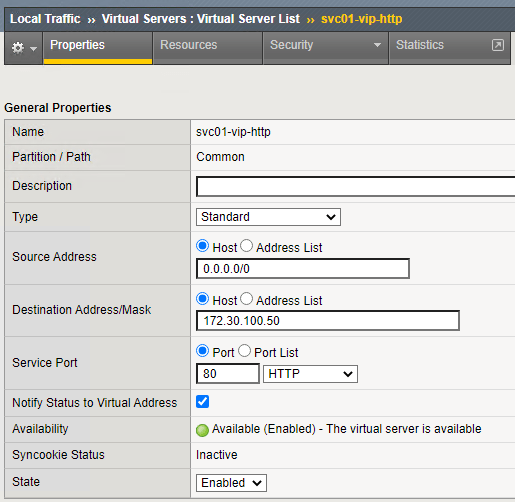

Assuming everything is configured correctly you should see the VIP coming online straight away, and you can also verify the service status at ***Local Traffic \> Network Map***:

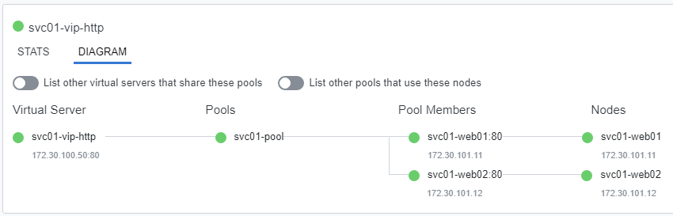

Now hit the VIP address in your browser and you should see traffic is being load balanced between the two nodes (since we selected the basic Round Robin LB method).

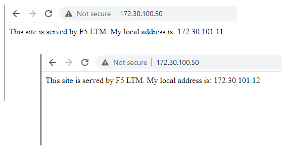

and because the F5s are deployed in inline (routed) mode without SNAT, the web servers are able to see the original source IPs from the clients.

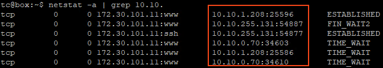
