With the latest [“Transit VPC” feature](https://docs.vmware.com/en/VMware-Cloud-on-AWS/0/rn/vmc-on-aws-relnotes.html#wn09615020) in the VMware Cloud on AWS (VMC) 1.12 release, you can now inject static routes in the VMware managed Transit Gateway (or VTGW) to forward SDDC egress traffic to a 3rd-party firewall appliance for security inspection. The firewall appliance is deployed in a Security/Transit VPC to provide transit routing and policy enforcement between SDDCs and workload VPCs, on-premises data center and the Internet.

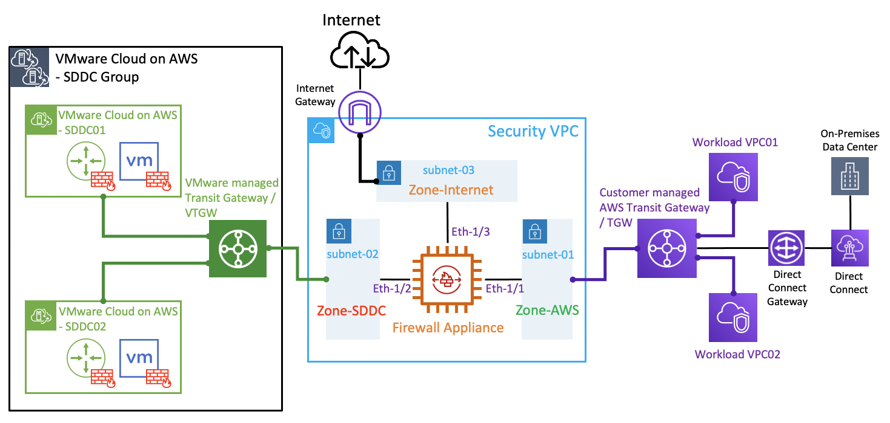

**Important Notes:**

- For this lab, I’m using a [Palo Alto VM-Series Next-Generation Firewall Bundle 2](https://aws.amazon.com/marketplace/pp/prodview-3xtziatyes54i) AMI – refer to [here](https://docs.paloaltonetworks.com/vm-series/10-0/vm-series-deployment/set-up-the-vm-series-firewall-on-aws/deploy-the-vm-series-firewall-on-aws/launch-the-vm-series-firewall-on-aws.html#ide07b93a2-ccb3-4c69-95fe-96e3328b8514) and [here](https://docs.paloaltonetworks.com/vm-series/10-0/vm-series-deployment/set-up-the-vm-series-firewall-on-aws/use-case-secure-the-ec2-instances-in-the-aws-cloud.html#idbec9bfd0-6a32-4941-a68a-30bf301ce5f5) for a detailed deployment instructions
- “Source/Destination Check” must be disabled on all ENIs attached to the firewall
- For Internet access, SNAT must be configured on firewall appliance to maintain route symmetry
- Similarly, inbound access from Internet to a server within VMC requires DNAT on firewall appliance

**Lab Topology:**

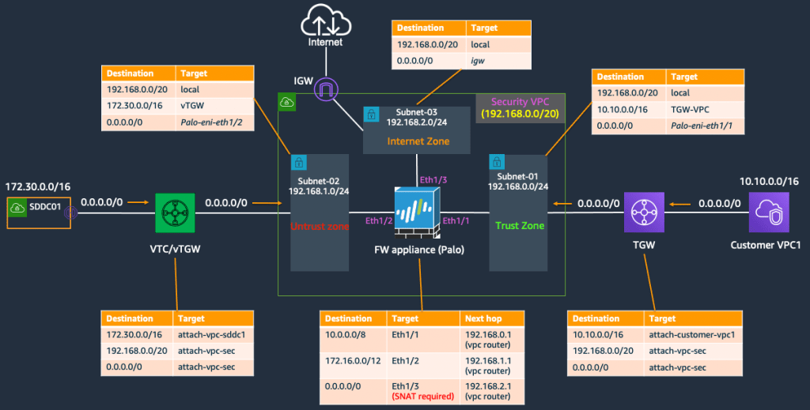

## **SDDC Group – Adding static (default) route**

After deployed the SDDC and SDDC Group, link your AWS account at here

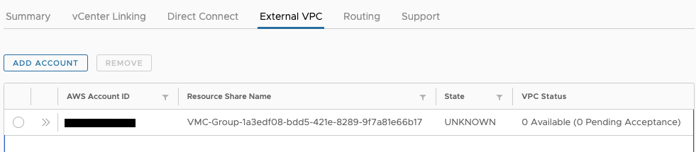

after a while, the VTGW will show up in the Resource Access Manager (RAM) within your account, accept the shared VTGW and then create a VPC attachment to connect your Security/Transit VPC to the VTGW.

Once done, add a static default route at SDDC Group to point to the VTGW-SecVPC attachment.

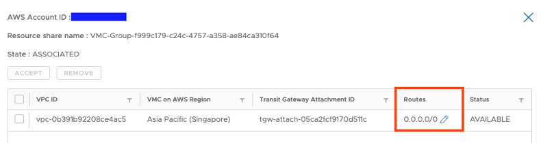

the default route should appear soon under your SDDC (*Network & Security —\> Transit Connect*), also notice we are advertising the local SDDC segments including the management subnets  

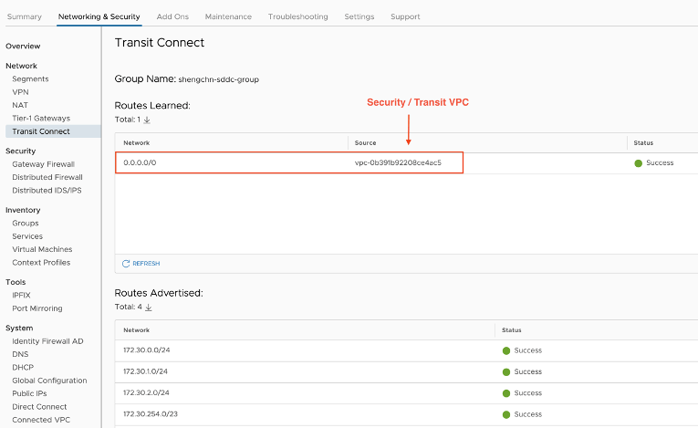

## **AWS SETUP**

Also we need to update the route table for each of the 3x firewall subnets  
  
Route Table for the AWS native side subnet-01 (Trust Zone):

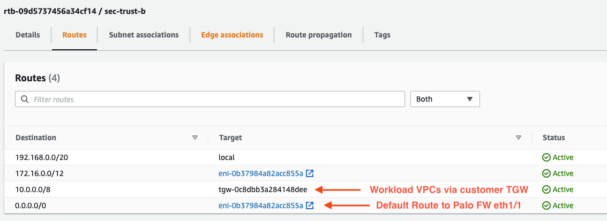

Route Table for the SDDC side subnet-02 (Untrust Zone):

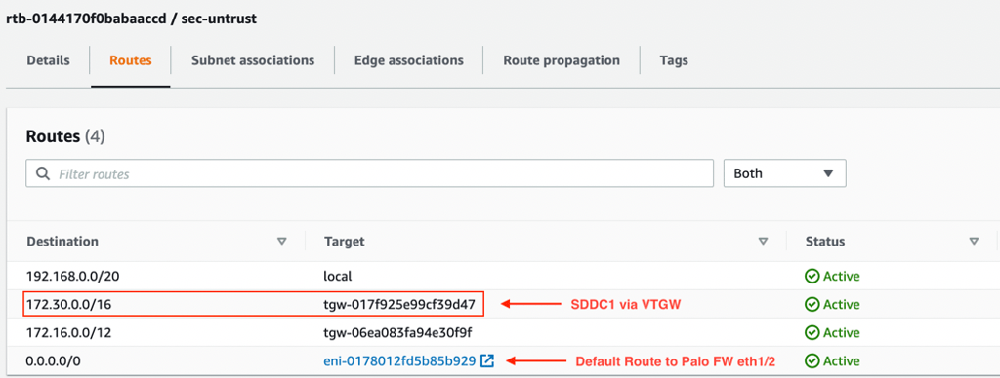

Route Table for the public side subnet-03 (Internet Zone):

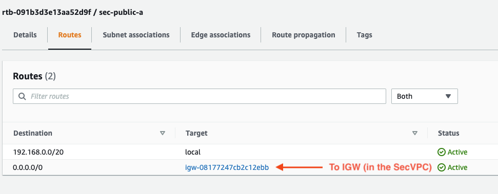

Route Table for the customer managed TGW:

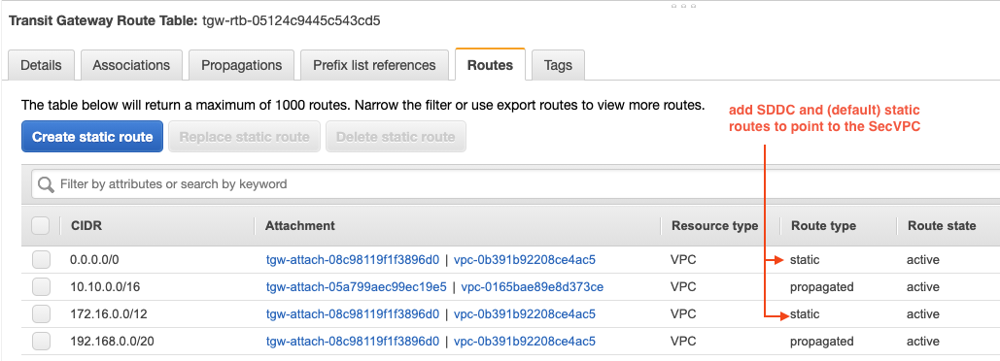

## Palo FW Configuration

Palo Alto firewall interface configuration

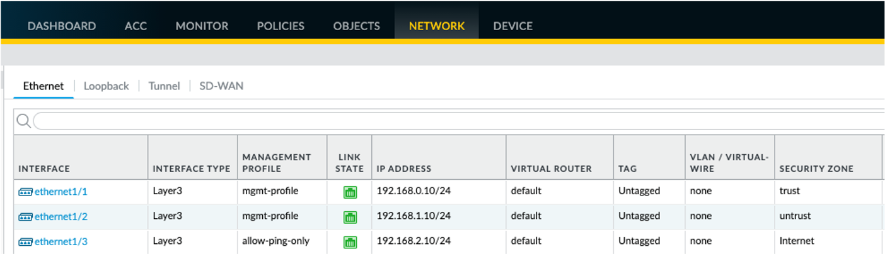

Virtual Router config:

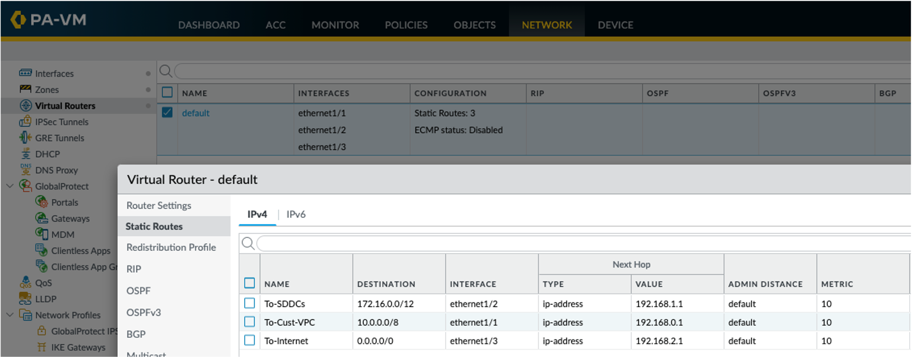

Security Zones

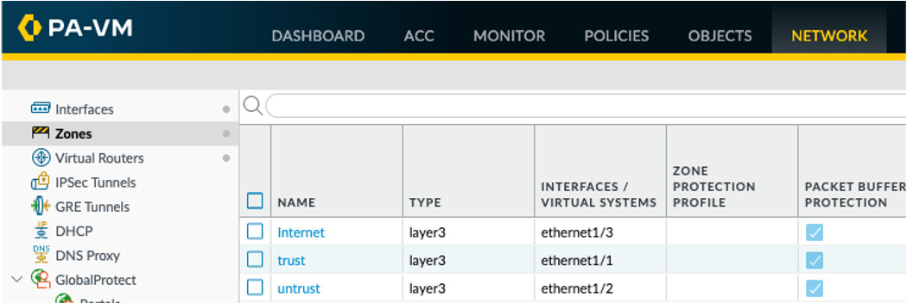

NAT Config

- Outbound SNAT to Internet
- Inbound DNAT to Server01 in SDDC01  

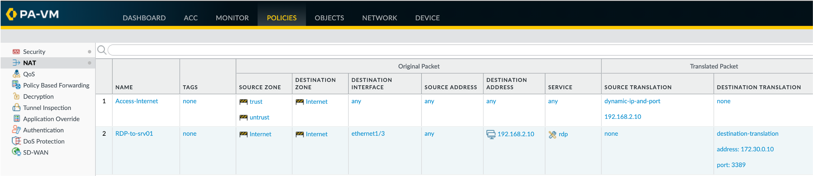

Testing FW rules

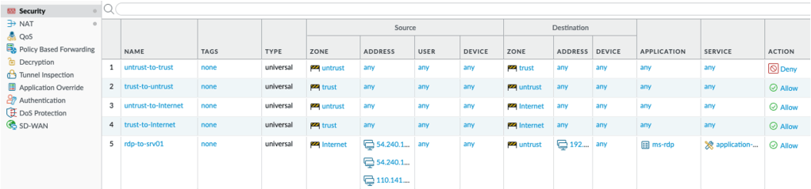

## Testing Results

- “untrust” —\> “trust” **deny**
- “trust” —\> “untrust” **allow**

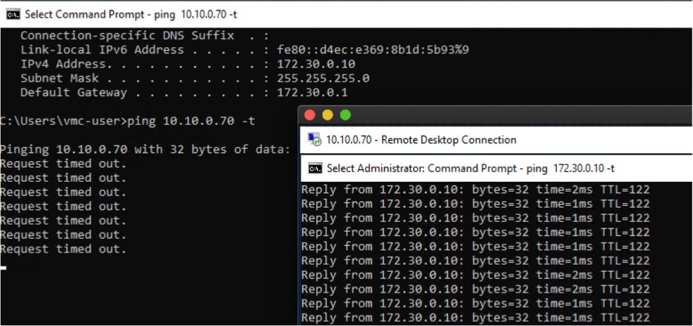

- “untrust” -\> “Internet” **allow**
- “trust” -\> “Internet” **allow**

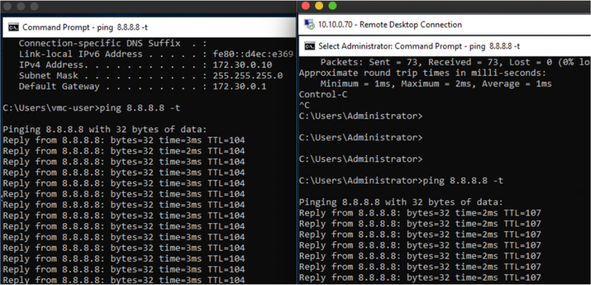
