This is the 2nd episode of our NKE lab series. In the [1st episode](/2024/08/08/nutanix-kubernetes-engine-nke-lab-series-ep1-create-a-nke-enabled-kubernetes-cluster-on-nutanix-community-edition-ce/), I have demonstrated how you can easily deploy an enterprise-grade NKE cluster in a Nutanix CE lab environment with nested virtualization.

In this episode, we’ll deploy a containerized multi-tier web application onto our NKE cluster, by leveraging the built-in Nutanix CSI driver to provide persistent storage for the demo app.

Specifically, we’ll explore 2x Nutanix CSI options:

- **PART-1:** default storage class – via Nutanix Volumes
- **PART-2:** files storage class – via Nutanix Files Manager

## pre-requisites

- a 1-node or 3-node [Nutanix CE 2.0](https://next.nutanix.com/discussion-forum-14/download-community-edition-38417) cluster deployed in nested virtualization depending on your lab compute capacity, as documented [here](https://www.jeroentielen.nl/installing-nutanix-community-edition-ce-on-vmware-esxi-vsphere/) and [here](https://polarclouds.co.uk/nested-nutanix-ce-deployment/)
- a NKE-enabled K8s cluster deployed in Nutanix CE ([see Ep1](/2024/08/08/nutanix-kubernetes-engine-nke-lab-series-ep1-create-a-nke-enabled-kubernetes-cluster-on-nutanix-community-edition-ce/))
- a lab network environment supports VLAN tagging and provides basic infra services such as AD, DNS, NTP etc (these are required when installing the CE cluster)
- a Linux/Mac workstation for managing the Kubernetes cluster, with **Kubectl installed**
- clone the demo app [Git repository](https://github.com/sc13912/nke-guestbook-demo) to the workstation

## PART-1: deploy demo app using the default Storage Class (Nutanix Volumes)

Before we start, let’s take a close look of the demo app, which is a simple Guestbook message board. It is a  containerized web application using PHP & Redis, originally developed by Google as a [GKE demo app](https://cloud.google.com/kubernetes-engine/docs/tutorials/guestbook). (Also see the generic K8s (non-GKE) [user guide](https://kubernetes.io/docs/tutorials/stateless-application/guestbook/))

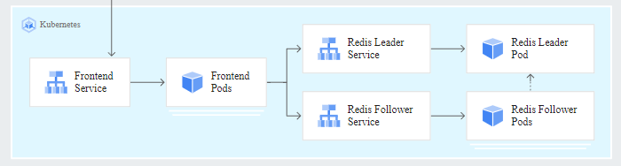

The k8s deployment files here are customized to demonstrate seamless integration with NKE platform capabilities such as out-of-the-box **Container Storage Interface (CSI)** and **Container Network Interface (CNI)** support.

By default, all Kubernetes Pods are deployed with ephemeral storage. This means the stored data will be gone when the Pod finishes or restarted. In order to preserve the data (i.e Guestbook messages), we can leverage the built-in Nutanix CSI driver to provide persistent storage for our Redis Leader and Redis Follower Pods.

Specifically, I have added the following sections to the Redis Leader and Redis Follower deployment files, instructing the Pods to store data in a **Persistent Volume (PV)** by requesting a **Persistent Volume Claim (PVC)**.

```
sc@vx-ops02:~/nke-labs/nke-guestbook-demo$ cat redis-leader-deployment.yaml 
...
    spec:
...
        volumeMounts:
        - name: redis-leader-data
          mountPath: /data
      volumes:
      - name: redis-leader-data
        persistentVolumeClaim:
          claimName: redis-leader-claim


sc@vx-ops02:~/nke-labs/nke-guestbook-demo$ cat redis-follower-deployment.yaml 
...
    spec:
...
        volumeMounts:
        - name: redis-follower-data
          mountPath: /data
      volumes:
      - name: redis-follower-data
        persistentVolumeClaim:
          claimName: redis-follower-claim
```

To do this, we’ll need to deploy the PVCs, which will trigger automatic PV provisioning by calling the the default storage class API.

First let’s verify the storage class status – notice it is powered by the Nutanix CSI driver (using the Nutanix Volume in the backend).

```
sc@vx-ops02:~$ kubectl get storageclasses.storage.k8s.io 
NAME                             PROVISIONER       RECLAIMPOLICY   VOLUMEBINDINGMODE   ALLOWVOLUMEEXPANSION   AGE
default-storageclass (default)   csi.nutanix.com   Retain          Immediate           true                   9h
```

take a look of the PVC Yaml config files

```
sc@vx-ops02:~$ cd nke-labs/k8s-guestbook/pvc/
sc@vx-ops02:~/nke-labs/k8s-guestbook/pvc$ cat guestbook-follower-claim.yaml 
kind: PersistentVolumeClaim
apiVersion: v1
metadata:
  namespace: guestbook
  name: redis-follower-claim
spec:
  accessModes:
    - ReadWriteOnce
  storageClassName: default-storageclass 
  resources:
    requests:
      storage: 2Gi
sc@vx-ops02:~/nke-labs/k8s-guestbook/pvc$ 
sc@vx-ops02:~/nke-labs/k8s-guestbook/pvc$ cat guestbook-leader-claim.yaml 
kind: PersistentVolumeClaim
apiVersion: v1
metadata:
  namespace: guestbook
  name: redis-leader-claim
spec:
  accessModes:
    - ReadWriteOnce
  storageClassName: default-storageclass
  resources:
    requests:
      storage: 2Gi
```

Go ahead and deploy the PVCs

```
sc@vx-ops02:~/nke-labs/k8s-guestbook/pvc$ kubectl create ns guestbook
namespace/guestbook created
sc@vx-ops02:~/nke-labs/k8s-guestbook/pvc$ 
sc@vx-ops02:~/nke-labs/k8s-guestbook/pvc$ kubectl apply -f ./
persistentvolumeclaim/redis-follower-claim created
persistentvolumeclaim/redis-leader-claim created
sc@vx-ops02:~/nke-labs/k8s-guestbook/pvc$ 
```

In a few seconds, you should see 2x PVCs (Redis Leader & Follower) created, and both are showing **“Bound”** status to the corresponding PVs with defined capacity and access modes.

```
sc@vx-ops02:~/nke-labs/k8s-guestbook/pvc$ kubectl get pvc -n guestbook 
NAME                   STATUS   VOLUME                                     CAPACITY   ACCESS MODES   STORAGECLASS           AGE
redis-follower-claim   Bound    pvc-66b235ed-4d90-47bc-b99b-982e9d562336   2Gi        RWO            default-storageclass   25s
redis-leader-claim     Bound    pvc-042544d9-f621-48d0-a11f-c2ec57cacbf5   2Gi        RWO            default-storageclass   25s
```

We can also see the 2x PVs automatically provisioned by the default storage class.

```
sc@vx-ops02:~/nke-labs/k8s-guestbook/pvc$ kubectl get pv | grep guestbook
pvc-042544d9-f621-48d0-a11f-c2ec57cacbf5   2Gi        RWO            Retain           Bound    guestbook/redis-leader-claim                     default-storageclass            114s
pvc-66b235ed-4d90-47bc-b99b-982e9d562336   2Gi        RWO            Retain           Bound    guestbook/redis-follower-claim                   default-storageclass            114s
```

and we can see the same under Prism Central:

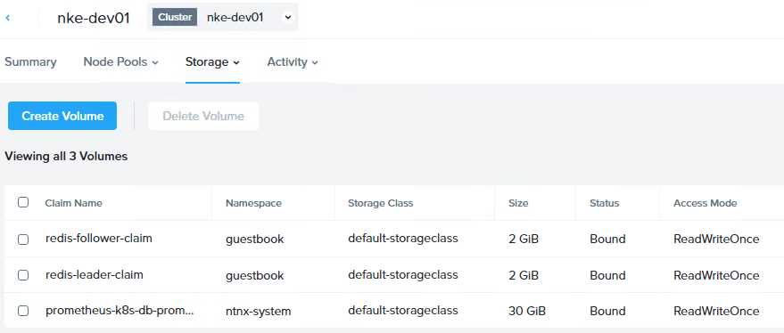

With both PVCs created and PVs provisioned, we are ready to deploy the demo app.

First, deploy the Redis Leader Pods and Services.

```
sc@vx-ops02:~/nke-labs/k8s-guestbook$ kubectl apply -f redis-leader-deployment.yaml -f redis-leader-service.yaml 
deployment.apps/redis-leader created
service/redis-leader created
sc@vx-ops02:~/nke-labs/k8s-guestbook$ kubectl get pod -n guestbook 
NAME                           READY   STATUS    RESTARTS   AGE
redis-leader-c767d6dbb-bbcxf   1/1     Running   0          9m44s
sc@vx-ops02:~/nke-labs/k8s-guestbook$ 
sc@vx-ops02:~/nke-labs/k8s-guestbook$ kubectl get svc -n guestbook 
NAME           TYPE        CLUSTER-IP     EXTERNAL-IP   PORT(S)    AGE
redis-leader   ClusterIP   10.20.150.67   <none>        6379/TCP   9m53s
```

Next, deploy the Redis Follower Pods and Services.

```
sc@vx-ops02:~/nke-labs/k8s-guestbook$ kubectl apply -f redis-follower-deployment.yaml -f redis-follower-service.yaml 
deployment.apps/redis-follower created
service/redis-follower created
sc@vx-ops02:~/nke-labs/k8s-guestbook$ kubectl get pods -n guestbook 
NAME                              READY   STATUS    RESTARTS   AGE
redis-follower-5ffdf87b7d-9t9v5   1/1     Running   0          15s
redis-leader-c767d6dbb-bbcxf      1/1     Running   0          10m
sc@vx-ops02:~/nke-labs/k8s-guestbook$ 
sc@vx-ops02:~/nke-labs/k8s-guestbook$ kubectl get svc -n guestbook 
NAME             TYPE        CLUSTER-IP     EXTERNAL-IP   PORT(S)    AGE
redis-follower   ClusterIP   10.20.23.235   <none>        6379/TCP   20s
redis-leader     ClusterIP   10.20.150.67   <none>        6379/TCP   10m
```

Before we can deploy the Frontend service, we’ll need to install a K8s [LoadBalancer](https://kubernetes.io/docs/concepts/services-networking/service/#loadbalancer) Controller so we can expose the web frontend to the external network. For this, I’m using [MetalLB](https://metallb.universe.tf/) which is a popular open-source LoadBalancer controller for baremetal or hybrid K8s environment.

The [installation](https://metallb.universe.tf/installation/) is easily done by using a single manifest.

```
sc@vx-ops02:~/nke-labs/k8s-guestbook$ kubectl apply -f https://raw.githubusercontent.com/metallb/metallb/v0.14.8/config/manifests/metallb-native.yaml
namespace/metallb-system created
customresourcedefinition.apiextensions.k8s.io/bfdprofiles.metallb.io created
customresourcedefinition.apiextensions.k8s.io/bgpadvertisements.metallb.io created
customresourcedefinition.apiextensions.k8s.io/bgppeers.metallb.io created
customresourcedefinition.apiextensions.k8s.io/communities.metallb.io created
customresourcedefinition.apiextensions.k8s.io/ipaddresspools.metallb.io created
customresourcedefinition.apiextensions.k8s.io/l2advertisements.metallb.io created
customresourcedefinition.apiextensions.k8s.io/servicel2statuses.metallb.io created
serviceaccount/controller created
serviceaccount/speaker created
role.rbac.authorization.k8s.io/controller created
role.rbac.authorization.k8s.io/pod-lister created
clusterrole.rbac.authorization.k8s.io/metallb-system:controller created
clusterrole.rbac.authorization.k8s.io/metallb-system:speaker created
rolebinding.rbac.authorization.k8s.io/controller created
rolebinding.rbac.authorization.k8s.io/pod-lister created
clusterrolebinding.rbac.authorization.k8s.io/metallb-system:controller created
clusterrolebinding.rbac.authorization.k8s.io/metallb-system:speaker created
configmap/metallb-excludel2 created
secret/metallb-webhook-cert created
service/metallb-webhook-service created
deployment.apps/controller created
daemonset.apps/speaker created
validatingwebhookconfiguration.admissionregistration.k8s.io/metallb-webhook-configuration created
sc@vx-ops02:~/nke-labs/k8s-guestbook$ 
```

MetalLB can be deployed in either L2 or L3 (BGP) mode. For simplicity, we’ll choose a flat L2 mode, and that means we’ll need to reserve a IP pool from the same NKE subnet for the LoadBalancer services to consume. We’ll also configure MetalLB to advertise this IP pool in L2 mode so it will respond to external ARP requests for these addresses.

```
sc@vx-ops02:~/nke-labs/k8s-guestbook$ cd ~/nke-labs/k8s-guestbook/MetalLB-config/
sc@vx-ops02:~/nke-labs/k8s-guestbook/MetalLB-config$ cat metallb_config.yaml 
---
apiVersion: metallb.io/v1beta1
kind: IPAddressPool
metadata:
  name: default
  namespace: metallb-system
spec:
  addresses:
  - 192.168.102.10-192.168.102.19
  autoAssign: true
---
apiVersion: metallb.io/v1beta1
kind: L2Advertisement
metadata:
  name: default
  namespace: metallb-system
spec:
  ipAddressPools:
  - default

sc@vx-ops02:~/nke-labs/k8s-guestbook/MetalLB-config$ kubectl apply -f metallb_config.yaml 
ipaddresspool.metallb.io/default created
l2advertisement.metallb.io/default created
```

Verify the MetalLB status and check the IP address pool advertised – make sure this range is outside the NKE DHCP range, and is not used by any other services on the subnet.

```
sc@vx-ops02:~/nke-labs/k8s-guestbook/MetalLB-config$ kubectl get ipaddresspools.metallb.io -n metallb-system 
NAME      AUTO ASSIGN   AVOID BUGGY IPS   ADDRESSES
default   true          false             ["192.168.102.10-192.168.102.19"]
sc@vx-ops02:~/nke-labs/k8s-guestbook/MetalLB-config$ kubectl get l2advertisements.metallb.io -n metallb-system -o wide
NAME      IPADDRESSPOOLS   IPADDRESSPOOL SELECTORS   INTERFACES   NODE SELECTORS
default   ["default"]                                             
```

Finally, we can deploy the Guestbook Frontend Pods and the (LoadBalancer) Service.

```
sc@vx-ops02:~/nke-labs/k8s-guestbook$ kubectl apply -f frontend-deployment.yaml -f frontend-service.yaml 
deployment.apps/frontend created
service/frontend created
```

You should now have all 3x tiers of K8s services running, with the Frontend service exposed to outside via MetalLB. In my case, I can see the Frontend LoadBalancer service is successfully deployed and has automatically obtained an external routable IP of 192.168.102.10.

```
sc@vx-ops02:~/nke-labs/k8s-guestbook$ kubectl get pods -n guestbook 
NAME                              READY   STATUS    RESTARTS   AGE
frontend-795b566649-kndwz         1/1     Running   0          3m4s
frontend-795b566649-v96qh         1/1     Running   0          3m4s
frontend-795b566649-z99gz         1/1     Running   0          3m4s
redis-follower-5ffdf87b7d-9t9v5   1/1     Running   0          6m55s
redis-leader-c767d6dbb-bbcxf      1/1     Running   0          17m
sc@vx-ops02:~/nke-labs/k8s-guestbook$ 


sc@vx-ops02:~/nke-labs/k8s-guestbook$ kubectl get svc -n guestbook 
NAME             TYPE           CLUSTER-IP     EXTERNAL-IP      PORT(S)        AGE
frontend         LoadBalancer   10.20.65.94    192.168.102.10   80:31807/TCP   3m10s
redis-follower   ClusterIP      10.20.23.235   <none>           6379/TCP       7m1s
redis-leader     ClusterIP      10.20.150.67   <none>           6379/TCP       17m
```

Open a browser page and hit that LB IP address, and you should see the Guestbook application delivered from our NKE cluster! Leave some messages there and click submit, and the data will be stored in the Redis database.

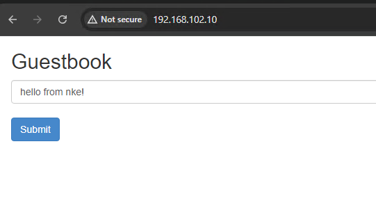

To test the persistent storage, we can simply delete the demo app and re-create it. When the new Redis Pods are re-deployed they should mount the same PVs which preserve the data.

```
sc@vx-ops02:~/nke-labs/k8s-guestbook$ kubectl delete  -f ./
deployment.apps "frontend" deleted
service "frontend" deleted
deployment.apps "redis-follower" deleted
service "redis-follower" deleted
deployment.apps "redis-leader" deleted
service "redis-leader" deleted

sc@vx-ops02:~/nke-labs/k8s-guestbook$ kubectl get all -n guestbook 
No resources found in guestbook namespace.

sc@vx-ops02:~/nke-labs/k8s-guestbook$ kubectl apply -f ./
deployment.apps/frontend created
service/frontend created
deployment.apps/redis-follower created
service/redis-follower created
deployment.apps/redis-leader created
service/redis-leader created
```

When the K8s services back online, open another browser page (use Incognito mode so there’s no cache) and hit the LB address again – the original message is still there, perfect!

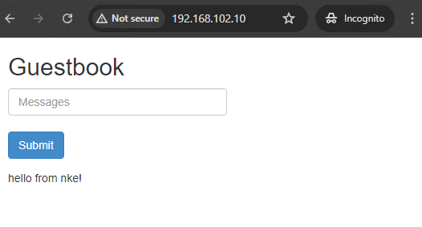

## STEP-2: deploy demo app using Multi-Access Storage Class (NUTANIX FILES)

In the last example, we have deployed the demo app using the NKE default storage class, supported by Nutanix CSI driver and using Nutanix Volume in the backend. However, we only deployed 1x Redis Follower Pod – but what about if we want to expand to multiple Redis Follower instances to provide better scalability?

In that case, we would need multiple Pods to access and read/write data to the same PV. This particular [PV Access mode](https://kubernetes.io/docs/concepts/storage/persistent-volumes/#access-modes) is referred as **ReadWriteMany**, which is not supported by the default NKE storage class (Nutanix Volume). Instead, we’ll need to create a new NFS-type storage class, which can be provided by the Nutanix Files manager.

To do so, first we’ll need to deploy a Nutanix Filer Server. In Prism Central, go to *Unified Storage \> Files \> Filer Server*, then click New Filer Server. I will be using ver 4.4.0.3 in this case.

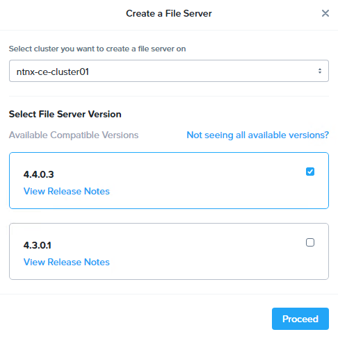

Provide file server domain name, and follow the wizard to configure Internal/External subnets with IP addresses for the filer server fleet.

Below is a snapshot of the configuration of my filer servers. I have also configured the corresponding records on the AD/DNS including all 3x server IP addresses.

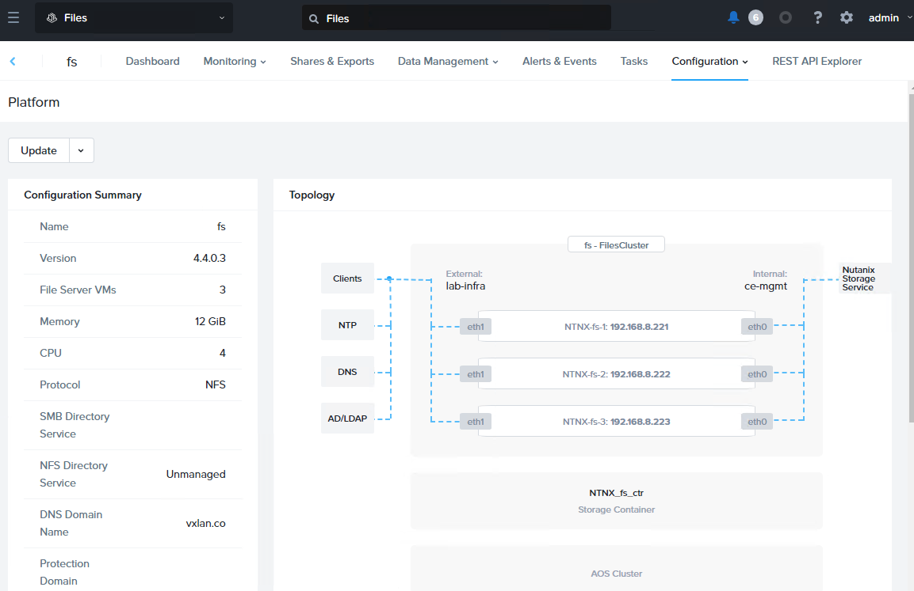

Once the filer server is provisioned, go to *Configuration \> Authentication* to enable the NFS protocol. Since this will be consumed by NKE so for now we just leave it to “Unmanaged”.

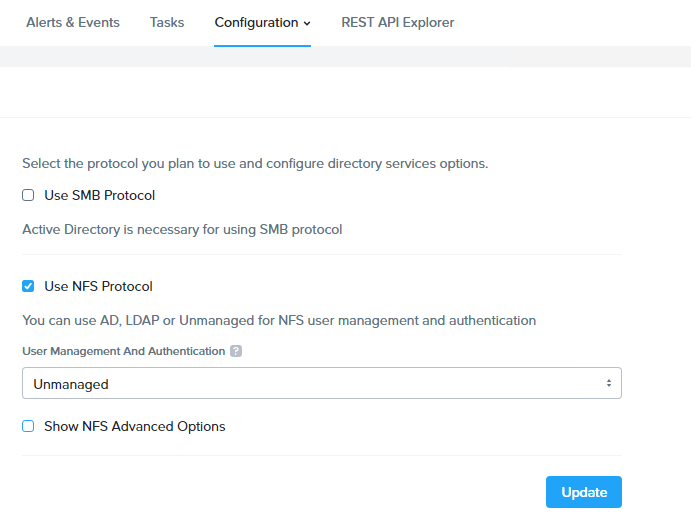

Now go to *Shares & Exports* to create a NFS share (for the NKE storage class). Provide a share name, specify size and select Protocol (NFS is pre-selected since we only enabled it). In *General Settings* page, leave the default (Enable Compression) and select next.

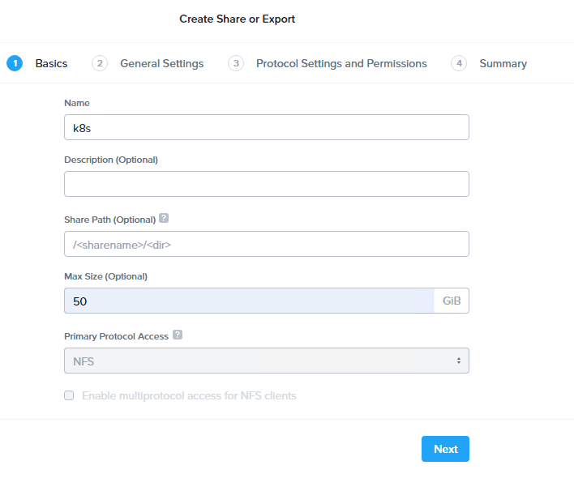

Here we’ll configure NFS protocol access

- Default Access – No Access, with Exception for the NKE subnet:
  - Client – 192.168.102.0/24
  - Access – Read/Write
  - Squashing – All Squashing

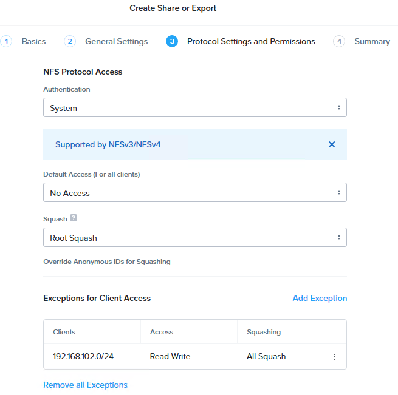

here’s a summary of the NFS share.

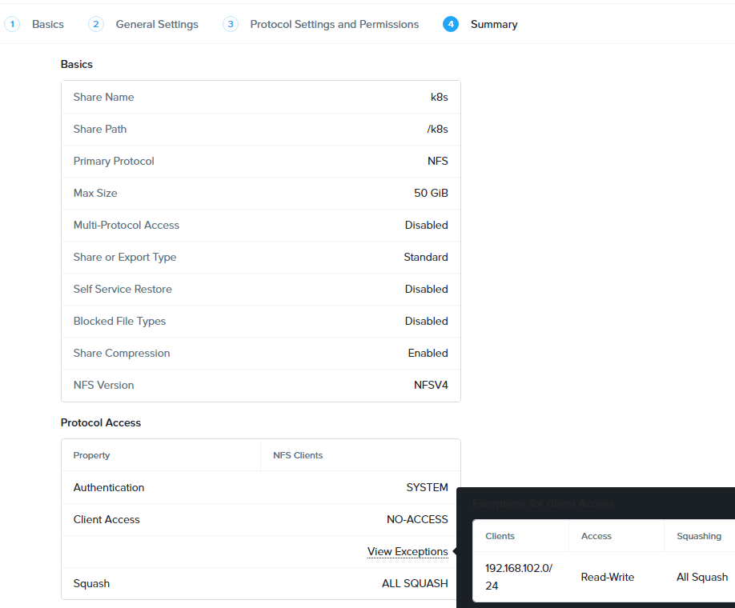

Once the NFS share is deployed. We are ready to create the storage class. Navigate to *Cloud Infrastructure \> Kubernetes Management \> Clusters*, and click into our NKE cluster.

Go to *Storage* \> *Storage Classes* to create a new storage class with the following settings:

- Volume Type – **nutanix_files**
- NFS Export Endpoint – **fs.vxlan.co** (Filer Server DNS name)
- NFS Export Path – **/k8s** (the NFS share provided by Filer Server)

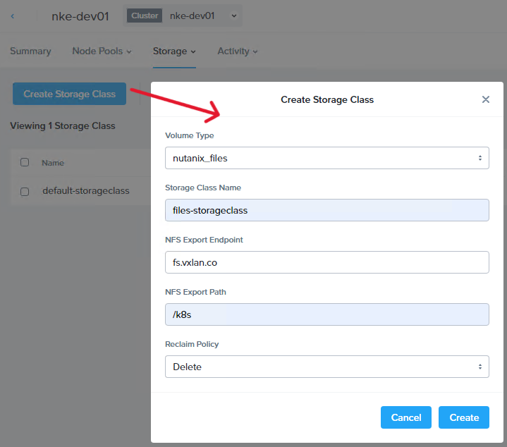

Now let’s check the storage class under our NKE cluster. You should see the new **files-storageclass** is automatically deployed into our cluster and is ready to be consumed!

```
sc@vx-ops02:~/nke-labs/k8s-guestbook/pvc$ kubectl get storageclasses.storage.k8s.io 
NAME                             PROVISIONER       RECLAIMPOLICY   VOLUMEBINDINGMODE   ALLOWVOLUMEEXPANSION   AGE
default-storageclass (default)   csi.nutanix.com   Retain          Immediate           true                   3h45m
files-storageclass               csi.nutanix.com   Delete          Immediate           false                  37s

sc@vx-ops02:~/nke-labs/k8s-guestbook/pvc$ kubectl describe storageclasses.storage.k8s.io  files-storageclass 
Name:                  files-storageclass
IsDefaultClass:        No
Annotations:           <none>
Provisioner:           csi.nutanix.com
Parameters:            nfsPath=/k8s,nfsServer=fs.vxlan.co,storageType=NutanixFiles
AllowVolumeExpansion:  <unset>
MountOptions:          <none>
ReclaimPolicy:         Delete
VolumeBindingMode:     Immediate
Events:                <none>
```

To test this, we’ll first clean up our existing deployment, including the previous PVCs.

```
sc@vx-ops02:~/nke-labs/k8s-guestbook$ kubectl delete  -f ./
deployment.apps "frontend" deleted
service "frontend" deleted
deployment.apps "redis-follower" deleted
service "redis-follower" deleted
deployment.apps "redis-leader" deleted
service "redis-leader" deleted

sc@vx-ops02:~/nke-labs/k8s-guestbook/pvc$ kubectl delete  -f ./
persistentvolumeclaim "redis-follower-claim" deleted
persistentvolumeclaim "redis-leader-claim" deleted
sc@vx-ops02:~/nke-labs/k8s-guestbook/pvc$ 
```

Next, we’ll make the following changes to fully utilize the **ReadWriteMany** capabilities provided by the NFS-based file storage class.

- Update the Redis follower PVC yaml file, and change the storage class to “**files-storageclass**” and access mode to “**ReadWriteMany**“
- Update the Redis follower deployment yaml file, and change the replicas to **3**

```
sc@vx-ops02:~/nke-labs/k8s-guestbook/pvc$ vim guestbook-follower-claim-nfs.yaml 
kind: PersistentVolumeClaim
apiVersion: v1
metadata:
  namespace: guestbook
  name: redis-follower-claim
spec:
  accessModes:
    - ReadWriteMany
  storageClassName: files-storageclass
  resources:
    requests:
      storage: 5Gi

sc@vx-ops02:~/nke-labs/k8s-guestbook$ vim redis-follower-deployment.yaml 
# SOURCE: https://cloud.google.com/kubernetes-engine/docs/tutorials/guestbook
apiVersion: apps/v1
kind: Deployment
...
spec:
  replicas: 3
  selector:
    matchLabels:
      app: redis
...
```

Let’s create the PVCs

```
sc@vx-ops02:~/nke-labs/k8s-guestbook/pvc$ kubectl apply -f guestbook-leader-claim.yaml -f guestbook-follower-claim-nfs.yaml 
persistentvolumeclaim/redis-leader-claim created
persistentvolumeclaim/redis-follower-claim created

sc@vx-ops02:~/nke-labs/k8s-guestbook/pvc$ kubectl get pvc -n guestbook 
NAME                   STATUS   VOLUME                                     CAPACITY   ACCESS MODES   STORAGECLASS           AGE
redis-follower-claim   Bound    pvc-9a99599b-bfb1-4851-9a21-8140e34b2528   5Gi        RWX            files-storageclass     91s
redis-leader-claim     Bound    pvc-2665d13e-26ba-4df4-8ecb-2d4cc292305f   2Gi        RWO            default-storageclass   5s
```

Now we have a new PVC created using the files-storageclass with the access mode of “RWX”

We are ready to deploy the demo app again

```
sc@vx-ops02:~/nke-labs/k8s-guestbook$ kubectl apply -f ./
deployment.apps/frontend created
service/frontend created
deployment.apps/redis-follower created
service/redis-follower created
deployment.apps/redis-leader created
service/redis-leader created
```

and notice this time there are 3x Redis Follower Pods deployed – all mounting the same PV which was provisioned by the files-storageclass powered by the Nutanix Files Manager!

```
sc@vx-ops02:~/nke-labs/k8s-guestbook$ kubectl get pods -n guestbook 
NAME                              READY   STATUS    RESTARTS   AGE
frontend-795b566649-42b8d         1/1     Running   0          44s
frontend-795b566649-m94nb         1/1     Running   0          44s
frontend-795b566649-xlkn9         1/1     Running   0          44s
redis-follower-5ffdf87b7d-d7gtc   1/1     Running   0          43s
redis-follower-5ffdf87b7d-ldpqr   1/1     Running   0          43s
redis-follower-5ffdf87b7d-thsld   1/1     Running   0          43s
redis-leader-c767d6dbb-dmjpl      1/1     Running   0          43s
```

and our favorite Guestbook service is back online with improved database scalability!

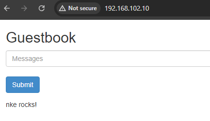

In the next episode, we’ll dive deep into the NKE networking space, and explore how you can leverage the Calico CNI to deploy flexible K8s network & security policies. Stay tuned!
