This is the 4th episode of our [NKE lab series](/tags/nke/). Previously, I have demonstrated how you can easily deploy a NKE cluster in a Nutanix CE lab environment, and I have explored some NKE platform features including out-of-the-box CSI and CNI support. In this episode, we’ll take a look how you can accelerate Kubernetes application development by integrating NKE with Nutanix Database Service (NDB).

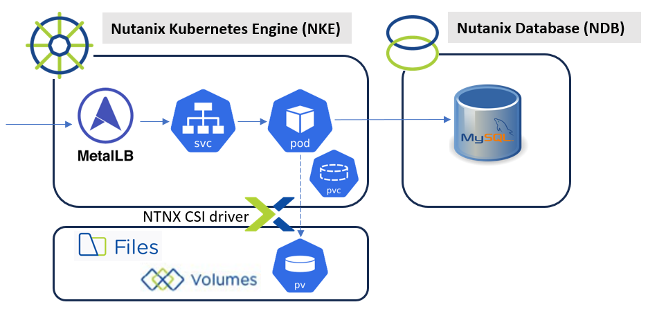

NDB is a Database-as-a-Service designed to help developers speed up application development and simplify database administration across on-prem and public clouds. It simplifies database operations such as test DB provisioning/cloning and integrated snapshots/backup etc. It also provides a consistent “Database-as-Code” experience using REST API and K8s integrations. NDB supports most popular database engines, and you can read more about it [at here](https://www.nutanix.com/au/products/database-service).

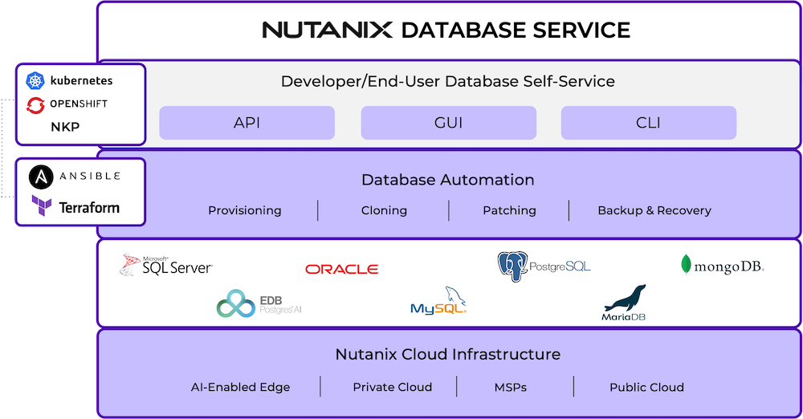

For this demo, we’ll deploy a containerized [WordPress app](https://kubernetes.io/docs/tutorials/stateful-application/mysql-wordpress-persistent-volume/) onto a NKE cluster, by connecting to a MySQL test database instance managed by the NDB.

Specifically, I will walkthrough the following steps:

- **PART-1**: Deploy the NDB service via Nutanix Marketplace
- **PART-2**: Provision a MySQL test database instance in NDB
- **PART-3**: Deploy the demo app onto NKE by connecting to the test database in NDB

## pre-requisites

- a 1-node or 3-node [Nutanix CE 2.0](https://next.nutanix.com/discussion-forum-14/download-community-edition-38417) cluster deployed in nested virtualization depending on your lab compute capacity, as documented [here](https://www.jeroentielen.nl/installing-nutanix-community-edition-ce-on-vmware-esxi-vsphere/) and [here](https://polarclouds.co.uk/nested-nutanix-ce-deployment/)
- a NKE-enabled K8s cluster deployed in Nutanix CE ([see Ep1](/2024/08/08/nutanix-kubernetes-engine-nke-lab-series-ep1-create-a-nke-enabled-kubernetes-cluster-on-nutanix-community-edition-ce/))
- a lab network environment supports VLAN tagging and provides basic infra services such as AD, DNS, NTP etc (these are required when installing the CE cluster)
- a Linux/Mac workstation for managing the Kubernetes cluster, with **Kubectl** installed.

## PART-1: Deploy the NDB service

To begin, log into your Prism Central and navigate to *Admin Center \> Marketplace*, and deploy the “Database Service”.

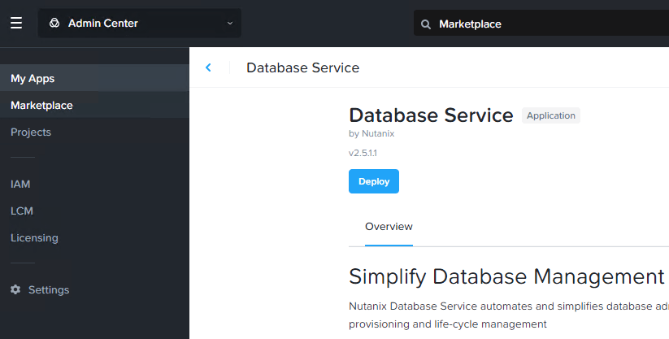

At the deployment blueprint, provide a name to the NDB VM and select your (management) network, leave everything else as default and click “Deploy”.

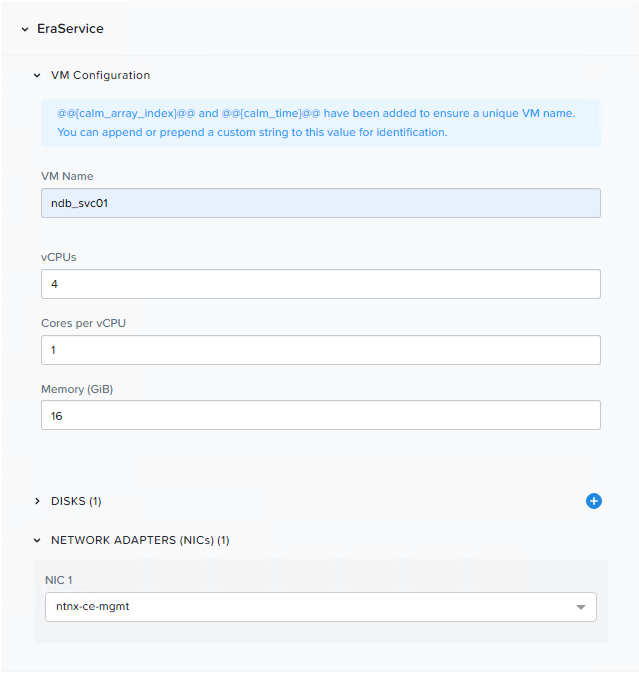

After the NDB service VM is deployed, you should see a new **Database Service** category under the navigation bar. It will take you to the NDB management console for initial service setup.

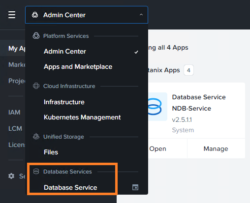

To register NDB, you’ll first need to supply your CE cluster virtual IP and login credentials.

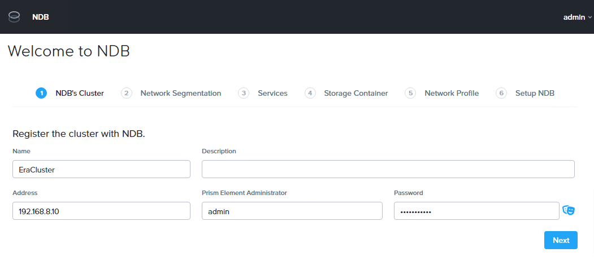

Select subnet profile(s) to access PC management and iSCSI services etc.

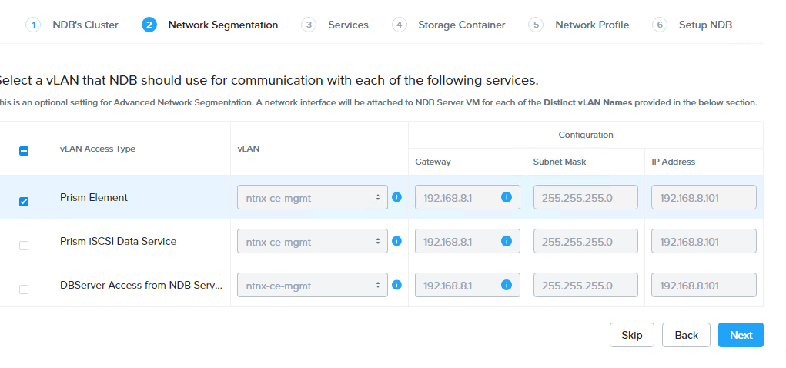

Next, configure DNS, NTP and SMTP based on your own environment.

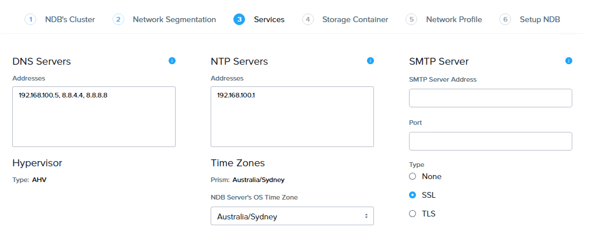

For the Network Profile, it is recommended you have a sperate and dedicated VLAN for database provisioning, and the address pool should be managed by NDB (instead of IPAM).

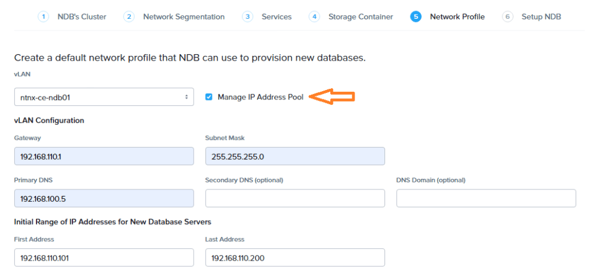

That’s pretty much all you need to deploy and register the NDB service. You’ll see NDB creating a bunch of database profiles to help streamline the DB provisioning process (more on this in a movement). The whole process will take approx. 10~20mins.

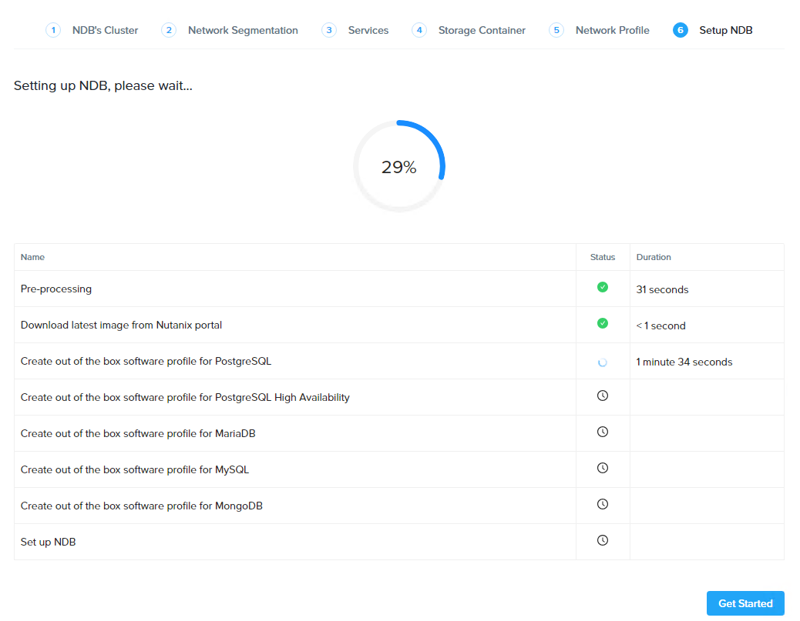

## PART-2: provision a test MySQL db instance

Once the NDB service is deployed and registered to your CE cluster, go to *Databases \> Source* to provision a MySQL instance for our demo app.

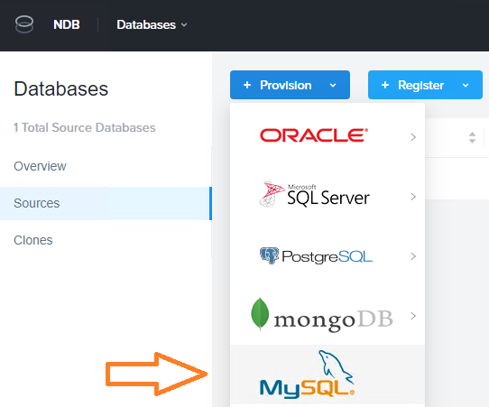

Here we’ll fast track the database provisioning process by simply selecting out-of-the-box software, compute and network profiles.

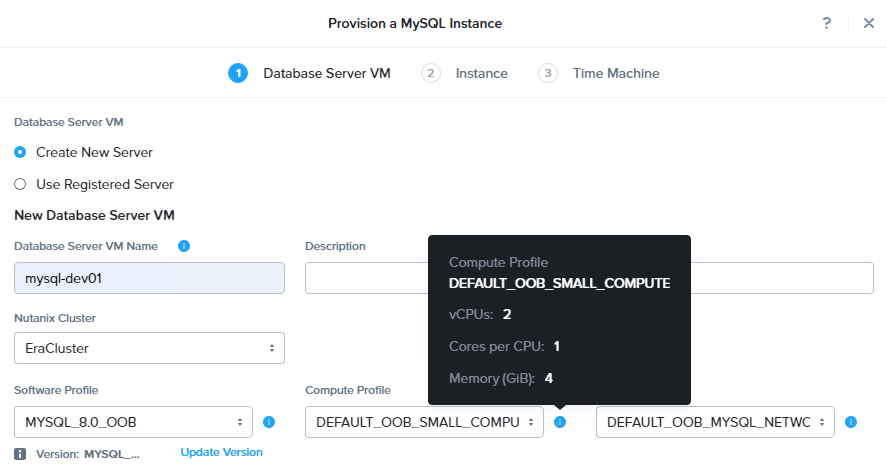

You’ll also have the option to upload a pubkey for using passwordless SSH into the DB VM.

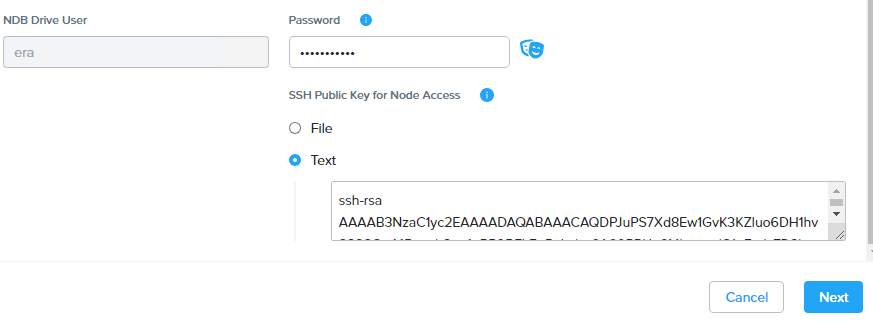

Next, you’ll define important properties such as DB name, TCP port, size etc. You can optionally attach customized pre-post scripts as well.

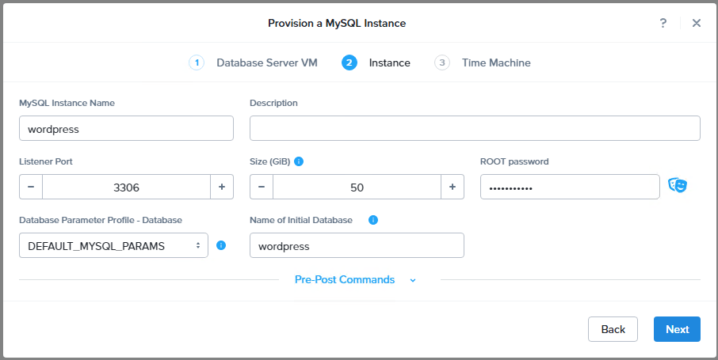

finally, you can select SLA profiles and customize snapshots settings etc. Click Provision to kick off the deployment.

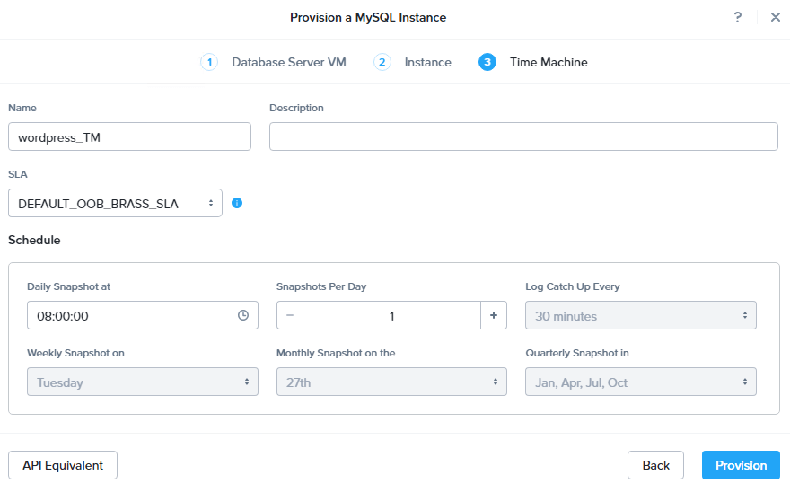

Within around 10~20min, you should see a test MySQL instance is ready online.

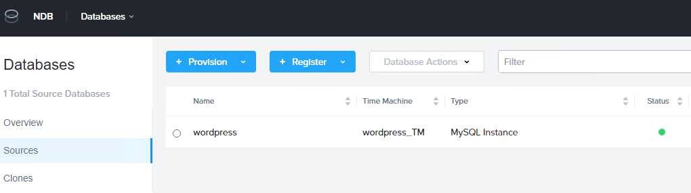

If you click into the test DB instance, you’ll find its IP address allocated by the NBD.

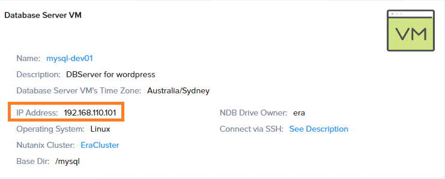

You can also verify that an initial database of “wordpress” has been created, perfect!

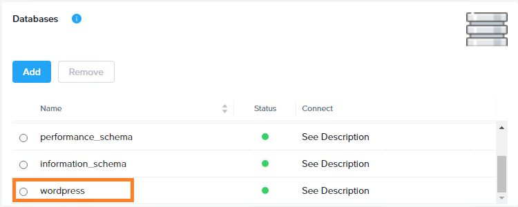

From your workstation (with supplied pubkey) you should be able to SSH into the DB VM without using password.

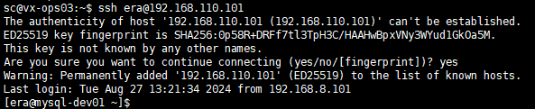

and while we are here, we can log into the DB and create a test user for our demo app.

```
[era@mysql-dev01 ~]$ mysql -u root -p
...
mysql> 
mysql> CREATE USER 'wordpress'@'%' IDENTIFIED BY 'your_password';
Query OK, 0 rows affected (0.12 sec)
mysql> GRANT ALL ON wordpress.* TO 'wordpress'@'%';
Query OK, 0 rows affected (0.06 sec)
mysql> FLUSH PRIVILEGES;
Query OK, 0 rows affected (0.02 sec)
mysql> exit
```

## PART-3: Deploy the demo app

We are now ready to rollout our demo app onto the NKE cluster, and connecting to the test DB instance via NDB! I’m using a k8s sample [WordPress app](https://kubernetes.io/docs/tutorials/stateful-application/mysql-wordpress-persistent-volume/), and specifically we’ll only need the [app component](https://raw.githubusercontent.com/kubernetes/website/main/content/en/examples/application/wordpress/wordpress-deployment.yaml) yaml file.

Before deploying it into my NKE cluster, I’ll just make the following changes:

- Change all resources to the k8s namespace of “wordpress”
- Update the database environment variables to our NDB test DB instance

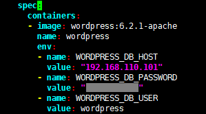

**NOTE:** I’m only putting password here for simple illustration, obviously you should never do this in production and it is always recommended to use K8s Secrets instead.

After you update the yaml file, go ahead and deploy it.

```
sc@vx-ops03:~/nke-labs/ndb-wp-demo$ kubectl apply -f ./
service/wordpress created
persistentvolumeclaim/wp-pv-claim created
deployment.apps/wordpress created
```

This should create a bunch of k8s resources, including a WordPress application Pod, a PVC for the Pod to mount the website data at /var/www/html. The PV is automatically provisioned by using the Nutanix CSI driver, as we discussed in [**Ep2**](/2024/08/08/nke-lab-series-ep2-deploy-a-multi-tier-web-application-on-a-nke-enabled-kubernetes-cluster-using-nutanix-csi/).

```
sc@vx-ops03:~/nke-labs/ndb-wp-demo$ kubectl get pvc -n wp-demo
NAME STATUS VOLUME CAPACITY ACCESS MODES STORAGECLASS AGE
wp-pv-claim Bound pvc-e58b02ff-37f9-4f91-957f-5872b9728e33 20Gi RWO default-storageclass 54s
sc@vx-ops03:~/nke-labs/ndb-wp-demo$
sc@vx-ops03:~/nke-labs/ndb-wp-demo$ kubectl get pv | grep wp-demo
pvc-e58b02ff-37f9-4f91-957f-5872b9728e33 20Gi RWO Delete Bound wp-demo/wp-pv-claim default-storageclass 59s
sc@vx-ops03:~/nke-labs/ndb-wp-demo$
sc@vx-ops03:~/nke-labs/ndb-wp-demo$ kubectl get pods -n wp-demo
NAME READY STATUS RESTARTS AGE
wordpress-69866957dd-89q8m 1/1 Running 0 72s
```

Also, the deployment yaml will create a LoadBalancer using MetalLB controller. Take a note of the external IP address (192.168.102.12).

```
sc@vx-ops03:~/nke-labs/ndb-wp-demo$ kubectl get svc -n wp-demo
NAME TYPE CLUSTER-IP EXTERNAL-IP PORT(S) AGE
wordpress LoadBalancer 10.20.105.22 192.168.102.12 80:31003/TCP 77s
```

Now launch a browser page and navigate to the LB IP address, you should see the WordPress setup page comes online, perfect!

(Note: if you are getting database connection error, double check the DB addresses and login credentials within the deployment yaml file).

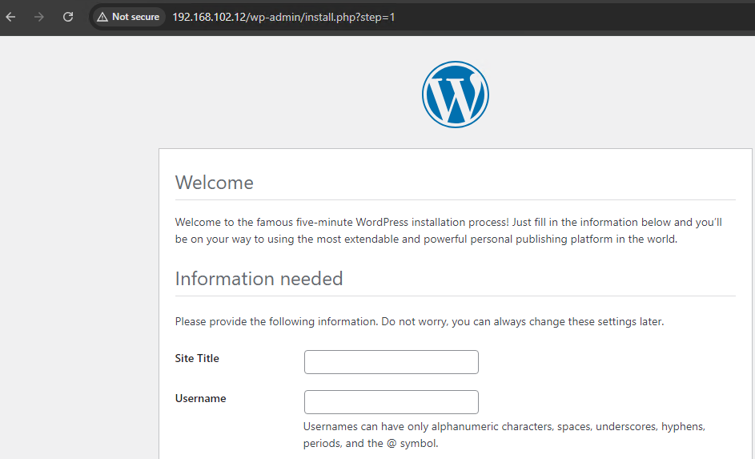

In this lab, we have successfully deployed a Kubernetes application stack without managing any VM or underlying infrastructure resources. By utilizing the power of NKE and NBD platforms, we can significantly improve the efficiency of application development process by reducing the heavy lifting of managing the underlying infrastructure.
