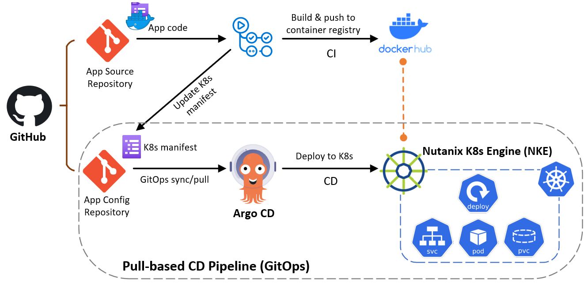
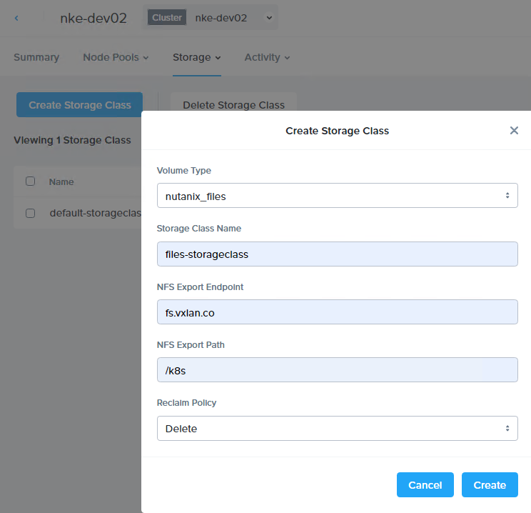
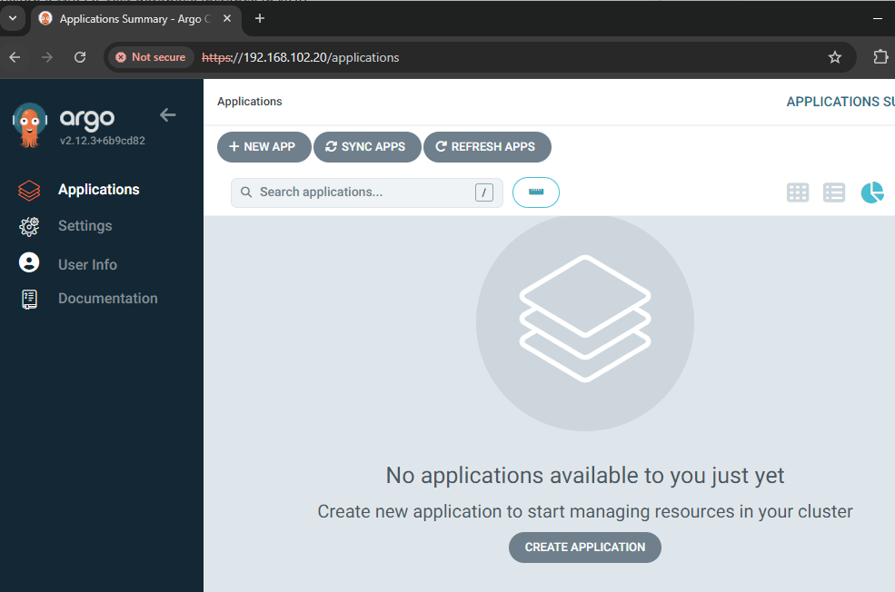
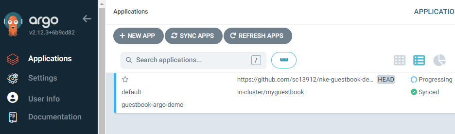
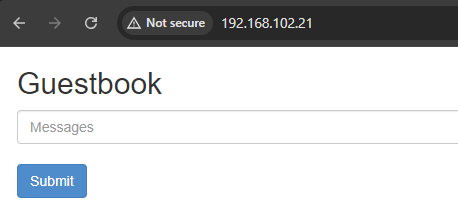
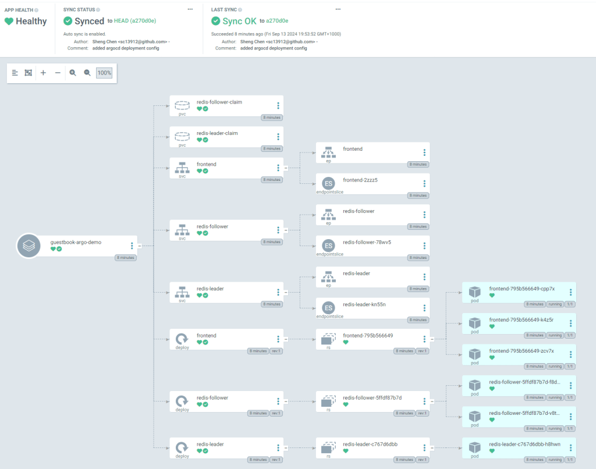
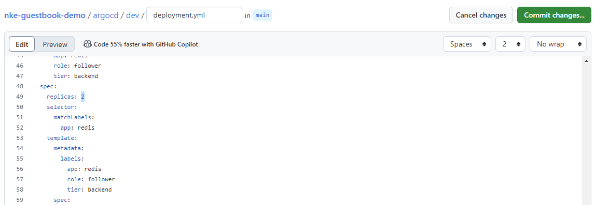
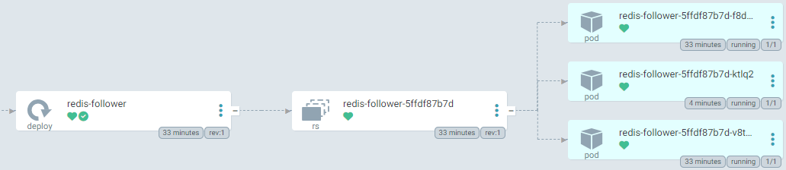

This is the 5th episode of our [NKE lab series](/tags/nke/). In this episode, I will demonstrate how you can easily build a fully-automated GitOps continues delivery (CD) pipeline, by using Github, NKE and [Argo CD](https://argoproj.github.io/cd/).

[GitOps](https://about.gitlab.com/topics/gitops/) is a operational framework that takes DevOps best practices (such as version control, Infra-as-Code, CI/CD etc), and applies them to modern and cloud native infrastructure such as Kubernetes-based clusters.

There are two GitOps approaches: Push-based and Pull-based, and you can reach more about each model [at here](https://www.harness.io/blog/gitops-the-push-and-pull-approach). This post will focus on the Pull-based approach as it provides many benefits such as better version control and governance, more automation and self-service capabilities, and easier for rollback, auditing/compliance suitable for large and stable production environment.

Below is an overview of the lab architecture (boxed environment) – specifically we’ll build a pull-based GitOps pipeline using GitHub, Argo CD and NKE. Argo CD will automatically pull the k8s application config from GitHub and deploy a [guestbook demo app](https://github.com/sc13912/nke-guestbook-demo) (as seen in [Ep2](/2024/08/08/nke-lab-series-ep2-deploy-a-multi-tier-web-application-on-a-nke-enabled-kubernetes-cluster-using-nutanix-csi/)). onto our NKE cluster.



I will walk through the following steps:

- **PART-1**: Prepare a NKE cluster
- **PART-2**: Install Argo CD onto your NKE cluster
- **PART-3**: Deploy the GitOps CD pipeline using Argo CD

## pre-requisites

- a 1-node or 3-node [Nutanix CE 2.0](https://next.nutanix.com/discussion-forum-14/download-community-edition-38417) cluster deployed in nested virtualization depending on your lab compute capacity, as documented [here](https://www.jeroentielen.nl/installing-nutanix-community-edition-ce-on-vmware-esxi-vsphere/) and [here](https://polarclouds.co.uk/nested-nutanix-ce-deployment/)
- a NKE-enabled K8s cluster deployed in Nutanix CE ([see Ep1](/2024/08/08/nutanix-kubernetes-engine-nke-lab-series-ep1-create-a-nke-enabled-kubernetes-cluster-on-nutanix-community-edition-ce/))
- a lab network environment supports VLAN tagging and provides basic infra services such as AD, DNS, NTP etc (these are required when installing the CE cluster)
- a Linux/Mac workstation for managing the Kubernetes cluster, with **Kubectl** installed.
- fork the [Git repo](https://github.com/sc13912/nke-guestbook-demo) which includes the Argo CD k8s app config file
- prepare a Nutanix File Server (see **part-2** [at here](/2024/08/08/nke-lab-series-ep2-deploy-a-multi-tier-web-application-on-a-nke-enabled-kubernetes-cluster-using-nutanix-csi/)), which is required to provide multi-access persistent storage for the Redis cluster within the demo app

## PART-1: Prepare a NKE cluster

If you haven’t got a NKE cluster yet, follow the [guide here](/2024/08/08/nutanix-kubernetes-engine-nke-lab-series-ep1-create-a-nke-enabled-kubernetes-cluster-on-nutanix-community-edition-ce/) to build one first. Once you have the cluster ready, navigate to *Storage \> Storage Classes* to deploy a file-based storage class using the Nutanix Files (as listed in the prerequisites). This is required to provide multi-access persistent volumes (PVs) for the Redis followers within the demo app.



You should see the new (file-based) storage class popping up in the NKE cluster immediately.

```
sc@vx-ops03:~$ kubectl get storageclasses.storage.k8s.io 
NAME                             PROVISIONER       RECLAIMPOLICY   VOLUMEBINDINGMODE   ALLOWVOLUMEEXPANSION   AGE
default-storageclass (default)   csi.nutanix.com   Delete          Immediate           true                   23h
files-storageclass               csi.nutanix.com   Delete          Immediate           false                  58s

sc@vx-ops03:~$ kubectl describe storageclasses.storage.k8s.io files-storageclass 
Name:                  files-storageclass
IsDefaultClass:        No
Annotations:           <none>
Provisioner:           csi.nutanix.com
Parameters:            nfsPath=/k8s,nfsServer=fs.vxlan.co,storageType=NutanixFiles
AllowVolumeExpansion:  <unset>
MountOptions:          <none>
ReclaimPolicy:         Delete
VolumeBindingMode:     Immediate
Events:                <none>
```

Next, we’ll prepare a Load Balancer service for our NKE cluster. You can skip this step if you have already deployed a LB controller within your cluster.

For this, I’ll simply install MetalLB in my cluster using L2 mode. Follow the [installation guide](https://metallb.universe.tf/installation/) to deploy MetalLB.

```
kubectl apply -f https://raw.githubusercontent.com/metallb/metallb/v0.14.8/config/manifests/metallb-native.yaml
...
sc@vx-ops03:~$ kubectl get all -n metallb-system 
NAME                              READY   STATUS    RESTARTS   AGE
pod/controller-77676c78d9-f5552   1/1     Running   0          60s
pod/speaker-6nhh5                 1/1     Running   0          60s
pod/speaker-nqj9p                 1/1     Running   0          60s

NAME                              TYPE        CLUSTER-IP     EXTERNAL-IP   PORT(S)   AGE
service/metallb-webhook-service   ClusterIP   10.21.19.162   <none>        443/TCP   60s
NAME                     DESIRED   CURRENT   READY   UP-TO-DATE   AVAILABLE   NODE SELECTOR            AGE
daemonset.apps/speaker   2         2         2       2            2           kubernetes.io/os=linux   60s
NAME                         READY   UP-TO-DATE   AVAILABLE   AGE
deployment.apps/controller   1/1     1            1           60s
NAME                                    DESIRED   CURRENT   READY   AGE
replicaset.apps/controller-77676c78d9   1         1         1       60s
```

Once all MetalaLB components are up and running, apply the following config file to enable the LB service at L2 mode. Note you need to the change the LB IP address pool to match your Lab environment – this should be the same subnet to where your NKE cluster is deployed.

```
sc@vx-ops03:~/nke-guestbook-demo/MetalLB-config$ cat metallb_config.yaml 
---
apiVersion: metallb.io/v1beta1
kind: IPAddressPool
metadata:
  name: default
  namespace: metallb-system
spec:
  addresses:
  - 192.168.102.20-192.168.102.29
  autoAssign: true
---
apiVersion: metallb.io/v1beta1
kind: L2Advertisement
metadata:
  name: default
  namespace: metallb-system
spec:
  ipAddressPools:
  - default
sc@vx-ops03:~/nke-guestbook-demo/MetalLB-config$ 
sc@vx-ops03:~/nke-guestbook-demo/MetalLB-config$ kubectl apply -f metallb_config.yaml 
ipaddresspool.metallb.io/default created
l2advertisement.metallb.io/default created
```

We are now ready to install Argo CD into our NKE cluster.

## PART-2: Install Argo CD onto the NKE cluster

To install Argo CD, simply follow the [official guide here](https://argo-cd.readthedocs.io/en/stable/getting_started/).

```
kubectl create namespace argocd
kubectl apply -n argocd -f https://raw.githubusercontent.com/argoproj/argo-cd/stable/manifests/install.yaml
```

You’ll see a bunch of resources being created within the NKE cluster (argocd namespace). Specifically, the Argo CD application controller is a Kubernetes controller that continuously monitors running applications and compares the current, live state against the desired target state (as specified in the repo). When it detects a mismatch (called out-of-sync), and depending on your configuration, Argo CD can automatically pull the latest app config from the repository and deploy it to the designated K8s cluster.

```
sc@vx-ops03:~$ kubectl get all -n argocd
NAME                                                    READY   STATUS    RESTARTS   AGE
pod/argocd-application-controller-0                     1/1     Running   0          104s
pod/argocd-applicationset-controller-587b5c864b-gdnsn   1/1     Running   0          105s
pod/argocd-dex-server-6958d7dcf4-ff589                  1/1     Running   0          105s
pod/argocd-notifications-controller-6847bd5c98-9h8nf    1/1     Running   0          105s
pod/argocd-redis-bfcfd667f-nxx8x                        1/1     Running   0          105s
pod/argocd-repo-server-9646985c8-sfshk                  1/1     Running   0          105s
pod/argocd-server-9d6c97757-88mhk                       1/1     Running   0          105s

NAME                                              TYPE        CLUSTER-IP      EXTERNAL-IP   PORT(S)                      AGE
service/argocd-applicationset-controller          ClusterIP   10.21.137.108   <none>        7000/TCP,8080/TCP            105s
service/argocd-dex-server                         ClusterIP   10.21.244.74    <none>        5556/TCP,5557/TCP,5558/TCP   105s
service/argocd-metrics                            ClusterIP   10.21.133.37    <none>        8082/TCP                     105s
service/argocd-notifications-controller-metrics   ClusterIP   10.21.195.247   <none>        9001/TCP                     105s
service/argocd-redis                              ClusterIP   10.21.250.115   <none>        6379/TCP                     105s
service/argocd-repo-server                        ClusterIP   10.21.191.71    <none>        8081/TCP,8084/TCP            105s
service/argocd-server                             ClusterIP   10.21.213.76    <none>        80/TCP,443/TCP               105s
service/argocd-server-metrics                     ClusterIP   10.21.55.77     <none>        8083/TCP                     105s

NAME                                               READY   UP-TO-DATE   AVAILABLE   AGE
deployment.apps/argocd-applicationset-controller   1/1     1            1           105s
deployment.apps/argocd-dex-server                  1/1     1            1           105s
deployment.apps/argocd-notifications-controller    1/1     1            1           105s
deployment.apps/argocd-redis                       1/1     1            1           105s
deployment.apps/argocd-repo-server                 1/1     1            1           105s
deployment.apps/argocd-server                      1/1     1            1           105s

NAME                                                          DESIRED   CURRENT   READY   AGE
replicaset.apps/argocd-applicationset-controller-587b5c864b   1         1         1       105s
replicaset.apps/argocd-dex-server-6958d7dcf4                  1         1         1       105s
replicaset.apps/argocd-notifications-controller-6847bd5c98    1         1         1       105s
replicaset.apps/argocd-redis-bfcfd667f                        1         1         1       105s
replicaset.apps/argocd-repo-server-9646985c8                  1         1         1       105s
replicaset.apps/argocd-server-9d6c97757                       1         1         1       105s

NAME                                             READY   AGE
statefulset.apps/argocd-application-controller   1/1     105
```

Next, we’ll need to expose the ArgoCD server to external so we can access the Web UI. This can be easily achieved using the MetalLB service we deployed before.

We’ll patch the existing *argocd-server* service and change the service type from ClusterIP to LoadBalancer.

```
sc@vx-ops03:~$ kubectl patch svc argocd-server -n argocd -p '{"spec": {"type": "LoadBalancer"}}'
service/argocd-server patched
```

and you should see its service type now changed to **LoadBalancer**, with a external IP automatically assigned from the LB address pool as configured earlier.

```
sc@vx-ops03:~$ kubectl get svc -n argocd argocd-server
NAME            TYPE           CLUSTER-IP     EXTERNAL-IP      PORT(S)                      AGE
argocd-server   LoadBalancer   10.21.213.76   192.168.102.20   80:31375/TCP,443:30619/TCP   113m
```

You should now be able to access the Web UI. But first let’s grab the initial admin password.

```
sc@vx-ops03:~$ kubectl -n argocd get secret argocd-initial-admin-secret -o jsonpath="{.data.password}" | base64 -d
```

Now open a browser page and hit the LB address for **argocd-server** (192.168.102.20 in my case), you should be able to login using *admin* with the initial password. Once logged in, you can update the password under *User Info \> Update password*.



## PART-3: Deploy the GitOps CD pipeline using Argo CD

It’s time to deploy the GitOps CD pipeline. For this, I have prepared an Argo CD application config file at the Git repo [here](https://github.com/sc13912/nke-guestbook-demo/tree/main/argocd).

```
sc@vx-ops03:~/nke-guestbook-demo/argocd$ cat application.yml 
apiVersion: argoproj.io/v1alpha1
kind: Application
metadata:
  name: guestbook-argo-demo
  namespace: argocd
spec:
  project: default

  source:
    repoURL: https://github.com/sc13912/nke-guestbook-demo.git
    targetRevision: HEAD
    path: argocd/dev
  destination: 
    server: https://kubernetes.default.svc
    namespace: myguestbook

  syncPolicy:
    syncOptions:
    - CreateNamespace=true

    automated:
      selfHeal: true
      prune: true
```

The above Argo CD config file defines the following:

- It tells Argo CD to monitor my **[nke-guestbook-demo](https://github.com/sc13912/nke-guestbook-demo/tree/main)** (path: argocd/dev) as the source repo for the demo app configuration;
- It tells Argo CD to deploy the demo app to the target K8s cluster (ie. local NKE cluster), within the **myguestbook** namespace;
- It tells Argo CD to auto create the namespace if it doesn’t exist in the target cluster;
- It also enables auto sync (disabled by default), with automatic self-healing and pruning — you can read more about these [at here](https://argo-cd.readthedocs.io/en/stable/user-guide/auto_sync/).

Now let’s go ahead and apply the Argo CD config:

```
sc@vx-ops03:~/nke-guestbook-demo/argocd$ kubectl apply -f application.yml 
application.argoproj.io/guestbook-argo-demo created
```

Since currently there is no app managed by Argo CD, it will immediately detect a mismatch (out-of-sync) and automatically pull the demo app config from the Git repo and deploy it onto the local NKE cluster.



We’ll see a bunch of resources being created within the NKE cluster. Take a note of the **frontend** LoadBalancer external address (192.168.102.21).

```
sc@vx-ops03:~/nke-guestbook-demo/argocd$ kubectl get all -n myguestbook 
NAME                                  READY   STATUS    RESTARTS   AGE
pod/frontend-795b566649-cpp7x         1/1     Running   0          5m8s
pod/frontend-795b566649-k4z5r         1/1     Running   0          5m8s
pod/frontend-795b566649-zcv7x         1/1     Running   0          5m8s
pod/redis-follower-5ffdf87b7d-f8dzg   1/1     Running   0          5m8s
pod/redis-follower-5ffdf87b7d-v8tcc   1/1     Running   0          5m8s
pod/redis-leader-c767d6dbb-h8hwn      1/1     Running   0          5m8s

NAME                     TYPE           CLUSTER-IP     EXTERNAL-IP      PORT(S)        AGE
service/frontend         LoadBalancer   10.21.130.37   192.168.102.21   80:31512/TCP   5m8s
service/redis-follower   ClusterIP      10.21.130.41   <none>           6379/TCP       5m8s
service/redis-leader     ClusterIP      10.21.227.65   <none>           6379/TCP       5m8s

NAME                             READY   UP-TO-DATE   AVAILABLE   AGE
deployment.apps/frontend         3/3     3            3           5m8s
deployment.apps/redis-follower   2/2     2            2           5m8s
deployment.apps/redis-leader     1/1     1            1           5m8s

NAME                                        DESIRED   CURRENT   READY   AGE
replicaset.apps/frontend-795b566649         3         3         3       5m9s
replicaset.apps/redis-follower-5ffdf87b7d   2         2         2       5m9s
replicaset.apps/redis-leader-c767d6dbb      1         1         1       5m9s
```

Open a browser page and hit the LB address, you should see the Guestbook page coming up.



Back at the Argo CD console, we can see the app status is now fully synced, and you can easily visualize what resources (Pods, PVCs, Services etc) are getting deployed. You can also click into each individual resource to examine the details such as live manifest and logs etc.



To test the automatic sync mechanism, we can make a simple change at the source repo: let’s update the Redis follower replica (from 2 to 3) and commit the change.



By default, Argo CD performs periodic check at 3-min interval. So after 3min you should see Argo CD detect the config update from the source repo and automatically deploy an additional Pod for the Redis follower Replicaset.


