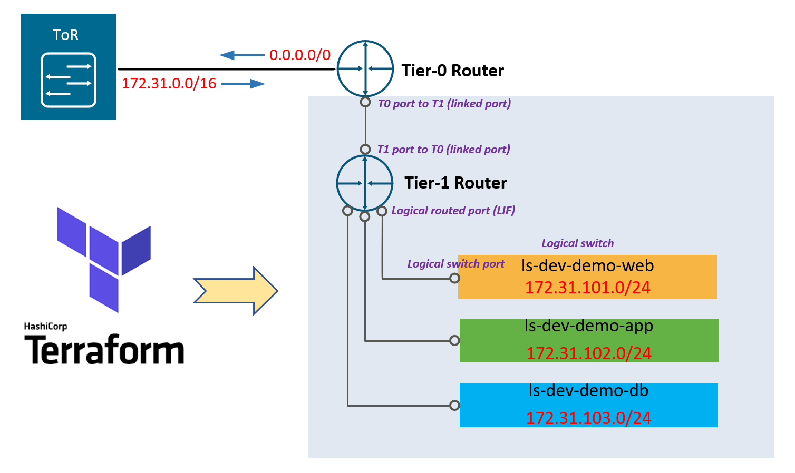
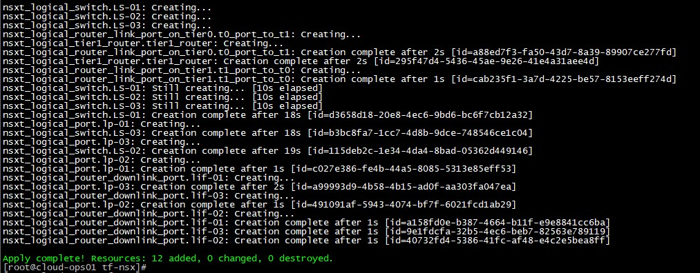
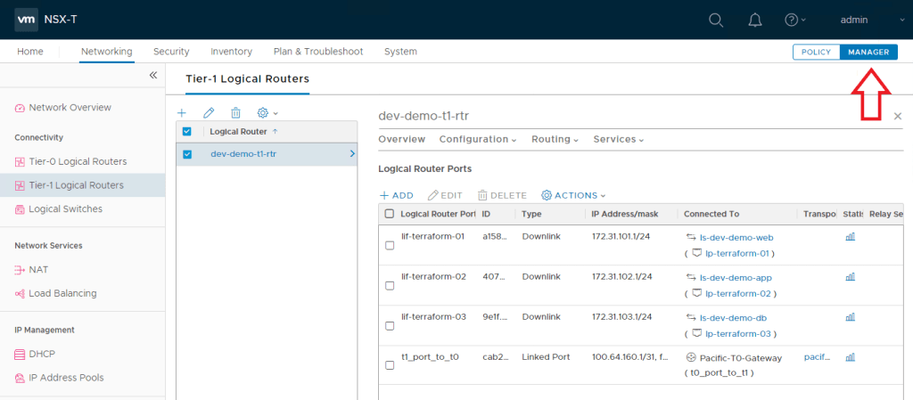
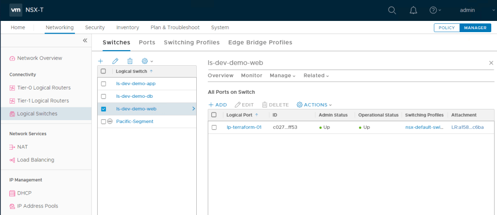
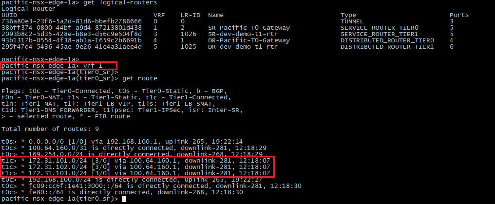
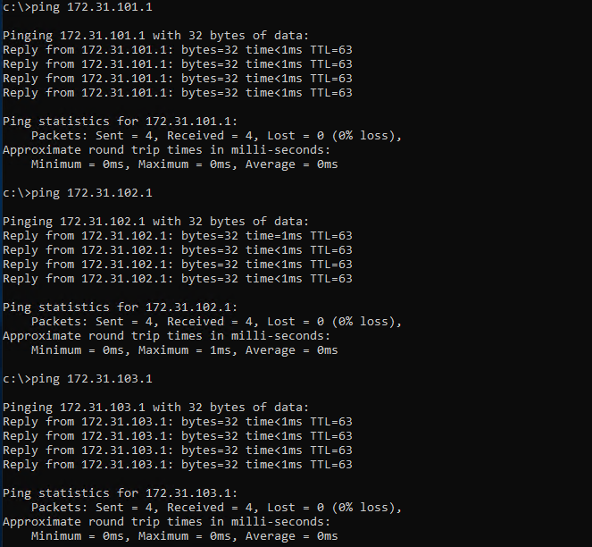

Recently I have tried out the Terraform NSX-T Provider and it worked like a charm. In this post, I will demonstrate a simple example on how to leverage Terraform to provision a basic NSX tenant network environment, which includes the following:

1.  create a Tier-1 router
2.  create (linked) routed ports on the new T1 router and the existing upstream T0 router
3.  link the T1 router to the upstream T0 router
4.  create three logical switches with three logical ports
5.  create three downlink LIFs (with subnets/gateway defined) on the T1 router, and link each of them to the logical switch ports accordingly

Once the tenant environment is provisioned by Terraform, the 3x tenant subnets will be automatically published to the T0 router and propagated to the rest of the network (if BGP is enabled), and we should be able to reach the individual LIF addresses. Below is a sample topology deployed in my lab — (here I’m using pre-provisioned static routes between the T0 and upstream network for simplicity reasons).



**Software Versions Used & Verified**

- Terraform – v0.12.25
- NSX-T Provider – v3.0.1 (auto downloaded by Terraform)
- NSX-T Data Center -v3.0.2 (build 0.0.16887200)

**Sample Terraform Script**

You can find the sample Terraform script at [my Git repo here](https://github.com/sc13912/tf-nsxt.git) — remember to update the variables based on your own environment.

```
nsx_manager     = "192.168.100.125"
nsx_username    = "admin"
nsx_password    = "xxxxxx"
nsxt_t1_rt_name = "dev-demo-t1-rtr"
ls1_name        = "ls-dev-demo-web"
ls2_name        = "ls-dev-demo-app"
ls3_name        = "ls-dev-demo-db"
ls1_gw          = "172.31.101.1/24"
ls2_gw          = "172.31.102.1/24"
ls3_gw          = "172.31.103.1/24"
```

Run the Terraform script and this should take less than a minute to complete.



We can review and reverify that the required NSX components were built successfully via the NSX manager UI — Note: you’ll need to switch to the “Manager mode” to be able to see the newly create elements (T1 router, logical switches etc), as Terraform was interacting with the NSX management plane (via MP-API) directly.





In addition, we can also check and confirm the3x tenant subnets are published via T1 to T0 by SSH into the active edge node. Make sure you connect to the correct VRF table for the T0 service router (SR) in order to see the full route table — here we can see the 3x /24 subnets are indeed advertised from T1 to T0 as directly connected (t1c) routes.



As expected I can reach to each of the three LIFs on the T1 router from the lab terminal VM.


