This blog is the 1st episode of a Nutanix Kubernetes Engine (NKE) home lab series. In this post, I will walk through the detailed process of deploying an enterprise-ready NKE-enabled Kubernetes cluster within a [Nutanix CE](https://www.nutanix.com/au/products/community-edition) environment.

Nutanix CE is a free version of Nutanix AOS, which powers the Nutanix Enterprise Cloud Platform. It is designed for people interested in test driving Nutanix platform features and capabilities in a non-production or PoC environment. Even better, Nutanix CE also works in a nested virtualization deployment on top of ESXi/vSphere. This makes it perfect for hands-on testing or exploring in a safe environment such as home-lab, which is exactly what I’m running here!

## pre-requisites

- a vSphere 7/8 environment with at least **64GB RAM** and **1TB** storage (preferably SSD)
- a 1-node or 3-node [Nutanix CE 2.0](https://next.nutanix.com/discussion-forum-14/download-community-edition-38417) cluster deployed in nested virtualization depending on your lab compute capacity, as documented [here](https://www.jeroentielen.nl/installing-nutanix-community-edition-ce-on-vmware-esxi-vsphere/) and [here](https://polarclouds.co.uk/nested-nutanix-ce-deployment/)
- Prism Central installed and connected to your CE cluster (I’m running **pc.2023.4.0.2**)
- a lab network environment supports VLAN tagging and provides basic infra services such as AD, DNS, NTP etc (these are required when installing the CE cluster)
- a Linux/Mac workstation for managing the Kubernetes cluster, with [Kubectl installed](https://kubernetes.io/docs/tasks/tools/#kubectl)
- Since this is in nested virtualization and the NKE cluster will be running on separate & dedicated VLAN, you need to apply the following vDS/vSS port-group configuration to the CE VM vNICs.
  - VLAN ID: All (4095),
  - Security – Promiscuous mode (Accept)
  - Security – Mac address changes (Accept)
  - Security – Forged transmits (Accept)

## **Lab Steps**

### Step-1: Prepare the CE cluster environemnt

Before we start, we’ll need to prepare our lab CE cluster and apply all the software/firmware patches and updates. To do so, simply go to Life Cycle Manager (LCM) in Prism Element, or *Platform Services \> Admin Center \> LCM* in Prism Central to perform an inventory discovery, and then follow the Update wizard to complete all software updates. Below is a snapshot of all software versions I’m running after the update process completes.

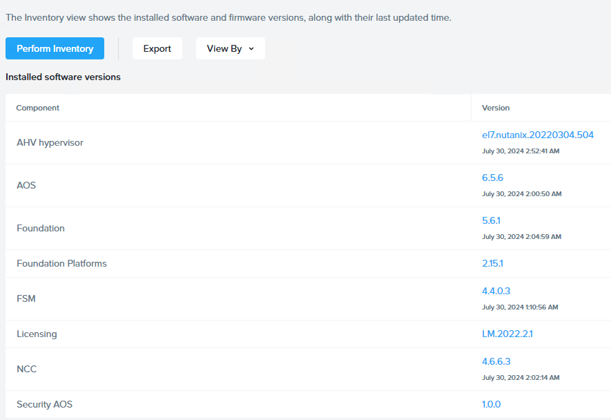

Next, log back into Prism Central and navigate to *Platform Services \> Apps & Marketplace* to **Enable Marketplace**.

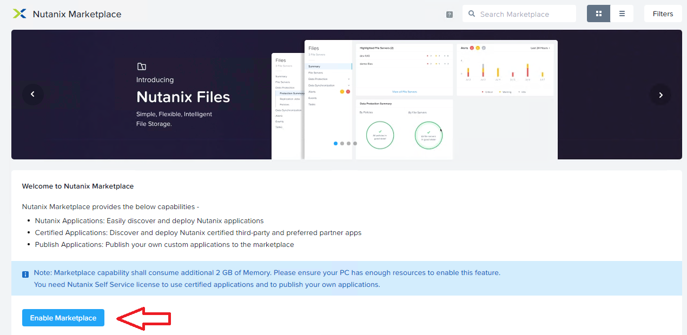

This process will take a few mins to complete, after that you’ll be able to select and install the NKE package. Below is what I have enabled on my CE environment, including some additional packages such as Foundation Central and Nutanix Files Manager, which will be used for CSI integrations in Episode 2 (stay tuned!).

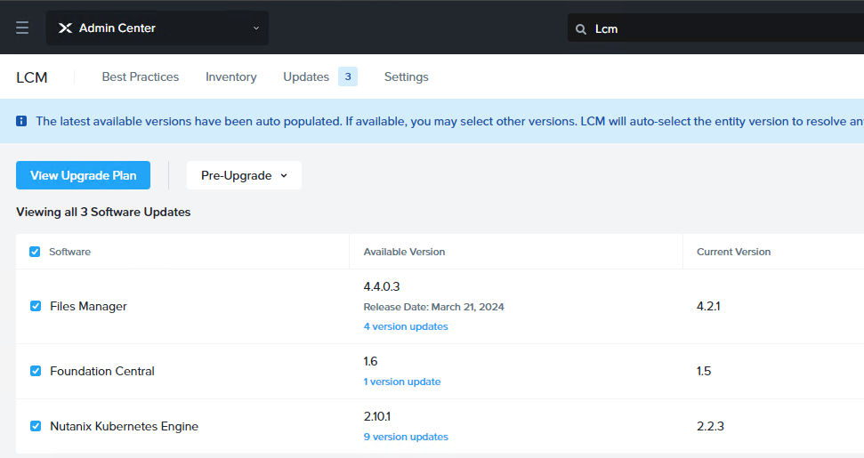

**Note:** By default the NKE version installed is only v2.2.3 which is far outdated, and you’ll need to run another LCM inventory check and update it to the latest version available (**v2.10.1** in my case as shown above)

Now go to the new NKE menu under Cloud Infrastructure \> Kubernetes Management, and you’ll need to download the latest NKE node OS and different Kubernetes version images based on your own needs.

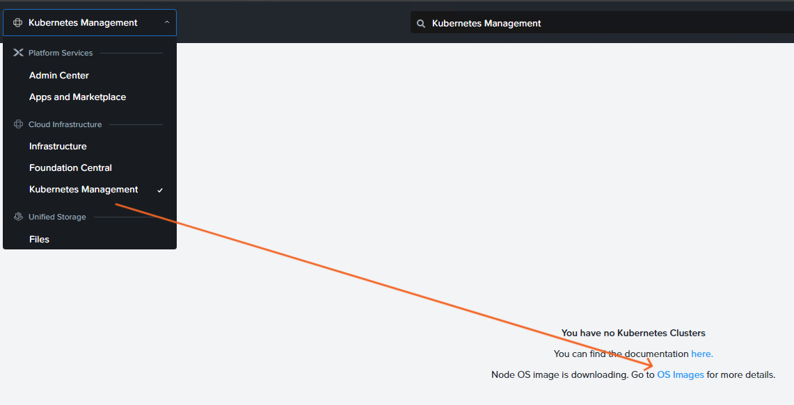

These are all the NKE node OS with Kubernetes images available to me at this point of time.

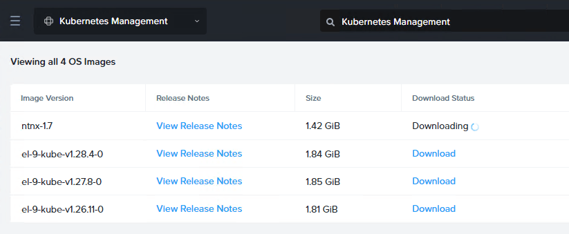

Before we can deploy the NKE cluster, the last thing is to prepare a dedicated VLAN/subnet. Go to *Infrastructure \> Network & Security \> Subnet* to create a subnet (VLAN 102 in my case).

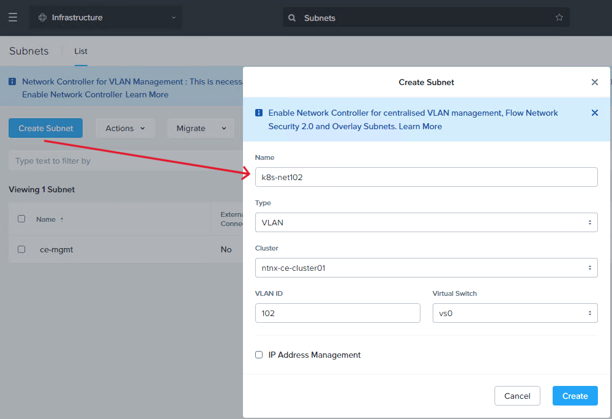

**NOTE:** It is very important this subnet has DHCP or IPAM configured as NKE will need this to automatically assign IP addresses for K8s nodes during cluster deployment. Since I’m using a Juniper switch to provide the DHCP service so I have left IPAM unchecked here.

### STEP-2: deploy a NKE-enabled K8s cluster

Time to deploy the NKE cluster. Navigate to *Cloud Infrastructure \> Kubernetes Management \> Clusters* and click *Create Kubernetes Cluster*.

For the purpose of demo (and save precious lab resources), we’ll deploy a Development Cluster.

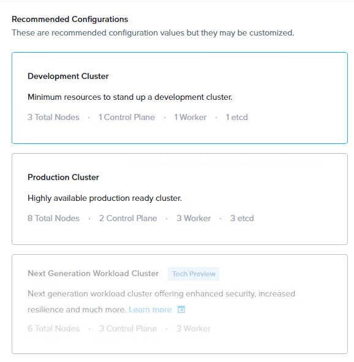

Provide a cluster name, and select preferred Node OS image and Kubernetes versions.

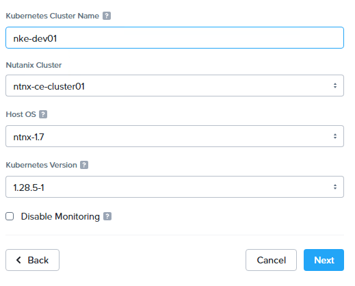

Specify the NKE cluster subnet we prepared earlier, and the number of worker nodes.

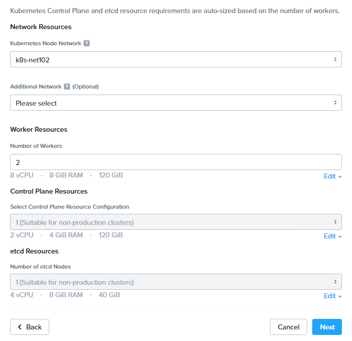

Next, select a CNI provider and specify the Kubernetes Pod and Service CIDR ranges. At the moment there are only 2x CNI options: Calico and Flannel. We’ll go with Calico as it is the most commonly deployed CNI in production.

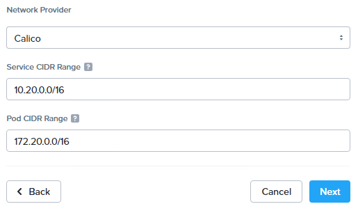

Next, configure a default storage class as the platform built-in CSI driver to provide [persistent storage](https://kubernetes.io/docs/concepts/storage/persistent-volumes/) for the NKE cluster. We’ll dive deeper on this in Ep2 to explore more features and capabilities provided by the NKE platform. You can also enable Flash Mode to ensure the Persistent Volumes (PVs) consumed by Pods are to be deployed on SSDs.

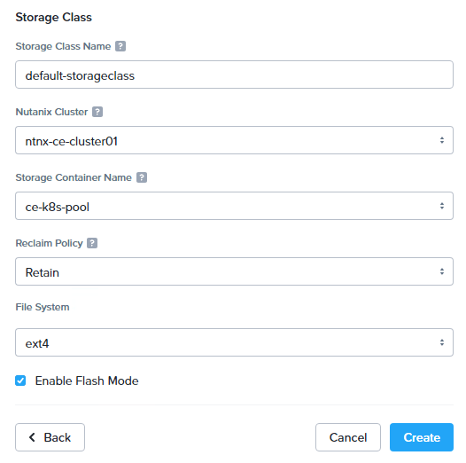

Now go ahead and deploy the NKE cluster. Depending on your CE cluster capacity, the process might take 10~20 min to complete. (note if you are getting ETCD deployment error, double check the NKE subnet DHCP/IPAM configuration).

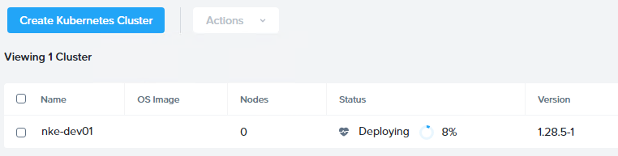

### STEP-3: ACCESS the NKE cluster

With a bit of luck you should see a Kubernetes cluster up and running in 20min. In my case, NKE has deployed a total of 4x K8s VM nodes, including:

- **1x Etcd node** (192.168.102.101) – a key-value database manages and holds the configuration data, state data, and metadata for the Kubernetes cluster
- **1x K8s master node** (192.168.102.102) – provides K8s API endpoint for cluster management & orchestration
- **2x K8s worker nodes** (192.168.102.103 & 104)

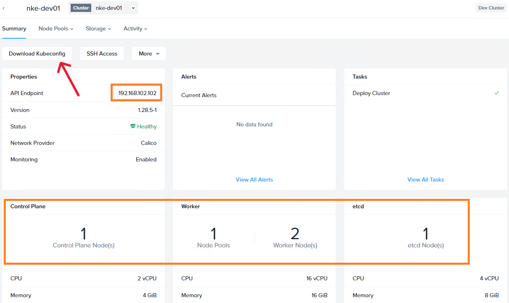

To access our K8s cluster, click “Download Kubeconfig” and save it to your workstation (MAC/Linux) where the [Kubectl tool installed](https://kubernetes.io/docs/tasks/tools/#kubectl).

Copy the kubeconfig file to path ***.kube/config***, and you should now have access to the cluster.

```
sc@vx-ops02:~$ cp nke-dev01-kubectl.cfg .kube/config
sc@vx-ops02:~$ 
sc@vx-ops02:~$ kubectl get nodes -o wide
NAME                        STATUS   ROLES                  AGE   VERSION   INTERNAL-IP       EXTERNAL-IP   OS-IMAGE                KERNEL-VERSION                 CONTAINER-RUNTIME
nke-dev01-89e792-master-0   Ready    control-plane,master   9h    v1.28.5   192.168.102.102   <none>        CentOS Linux 7 (Core)   3.10.0-1160.108.1.el7.x86_64   containerd://1.6.16
nke-dev01-89e792-worker-0   Ready    node                   9h    v1.28.5   192.168.102.103   <none>        CentOS Linux 7 (Core)   3.10.0-1160.108.1.el7.x86_64   containerd://1.6.16
nke-dev01-89e792-worker-1   Ready    node                   9h    v1.28.5   192.168.102.104   <none>        CentOS Linux 7 (Core)   3.10.0-1160.108.1.el7.x86_64   containerd://1.6.16
```

Take a look at the **kube-system** namespace, as expected the Calico CNI provider is installed and ready to provide Kubernetes networking services. We’ll dive deeper into CNI in a later episode.

```
sc@vx-ops02:~$ kubectl get pods -n kube-system 
NAME                                       READY   STATUS    RESTARTS   AGE
calico-kube-controllers-5cd67d7657-52km8   1/1     Running   0          9h
calico-node-4z7kd                          1/1     Running   0          9h
calico-node-vd77x                          1/1     Running   0          9h
calico-node-z7sc4                          1/1     Running   0          9h
calico-typha-6cfbdf945c-ll5p2              1/1     Running   0          9h
coredns-6fb596b5df-4kkrc                   1/1     Running   0          9h
coredns-6fb596b5df-p7mhq                   1/1     Running   0          9h
kube-apiserver-nke-dev01-89e792-master-0   3/3     Running   0          9h
kube-proxy-ds-8k4x5                        1/1     Running   0          9h
kube-proxy-ds-b7wq7                        1/1     Running   0          9h
kube-proxy-ds-ljf2p                        1/1     Running   0          9h
sc@vx-ops02:~$ 
```

and in the **ntnx-system** namespace, we have a bunch of other plugins pre-installed such as FluentBit and Prometheus adapter to provide out-of-the-box logging, monitoring and observability services.

```
sc@vx-ops02:~$ kubectl get pods -n ntnx-system 
NAME                                         READY   STATUS    RESTARTS     AGE
alertmanager-main-0                          2/2     Running   1 (9h ago)   9h
blackbox-exporter-5458d77cfb-d62kc           3/3     Running   0            9h
csi-snapshot-controller-7d68bf5bd7-6fg9c     1/1     Running   0            9h
csi-snapshot-webhook-756b45fb5c-t9k8k        1/1     Running   0            9h
fluent-bit-2qwsg                             1/1     Running   0            9h
fluent-bit-t9d7c                             1/1     Running   0            9h
fluent-bit-v8gdt                             1/1     Running   0            9h
kube-state-metrics-54c97cdfdd-rkm2m          3/3     Running   0            9h
kubernetes-events-printer-6f44868d47-5sg98   1/1     Running   0            9h
node-exporter-gw2ms                          2/2     Running   0            9h
node-exporter-pvw25                          2/2     Running   0            9h
node-exporter-vmdvk                          2/2     Running   0            9h
nutanix-csi-controller-768695cfcf-xpgx9      5/5     Running   1 (9h ago)   9h
nutanix-csi-node-2mrnm                       3/3     Running   1 (9h ago)   9h
nutanix-csi-node-q6plw                       3/3     Running   1 (9h ago)   9h
prometheus-adapter-678c647d87-rbkqc          1/1     Running   0            9h
prometheus-k8s-0                             2/2     Running   0            9h
prometheus-operator-f57b8d9cb-kpwp9          2/2     Running   0            9h
```

More importantly, we can see the Nutanix CSI controller is also deployed for us. If we check the storage classes, we can see the default storage class is now ready to be consumed and the persistent storage provider is *csi.nutanix.com*, perfect!

```
sc@vx-ops02:~$ kubectl get storageclasses.storage.k8s.io 
NAME                             PROVISIONER       RECLAIMPOLICY   VOLUMEBINDINGMODE   ALLOWVOLUMEEXPANSION   AGE
default-storageclass (default)   csi.nutanix.com   Retain          Immediate           true                   9h
```

In the next episode, we’ll deploy a demo app onto our NKE cluster, by using the built-in CSI driver to provide persistent storage for the data tier. We’ll also explore other NKE CSI capabilities and options including native integration with the Nutanix Filer server, stay tuned!
