With the [recently announced](https://aws.amazon.com/blogs/aws/new-amazon-fsx-for-netapp-ontap/) **Amazon FSx for NetApp ONTAP**, it is very exciting that for the first time we have a fully managed ONTAP file system in the cloud! What’s more interesting about this service is that we can now deliver high-performance block storage to the workloads running on VMware Cloud on AWS (VMC) through a first-party Amazon managed service!

In this post I will walk you through a simple example for provisioning and integrating iSCSI-based block storage to a Windows workload running on VMC environment using Amazon FSx for NetAPP ONTAP. For this demo I’ve provisioned the FSx service in a shared service VPC, which is connected to the VMC SDDC cluster through an AWS Transit Gateway (TGW) via VPN attachment (as per below diagram).

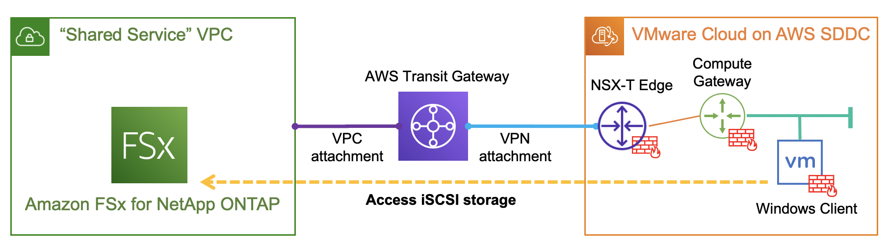

Depending on your environment or requirements, you can also leverage a [VMware Transit Connect](https://blogs.vmware.com/networkvirtualization/2020/09/vmware-transit-connect-simplifying-networking-for-vmc.html/) (or VTGW) to provide high speed VPC connections between the shared service VPC and VMC, or simply provision the FSx service in the connected VPC so no TGW/VTGW is required.

## **AWS Configuration**

To begin, I simply go to AWS console and select FSx in the service category and provision an [Amazon FSx for NetApp ONTAP](https://aws.amazon.com/fsx/netapp-ontap/) service in my preferred region. As a quick summary I have used the below settings:

- SSD storage capacity 1024GB (min 1024GB, max 192TB)
- sustained throughput capacity 512MB/s
- Multi-AZ (ontap cluster) deployment
- 1x storage virtual machine (**svm01**) to provide iSCSI service
- 1x default volume (**/vol01**) of 200GB to host the iSCSI LUNs
- storage efficiency (deduplication/compression etc): enabled
- capacity pool tiering policy: enabled

After around 20min wait, the FSx ONTAP file system will be provisioned and ready for service. If you are using the above settings you should see a summary page similar like below. You can also retrieve the management endpoint IP address under the “**Network & Security**” tab.

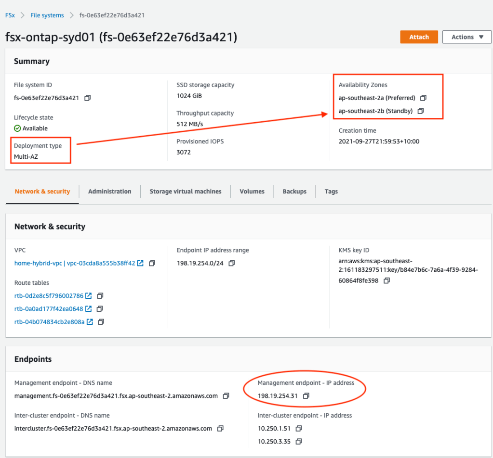

Note the management addresses (for both the cluster and SVMs) are automatically allocated from within a **198.19.0.0/16** range, and the same address block is going to provide the floating IP for NFS/SMB service (so customers don’t have to change file share mounting point address during an ONTAP cluster failover). Since this subnet is not natively deployed in a VPC, AWS will automatically inject the endpoint addresses (for management and NFS/SMB) into the specific VPC route tables based on your configurations.

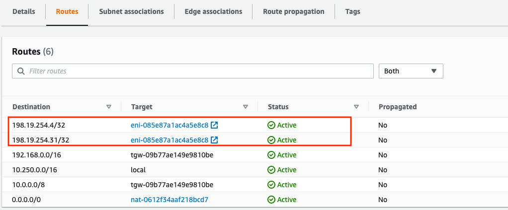

However, you’ll need to specifically inject a static route for this (see below) on TGW/VTGW, especially if you are planning to provide NFS/SMB services to the VMC SDDCs over peering connections — [see here](https://docs.aws.amazon.com/fsx/latest/ONTAPGuide/supported-fsx-clients.html#access-from-peered-networks) for more details.

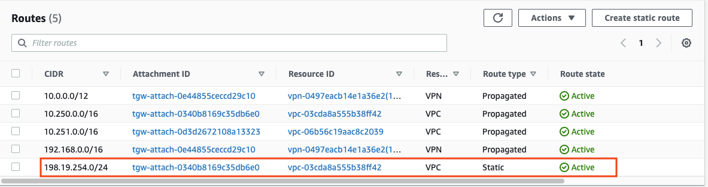

Conversely, this static route is not required if you are only using iSCSI services as the iSCSI endpoints are provisioned directly onto the native subnets hosting the FSx service and are not using the floating IP range — more on this later.

Next, we’ll verify the SVM (svm01) and Volume (vol01) status and make sure they are all online and healthy before we can provision iSCSI LUNs. Note: you’ll always see a separate root volume (automatically) created for each SVM.

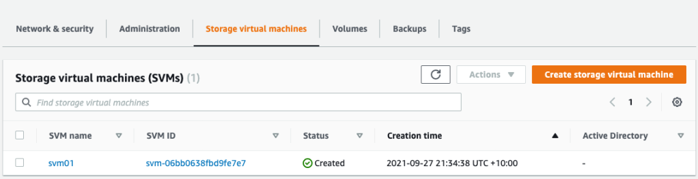

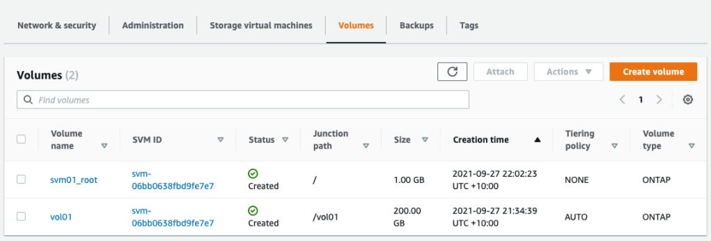

Now click the “svm01” to dive into the details, and you’ll find the iSCSI endpoint IP addresses (again they are in the native VPC subnets not the mgmt floating IP range)

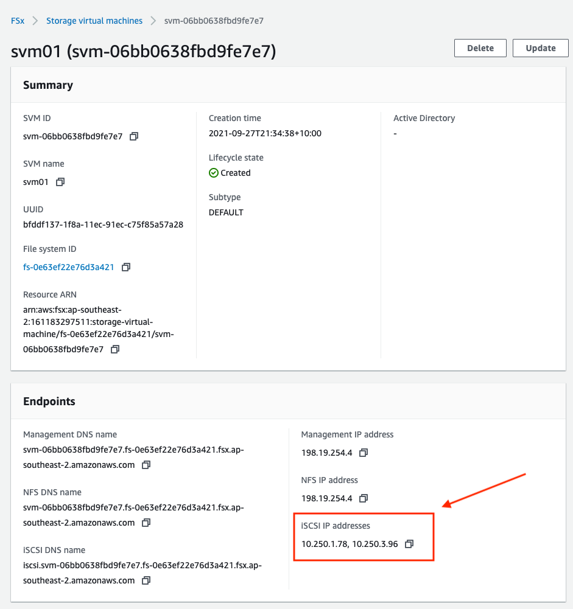

## ONTAP CLI CONFIGURATION

We are now ready to move onto the iSCSI LUN provisioning. This can be done by using either ONTAP API or ONTAP CLI, which is what I’m using here. First, we’ll SSH into the cluster management IP and verify the SVM and volume status.

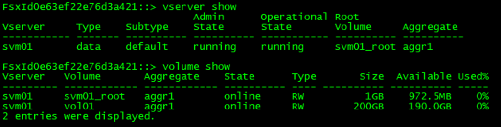

Since this is a fully managed service, iSCSI service has been already activated on the SVM and the cluster is listening for iSCSI sessions on the 2x subnets across both AZs. You’ll also find the iSCSI target name here.

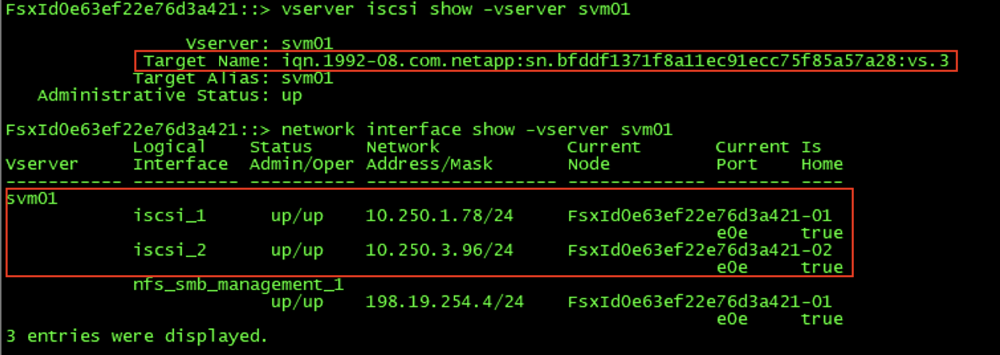

Now we’ll create a 20GB LUN for the Windows client running on VMC.

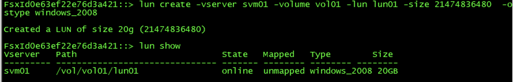

Next, create an igroup to include the Windows client iSCSI initiator. Notice the [ALUA feature](https://kb.netapp.com/Advice_and_Troubleshooting/Data_Storage_Software/ONTAP_OS/Asymmetric_Logical_Unit_Access_(ALUA)_support_on_NetApp_Storage_-_Frequently_Asked_Questions) is enabled by default — this is pretty cool as we can test iSCSI MPIO as well 🙂

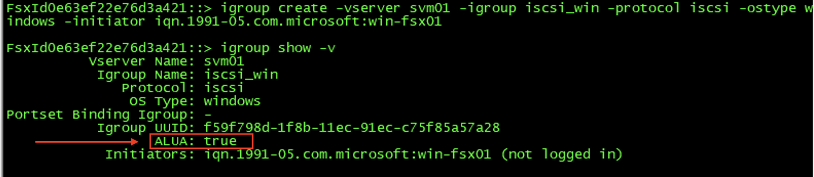

Finally, map the igroup to the LUN we have just created, make sure the LUN is now in “mapped” status and we are all done here!

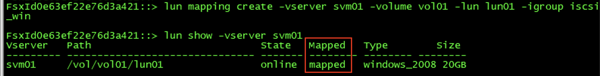

## Windows Client Setup

On the Windows client (running on the VMC), launch the iSCSI initiator configuration and put the iSCSI IP address of one of the FSx subnets in “Quick Connect”, Windows will automatically discover the available targets on the FSx side and log into the fabric.

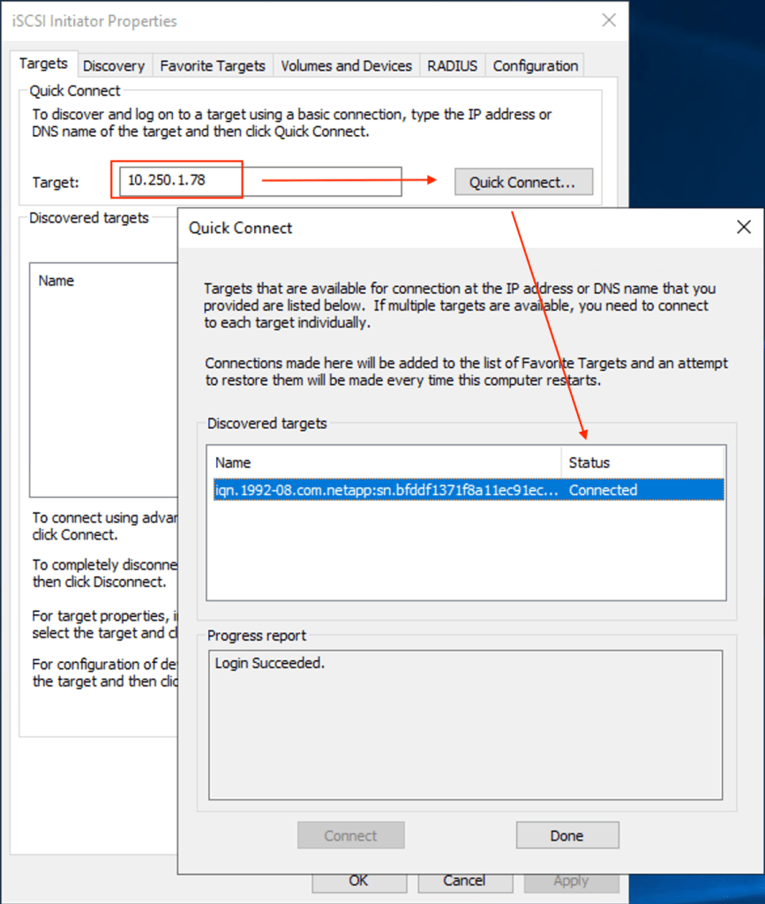

Optionally, you could add a secondary storage I/O path if MPIO is installed/enabled on the Windows client. Like in my example here, I have add a second iSCSI session by using another iSCSI endpoint address in a different FSx subnet/AZ.

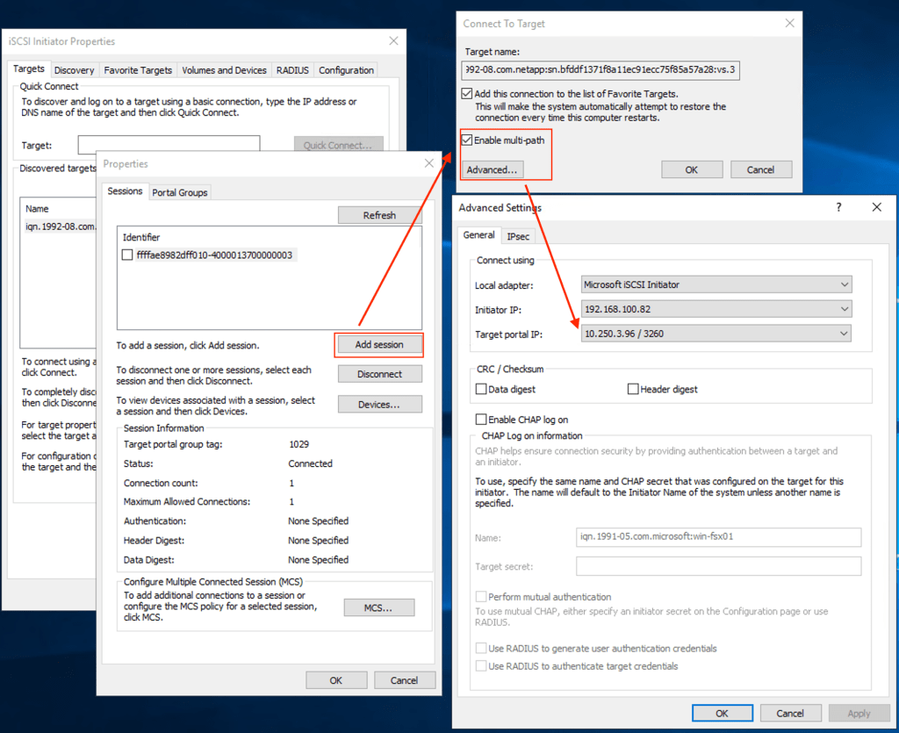

Now click “Auto Configure” under “Volumes and Devices” to discover and configure the iSCSI LUN device.

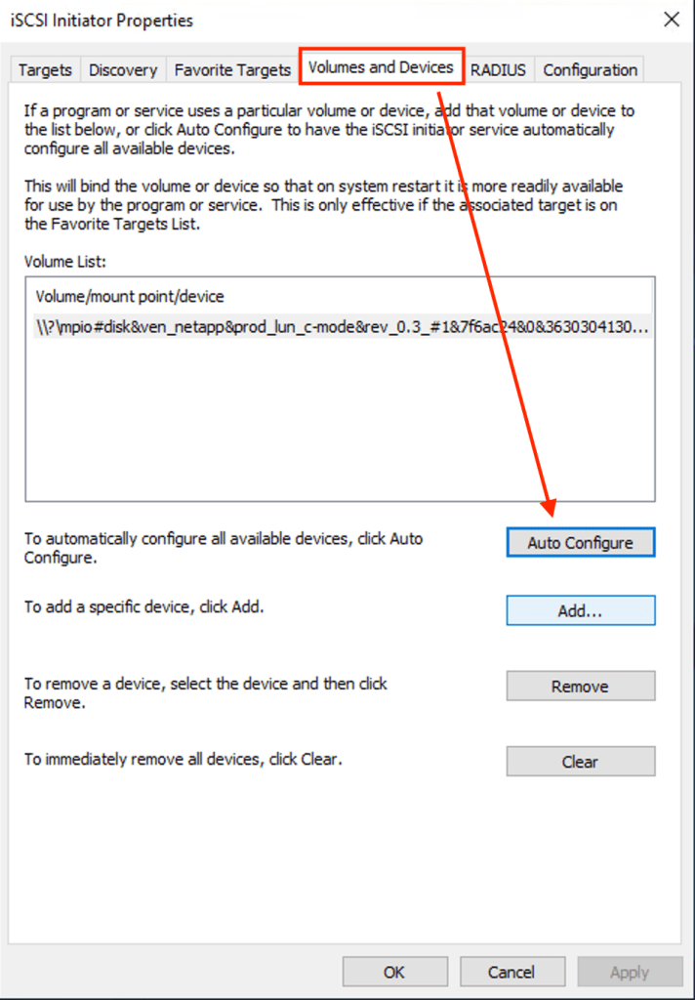

Next, go to “Computer Management” then “Disk Management” —\> you should see a new 20GB disk has been automatically discovered (or manually refresh the hardware list if you can’t see the new disk yet). Initialise and format the disk.

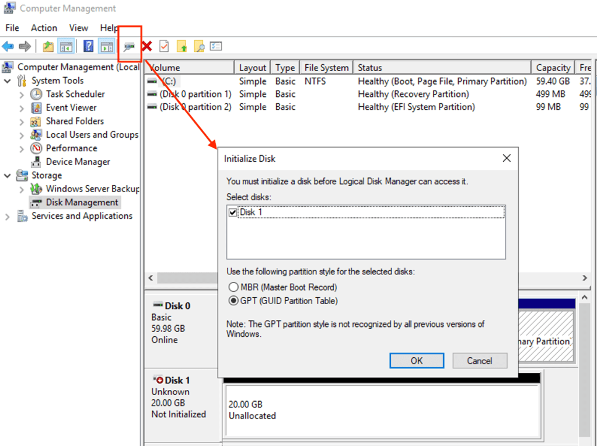

The new 20GB disk is now ready to use. In the disk properties, you can verify the 2x iSCSI I/O paths as per below, and you can also change the MPIO policy based on your own requirements.

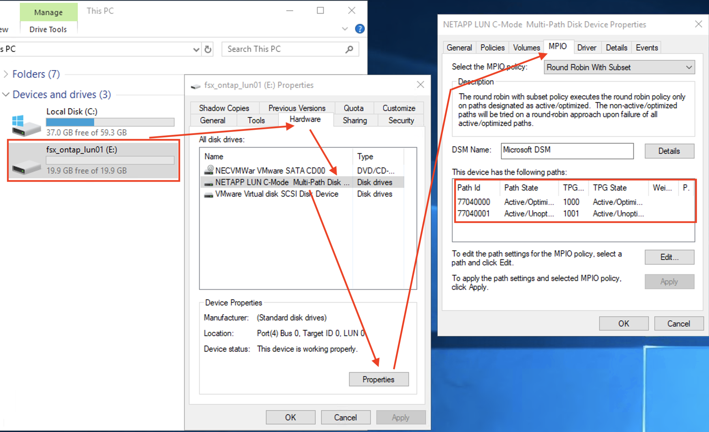
