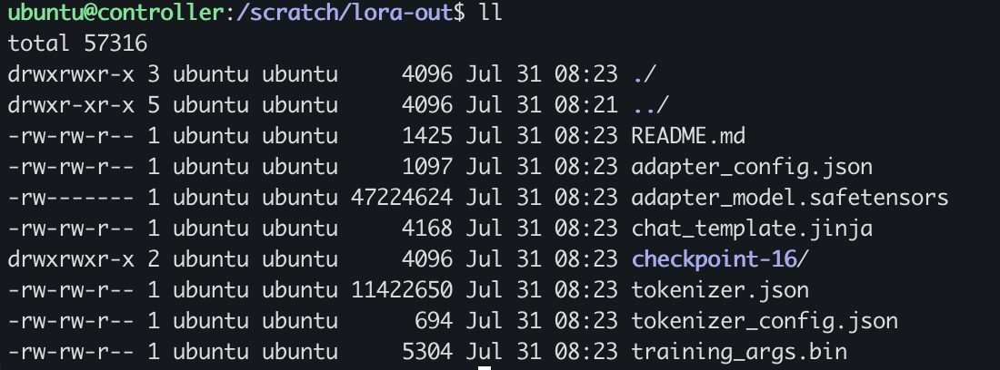

Slurm is the workload manager that runs most of the world's HPC and large-scale ML
training. This post walks through building a small Slurm GPU cluster on AWS from scratch,
and runs a distributed LoRA fine-tune of Qwen3-4B across two GPU nodes (8 GPUs total).

## Why Slurm for training

If you already run Kubernetes, it's worth being clear about why you'd reach for
Slurm at all. Kubernetes is a *service* orchestrator — built to keep long-running
things alive and healthy. A training run is the opposite shape: a finite job that
grabs N GPUs, runs to completion, and exits. That's a **batch** workload, and Slurm
is a batch scheduler built exactly for it — with a real queue, **gang scheduling**
(all your nodes start together or the job waits), and one-line multi-node launch via
`srun`. 

## Architecture

A Slurm cluster consists of the following basic components: 

- **`slurmctld`** — the controller daemon. The brain: holds the queue, decides what
  runs where. Runs on one node.
- **`slurmd`** — the compute daemon. Runs on every GPU node and executes the work.
- **Munge** — the shared-secret authentication layer the daemons use to trust each
  other.
- **GRES** — Slurm's "generic resource" system, which is how it learns a node has
  GPUs and hands them out to jobs.

We'll run `slurmctld` on a cheap CPU-only controller, and `slurmd` on two GPU nodes.
A shared NFS directory (`/scratch`) ties them together so every node sees the same
code, data, and logs.

## The Setup

To exercise the two levels of GPU communication that real distributed training uses
— fast links *inside* a node and the RDMA network *between* nodes — this build uses:

| Role | Instance | GPUs | Notes |
|---|---|---|---|
| controller | `t3.large` | none | runs slurmctld + NFS server |
| gpu-node-01 | `g6.12xlarge` | 4× NVIDIA L4 | EFA-enabled |
| gpu-node-02 | `g6.12xlarge` | 4× NVIDIA L4 | EFA-enabled |

That's **8 GPUs across 2 nodes**, all in a single VPC subnet to minimize latency.
All three run the **AWS Deep Learning Base GPU AMI (Ubuntu 22.04)** —
`ami-0fd3bc7a446d73ca2` in `ap-northeast-2`. It ships with the pieces we'd
otherwise install by hand:

- **NVIDIA driver 595.71.05** + **CUDA 13.2** toolkit (GPUs work out of the box)
- The full **EFA stack** under `/opt/amazon` — the EFA kernel driver, libfabric,
  and the **aws-ofi-nccl** plugin that lets NCCL ride EFA
- **OpenMPI**, also EFA-aware

One thing it does *not* include is PyTorch (this is the *Base* AMI, not the
framework-specific one), so we pip-install it in Step 8. Pick the Base GPU AMI on
the GPU nodes; the controller can run any Ubuntu 22.04 image, since it has no GPU.

A note on GPU choice: the L4 has no NVLink, so intra-node GPUs communicate over PCIe
rather than the ~900 GB/s NVLink you'd get on an H100 box. That's still way faster
than the inter-node network — you're still working with the two-level communication hierarchy.
Everything here scales to bigger GPUs by changing the instance type.

You can find all artefacts used in this post — the Slurm batch script, the training script, and the full run log — at my **[GitHub repo](https://github.com/sc13912/slurm-cluster-finetune-qwen)**.

## Step 1 — Launch the instances

Launch all 3x instances into **one subnet** and **one security group**. The security group
needs exactly two inbound rules:

- **SSH (22)** from your IP only.
- **All traffic** from the security group *to itself* — the cluster nodes talk to
  each other on many ports (Slurm + NCCL), and EFA requires this. Add the same
  **all-traffic self-reference on egress** too; EFA's transport isn't ordinary TCP
  and needs the return path explicitly allowed.

Use EFA-enabled network interfaces on the two GPU nodes (`InterfaceType=efa` at
launch — it can't be added later). Give the GPU nodes a 200 GB gp3 root volume.

## Step 2 — Name the nodes

Slurm identifies each daemon by the machine's **real hostname**, so set them to match
the names we'll use in `slurm.conf`. On each node:

```bash
sudo hostnamectl set-hostname controller   # or gpu-node-01 / gpu-node-02
# keep the name across reboots (cloud-init resets it otherwise):
echo 'preserve_hostname: true' | sudo tee -a /etc/cloud/cloud.cfg
```

Then add all three to `/etc/hosts` on every node:

```bash
sudo tee -a /etc/hosts <<'EOF'
172.31.15.83   controller
172.31.14.146  gpu-node-01
172.31.2.40    gpu-node-02
EOF
```

## Step 3 — Install Slurm

On **all three nodes**:

```bash
sudo apt update
sudo apt install -y slurm-wlm munge nfs-common
sudo mkdir -p /var/log/slurm /var/lib/slurm/slurmctld /var/lib/slurm/slurmd
sudo chown -R slurm: /var/log/slurm /var/lib/slurm
```

On the **controller only**, add the NFS server:

```bash
sudo apt install -y nfs-kernel-server
```

## Step 4 — Shared storage

The controller exports `/scratch`; the GPU nodes mount it over NFS.

On the **controller**:

```bash
sudo mkdir -p /scratch && sudo chown ubuntu: /scratch
echo "/scratch *(rw,sync,no_subtree_check,no_root_squash)" | sudo tee -a /etc/exports
sudo exportfs -ra && sudo systemctl restart nfs-kernel-server
```

On **each GPU node**, mount it via `/etc/fstab` so it survives reboots:

```bash
sudo mkdir -p /scratch
echo '172.31.15.83:/scratch /scratch nfs defaults,_netdev,nofail 0 0' | sudo tee -a /etc/fstab
sudo mount /scratch
mkdir -p /scratch/logs /scratch/hf-cache
```

Verify: `touch /scratch/hello` on a GPU node should appear on the controller.

## Step 5 — Munge authentication

The munge key must be **byte-identical** on all nodes. Copy the controller's key to
each GPU node, fix ownership, and start the daemon:

```bash
# on each GPU node, after copying /etc/munge/munge.key from the controller:
sudo chown munge: /etc/munge/munge.key
sudo chmod 400 /etc/munge/munge.key
sudo systemctl enable munge
sudo systemctl restart munge     # restart so it loads the key you just copied
```

Verify the trust chain by decoding a controller-made credential on a GPU node:

```bash
munge -n | ssh gpu-node-01 unmunge | grep STATUS   # expect: STATUS: Success (0)
```

## Step 6 — Slurm configuration

Create `/etc/slurm/slurm.conf`, **identical on all three nodes**:

```conf
ClusterName=mini
SlurmctldHost=controller
GresTypes=gpu
ProctrackType=proctrack/linuxproc
ReturnToService=1
SlurmUser=slurm
StateSaveLocation=/var/lib/slurm/slurmctld
SlurmdSpoolDir=/var/lib/slurm/slurmd
SchedulerType=sched/backfill
SelectType=select/cons_tres
SelectTypeParameters=CR_Core
NodeName=gpu-node-01 NodeAddr=172.31.14.146 Gres=gpu:l4:4 CPUs=48 RealMemory=185000 State=UNKNOWN
NodeName=gpu-node-02 NodeAddr=172.31.2.40   Gres=gpu:l4:4 CPUs=48 RealMemory=185000 State=UNKNOWN
PartitionName=gpu Nodes=ALL Default=YES MaxTime=24:00:00 State=UP
```

Two things worth understanding:

- **`Gres=gpu:l4:4`** declares that each node *has* 4 GPUs of type `l4`. The
  request syntax is `gpu:<type>:<count>`, so a job can ask for a specific model and
  count — e.g. `--gres=gpu:l4:2` requests 2 of the L4s (fewer than the 4 available).
  The type label is what lets you target a model when a cluster has mixed GPUs.
- **`RealMemory=185000`** is set just under what the node actually reports. Run
  `slurmd -C` on a node to see its true memory — Slurm drains a node if the config
  claims more than it has.

Then create `/etc/slurm/gres.conf`, binding the GRES to real device files:

```conf
NodeName=gpu-node-01 Name=gpu Type=l4 File=/dev/nvidia[0-3]
NodeName=gpu-node-02 Name=gpu Type=l4 File=/dev/nvidia[0-3]
```

## Step 7 — Start the daemons

Controller:

```bash
sudo systemctl enable --now slurmctld
```

Each GPU node:

```bash
sudo systemctl enable --now slurmd
```

Verify from the controller:

```bash
$ sinfo
PARTITION AVAIL  TIMELIMIT  NODES  STATE NODELIST
gpu*         up 1-00:00:00      2   idle gpu-node-[01-02]
```

Both nodes `idle` and the 24-hour time limit applied — the scheduler is live. (If a
node shows `down` right after boot, `sudo scontrol update nodename=gpu-node-01
state=resume` re-registers it.)

## Step 8 — Install PyTorch and the training libraries

The base Deep Learning AMI has the NVIDIA driver and CUDA but not PyTorch, so install
it on **both GPU nodes**:

```bash
python3 -m pip install --upgrade pip
python3 -m pip install torch --index-url https://download.pytorch.org/whl/cu124
python3 -m pip install transformers datasets peft trl accelerate
```

Confirm CUDA sees all 4 GPUs (should print `True 4`):

```bash
python3 -c "import torch; print(torch.cuda.is_available(), torch.cuda.device_count())"
```

## Step 9 — The training script

This is a minimal LoRA fine-tune of **Qwen3-4B** on the Alpaca instruction dataset.
LoRA freezes the 4B base model and trains a few million small adapter matrices —
which is what lets a 4B model fine-tune on a single 24 GB L4. Save it to
`/scratch/train.py` so both nodes see it:

```python
import os
from datasets import load_dataset
from transformers import AutoModelForCausalLM, AutoTokenizer
from peft import LoraConfig
from trl import SFTConfig, SFTTrainer

MODEL_ID = os.environ.get("MODEL_ID", "Qwen/Qwen3-4B")
OUTPUT_DIR = os.environ.get("OUTPUT_DIR", "/scratch/lora-out")
N_EXAMPLES = int(os.environ.get("N_EXAMPLES", "2000"))

def main():
    tok = AutoTokenizer.from_pretrained(MODEL_ID)
    if tok.pad_token is None:
        tok.pad_token = tok.eos_token
    model = AutoModelForCausalLM.from_pretrained(MODEL_ID, torch_dtype="bfloat16")

    ds = load_dataset("tatsu-lab/alpaca", split=f"train[:{N_EXAMPLES}]")
    def fmt(ex):
        p = f"### Instruction:\n{ex['instruction']}\n\n### Response:\n"
        return {"text": p + ex["output"] + tok.eos_token}
    ds = ds.map(fmt, remove_columns=ds.column_names)

    lora = LoraConfig(r=16, lora_alpha=32, lora_dropout=0.05,
                      target_modules=["q_proj","k_proj","v_proj","o_proj"],
                      task_type="CAUSAL_LM")
    cfg = SFTConfig(output_dir=OUTPUT_DIR, num_train_epochs=1,
                    per_device_train_batch_size=2, gradient_accumulation_steps=8,
                    learning_rate=2e-4, bf16=True, logging_steps=10,
                    max_length=1024, gradient_checkpointing=True,
                    dataset_text_field="text", report_to="none",
                    ddp_find_unused_parameters=False)
    SFTTrainer(model=model, args=cfg, train_dataset=ds,
               peft_config=lora, processing_class=tok).train()
    print(f"Done. LoRA adapters saved to {OUTPUT_DIR}")

if __name__ == "__main__":
    main()
```

Notice when it runs under `torchrun`, TRL's SFTTrainer (a subclass of HuggingFace's Trainer)
detects the environment and sets up `DistributedDataParallel` automatically — 
each GPU trains a different slice of every batch, and gradients are averaged across all 8 GPUs over NCCL each step.


## Step 10 — The Slurm batch script

Save this as `/scratch/finetune.sbatch`. It's the recipe Slurm runs: the `#SBATCH`
directives request resources, then `srun` launches one task per node and `torchrun`
spawns the 4 GPU workers on each.

```bash
#!/bin/bash
#SBATCH --job-name=lora-finetune
#SBATCH --nodes=2
#SBATCH --ntasks-per-node=1
#SBATCH --gres=gpu:4
#SBATCH --exclusive
#SBATCH --output=/scratch/logs/%x-%j.out

export MASTER_ADDR=$(scontrol show hostnames "$SLURM_JOB_NODELIST" | head -n 1)
export MASTER_PORT=29500

# --- EFA / NCCL setup ---
export FI_PROVIDER=efa
export LD_LIBRARY_PATH=/opt/amazon/ofi-nccl/lib:/opt/amazon/efa/lib:$LD_LIBRARY_PATH
export NCCL_SOCKET_IFNAME=enp39s0     # the node's normal ENA interface
export NCCL_P2P_DISABLE=1             # required on L4 nodes (no NVLink) 
export NCCL_DEBUG=INFO
export HF_HOME=/scratch/hf-cache      # shared model cache on NFS

srun python3 -m torch.distributed.run \
  --nnodes=$SLURM_JOB_NUM_NODES \
  --nproc_per_node=4 \
  --rdzv_backend=c10d \
  --rdzv_endpoint=$MASTER_ADDR:$MASTER_PORT \
  train.py
```

Note these settings in the env block enable the multi-node training:

- **`FI_PROVIDER=efa`** + the `LD_LIBRARY_PATH` — routes NCCL's inter-node traffic
  over the EFA RDMA fabric (via the aws-ofi-nccl plugin bundled in the AMI).
- **`NCCL_P2P_DISABLE=1`** — the L4 has no NVLink, so NCCL would try PCIe
  peer-to-peer for intra-node comms; under EC2's virtualization that path stalls the
  first collective. Disabling it routes intra-node traffic over shared memory, which works cleanly.
- **`python3 -m torch.distributed.run`** instead of the bare `torchrun` binary —
  `pip --user` puts that binary in `~/.local/bin`, which isn't on the PATH inside a
  Slurm job. The module form doesn't depend on PATH.

## Step 11 — Run it

From the controller, in `/scratch`:

```bash
# sanity check first — proves Slurm can place a job on the GPUs
sbatch sanity.sbatch

# then the fine-tune
sbatch finetune.sbatch
squeue                                      # R on gpu-node-[01-02]
tail -f /scratch/logs/lora-finetune-*.out
```

## What you'd expect to see:

With `NCCL_DEBUG=INFO` on, the log shows exactly how NCCL wired the 8 GPUs into a
communication ring — and this is the whole point of the multi-node build:

```
# intra-node: two GPUs in the SAME box, over shared memory
gpu-node-02 ... Channel 00 : 6[2] -> 7[3] via SHM/direct/direct

# inter-node: crossing to the OTHER box, over EFA/RDMA
gpu-node-02 ... Channel 00/0 : 7[3] -> 0[0] [send] via NET/Libfabric/0

# EFA confirmed as the transport
gpu-node-02 ... NET/OFI Selected provider is efa, fabric is efa (found 1 nics)
```

Read `7[3] -> 0[0]` as "global rank 7 (GPU 3 on node-02) sends to global rank 0 (GPU
0 on node-01)." Notice the pattern: hops *within* a node are `via SHM/direct`
(shared memory over PCIe), while the ones that *cross* between nodes are `via
NET/Libfabric` (EFA). NCCL keeps traffic local wherever it can and routes only a few
links across the slower inter-node fabric, using each node's edge GPUs as the
gateways — that's the two-level hierarchy in action.

## Results

```
{'train_runtime': 95.07, 'train_loss': 1.803, 'mean_token_accuracy': 0.614, 'epoch': 1}
Done. LoRA adapters saved to /scratch/lora-out
```

16 steps, one epoch across 8 GPUs in about 95 seconds. Loss fell from ~1.99 to ~1.80
and token accuracy rose to 0.61 — a real (if small) improvement. This is a
deliberately tiny run to prove the pipeline end to end; scale it up by raising
`N_EXAMPLES` and `num_train_epochs`.

The trained model lands in `/scratch/lora-out`:



Because this is a **LoRA** fine-tune, the output isn't a full copy of Qwen3-4B —
it's the small set of adapter weights plus the metadata needed to load them onto
the frozen base model. Here's what each file is:

| File | What it is |
|---|---|
| `adapter_model.safetensors` | **The trained weights** — the LoRA adapter matrices. Just ~47 MB, versus the ~8 GB base model, because LoRA only trains these small matrices and leaves Qwen3-4B frozen. This is the actual output of the run. |
| `adapter_config.json` | The LoRA recipe — base model (`Qwen/Qwen3-4B`), rank `r=16`, `lora_alpha`, and which layers were adapted. Tells `peft` how to re-attach the adapter at load time. |
| `tokenizer.json`, `tokenizer_config.json` | The tokenizer, saved alongside so the adapter loads as a self-contained unit. |
| `chat_template.jinja` | The chat/prompt template carried over from the base model. |
| `training_args.bin` | The full set of training hyperparameters used, for reproducibility. |
| `checkpoint-16/` | A checkpoint at the final step (16). Holds the same adapter plus `trainer_state.json` with the step-by-step metrics. |

To use it, you load the base Qwen3-4B and apply this adapter on top with `peft` — 
a few MB to move around instead of the whole model. That's the whole appeal of LoRA.

## Scaling from here

Everything in this guide is identical on a larger cluster. To go bigger you change two
numbers — `--nodes` and `--gres` — and, once a model no longer fits on a single GPU,
swap the strategy from DDP to FSDP (a launcher flag, not a rewrite). Move to p5/p6
instances and EFA gains GPUDirect RDMA, where the NIC reads GPU memory directly. But
the mechanics you just built — Slurm scheduling, `srun` + `torchrun` launch,
EFA-backed NCCL — stay exactly the same.
