This is the third episode of our **Cloud Native DevOps on GCP **series. In the previous chapters, we have achieved the following:

- [**Built a GKE Cluster with Terraform**](https://route179.wordpress.com/2020/06/09/build-a-gke-cluster-with-terraform/)
- [**Created a CI/CD pipeline with GKE, GCR and Cloud Build **](https://route179.wordpress.com/2020/06/09/create-a-ci-cd-pipeline-with-gke-gcr-and-cloud-build/)

This time, we will take a step further and go completely serverless by deploying the same Node app onto the Google Cloud Run platform. Cloud Run is built from an open source project named [Knative](https://knative.dev/), which is a serverless framework developed based on the industry proven Kubernetes architecture. Whilst Knative is developed with the same event-driven concept (like other serverless solutions), it also offers great flexibility and multi-cloud portability at a container level.

For this demo, we will firstly launch a Cloud Run Service with an initial image using *[cloudrun-hello app](https://github.com/GoogleCloudPlatform/cloud-run-hello)* provided by Google. We will also create a Cloud Build Pipeline to automatically build and push our Node app onto GCR, and then deploy it to the same Cloud Run Service (as a new revision). As previously, the pipeline will be synced to GitHub repository and automatically triggered by a Git push event.

Best of all, all GCP resources in this environment, including the Cloud Run Service and the Cloud Build Pipeline will be provisioned via Terraform, as illustrated at below.

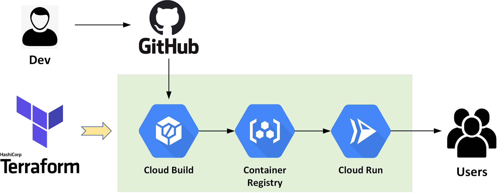

**WHAT YOU’LL NEED:**

- Access to a GCP testing environment
- Install Git and Terrafrom on your client
- Install [**GCloud SDK**](https://href.li/?https://cloud.google.com/sdk/install)
- Check the NTP clock & sync status on your client —\> important!
- Clone or download the Terraform script **[at here](https://github.com/sc13912/cloudrun-tf-demo)**
- Clone or fork the NodeJS demo app **[at here](https://github.com/sc13912/cloudrun-demo-app.git)**

**Step-1: Prepare the GCloud Environment**

To start, configure the GCloud environment variables and authentications.

```
gcloud init
gcloud config set accessibility/screen_reader true
gcloud auth application-default login
```

Enable required GCP API services

```
gcloud services enable servicenetworking.googleapis.com
gcloud services enable cloudresourcemanager.googleapis.com
gcloud services enable cloudbuild.googleapis.com
gcloud services enable containerregistry.googleapis.com 
gcloud services enable run.googleapis.com 
gcloud services enable sourcerepo.googleapis.com    
```

Update Cloud Build service account with all the necessary roles so it will have required permissions to access Cloud Run and GCR within the project.

```
PROJECT_ID=`gcloud config get-value project`
CLOUDBUILD_SA="$(gcloud projects describe $PROJECT_ID --format 'value(projectNumber)')@cloudbuild.gserviceaccount.com"
gcloud projects add-iam-policy-binding $PROJECT_ID --member serviceAccount:$CLOUDBUILD_SA --role roles/editor
gcloud projects add-iam-policy-binding $PROJECT_ID --member serviceAccount:$CLOUDBUILD_SA --role roles/run.admin
gcloud projects add-iam-policy-binding $PROJECT_ID --member serviceAccount:$CLOUDBUILD_SA --role roles/container.developer
```

**Step-2: Connect Cloud Build to GitHub Repository**

Next, let’s connect Cloud Build to the demo app Git Repository. On GCP console, go to “*Cloud Build —\> Triggers —\> Connect Repository*” and then select “GitHub” as below. (You will be redirected to GitHub for authentication.)

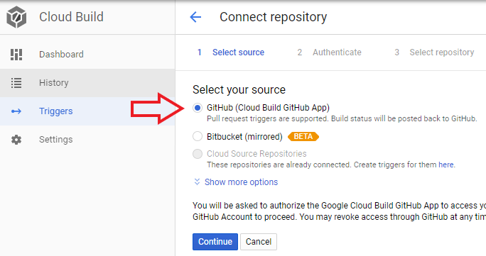

Select the demo app repository which contains the sample NodeJs application.

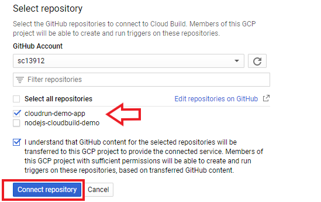

In the next page, make sure to click **“Skip for now”** and we are done. We’ll leave it to Terraform to create the trigger at later.

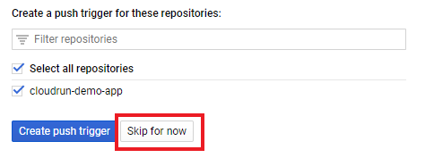

**Step-3: Run Terrafrom Script to launch a Serverless CI/CD Pipeline**

Before executing the script, make sure to update the variables (as defined in *Terrafrom.tfvars*) as per your own GCP environment.

```
project_id = "xxxxxxxx"
location = "asia-northeast1"
gcr_region = "asia"
github_owner = "xxxxxx"
github_repository = "xxxxxx"
```

Run the Terraform script.

```
terraform init
terraform apply
```

Since we are not provisioning any Infrastructure resources (it’s Serverless!), the process should take less than 2~3 mins. Take a note of the URL provided in the output — this is the public URL of our Cloud Run Service.

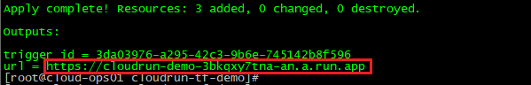

On GCP console verify the Cloud Run Service has been deployed successfully.

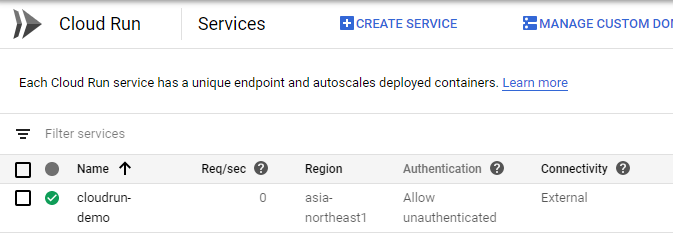

Now go to the above URL and you should see the default page of the ***[cloudrun-hello app](https://github.com/GoogleCloudPlatform/cloud-run-hello.git)***.

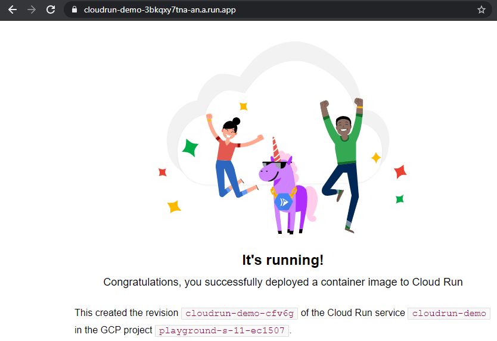

Before we move forward, confirm there is now a Cloud Build triggered provisioned by Terrafrom with the pipeline config defined as “*cloudbuild.yaml*“.

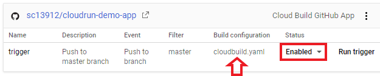

**Step-4: Test the Pipeline**

Now let’s take a closer look at the pipeline code. This is a basic 3-stage pipeline:

- Build the demo Node app
- Push the image to GCR
- Deploy the image from GCR to the existing Cloud Run Service

``` brush:
steps:
  # Build Node app docker image
  - name: "gcr.io/cloud-builders/docker"
    args:
      - build
      - -t
      - ${_GCR_REGION}.gcr.io/$PROJECT_ID/${_SERVICE_NAME}:$COMMIT_SHA
      - .

  # Push Node app image to GCR
  - name: "gcr.io/cloud-builders/docker"
    args:
      - push 
      - ${_GCR_REGION}.gcr.io/$PROJECT_ID/${_SERVICE_NAME}:$COMMIT_SHA

  # Deploy the docker image to Cloud Run Service
  - name: "gcr.io/cloud-builders/gcloud"
    args:
      - run
      - deploy
      - ${_SERVICE_NAME}
      - --image=${_GCR_REGION}.gcr.io/$PROJECT_ID/${_SERVICE_NAME}:$COMMIT_SHA
      - --region=${_LOCATION}
      - --platform=managed

images:
  - "${_GCR_REGION}.gcr.io/$PROJECT_ID/${_SERVICE_NAME}:$COMMIT_SHA"

timeout: 1200s
substitutions:
  _LOCATION: asia-northeast1 
  _GCR_REGION: asia 
  _SERVICE_NAME: cloudrun-demo
```

Time to test the pipeline! We’ll add a note into the README file.

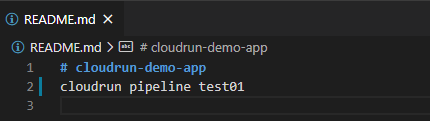

Commit and push to Git.

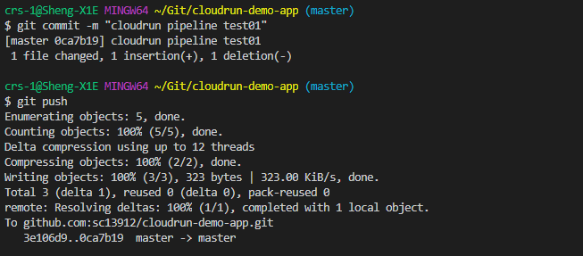

This should automatically trigger the pipeline, and the 3-stage process should be completed around a minute 🙂

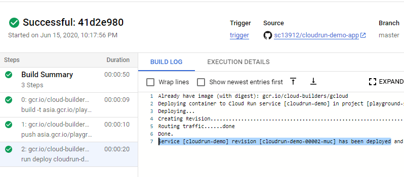

Now go back to our Cloud Run Service, you should see a new revision has been deployed by Cloud Build, with the container image now pointing to the GCR path (which contains our demo app).

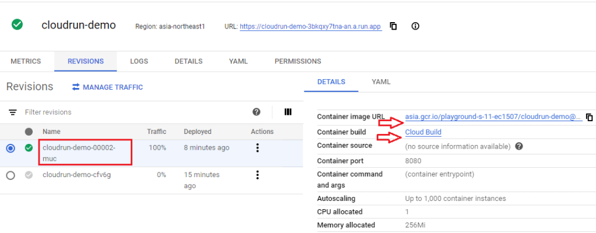

Refresh the browser and Boom — you now have access to the demo app running on Google Cloud Run!

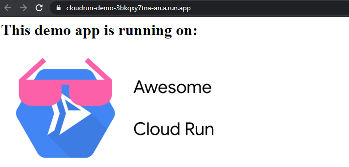

This concludes our **Cloud Native DevOps on GCP **series. I hope this has been informative and thanks very much for reading!
